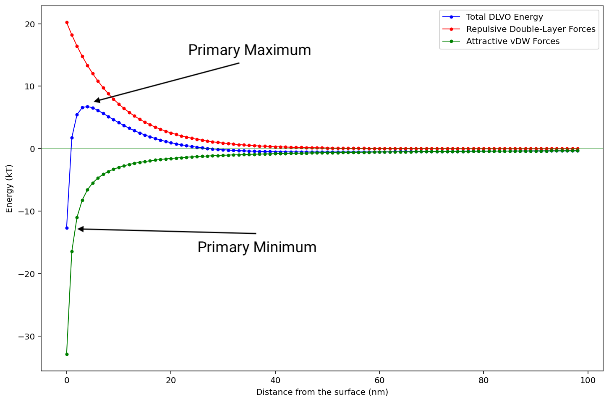
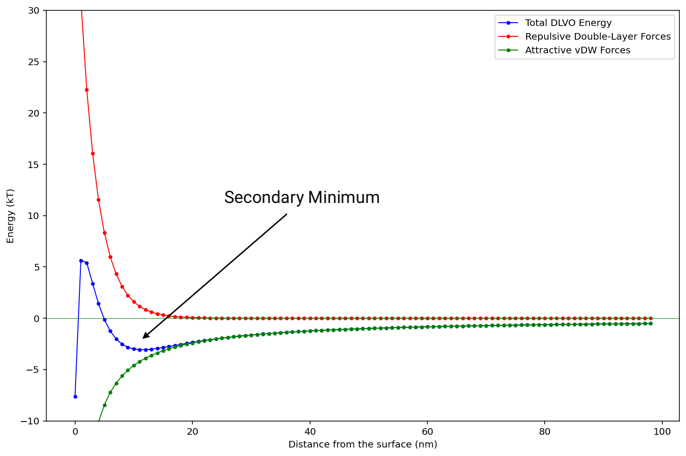
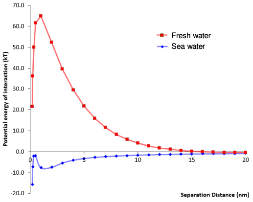

# DLVO Theory

Combining the attractive forces described by the [Hamaker Equation](../01c/#hamaker) and the [repulsive effect of the ion double-layer](../03a/#osmotic-repulsion)

It stands to reason that the attractive forces that fall off at a rate $\propto\frac{1}{d^6}$ will only be effect colloidal particles that can get close enough to feel such charges, so the predominating factor will be the repulsion of the ion clouds surrounding the colloidal particles.

We can combine these equations quite simply as such:

$$
V_{Total}^{DLVO}\approxeq\big(2\pi r\eo D\Psi^2_0\exp(-\kappa d)\big)-\frac{A_{121}r}{12d}
$$

Be aware that when using the approximation $\kappa^{-1}\frac{0.304}{\sqrt{c}}\:nm$ that the result you get is in $nm$, not $m^{-1}$ as you need for the DLVO equation.

A better approximation would be:

$$
\kappa=\frac{\sqrt{c}}{0.304\e{-9}}\:m^{-1}
$$

!!! info "Example 1"

	$250\:nm$ diameter particles, $30\:mV$ surface potential, $0.001\:M\:\ce{NaCl}$, $20\:nm$ apart, Hamaker constant of $1.3\e{-20}$
	
	$$
	\begin{align}
	\kappa&=\bigg(\frac{2q^2Z^2\rho_{(bulk)}}{\eo DkT}\bigg)^{1/2}\\
	&=\bigg(\frac{2(\q)^21^2(0.001)(1000)(6.022\e{23})}{(\eon)(78.54)(\k)(298) }\bigg)^{1/2}\\
	&=\bigg(\frac{3.090977\e{-14}}{2.861807\e{-30}}\bigg)^{1/2}\\
	&=1.039\e{8}\:m^{-1}\\
	\\
	V_{Total}^{DLVO}&\approxeq\big(2\pi r\eo D\Psi^2_0\exp(-\kappa d)\big)-\frac{A_{121}r}{12d}\\
	&\approxeq\big(2\pi(125\e{-9})(\eon) 78.54((30)(1000))^2\exp((-1.039\e{8}) (20\e{-9}))\big)-\frac{(1.3\e{-20})(\frac{250\e{-9}}{2})}{12(20\e{-9})}\\
	&\approxeq6.153169\e{-20}-6.770833\e{-21}\\
	&\approxeq\frac{65.47\e{-20}\:J}{(\k)(298)}\\
	&\approxeq13.3\:kT
	\end{align}
	$$

## Features of the DLVO Energy plot

The two biggest features are the primary minimum and primary maximum, which are the highest and lowest points on the DLVO plot

{: style="width: 50%; "class="center"}

We can also observe a secondary minimum in systems that will likely flocculate

{: style="width: 50%; "class="center"}

!!! info "Example 2 - Sedimentation of clay in salt water" 
	
	With nothing else interfering, the charge on the clay particles is enough to keep them repelling each other and prevent them from aggregating, however when the concentration increases in sea water, by a factor of $\sim100$, the clay particles are shielded by counterions, reducing their Debye length ($\kappa$), thus reducing how far out the charge extends and allowing the aDW forces to take over.
	
	{: style="width: 50%; "class="center"} 

## Critical Coagulation Concentration

An important and useful application of DLVO theory is being able to determine the concentration (range) of electrolyte that will destabilise a colloidal suspension. This concentration is determined experimentally, but has a theoretical formula, which uses the [alternative](../03a/#alternative) DLVO formulation:

$$
CCC=\frac{98.5(\eo D)^3k^5T^5\gamma^4}{N_AA^2e^6z^6}
$$

Where:

$$
\gamma=\frac{\exp(ze\Psi_0/2kT)-1}{\exp(ze\Psi_0/2kT)+1}
$$

The biggest factor in this equation is the ionic charge which results in a relationship as such:

$$
CCC\propto\frac{1}{z^6}
$$

This is known as the Shultz-Hardy rude

## Non-DLVO forces

DLVO only explicitly accounts for repulsive forces related to the ion double-layer and attractive vDW forces, but ultimately for nothing else. Any corrections to this, such as H-bonding, cavitation, lewis acid/base considerations, polyelectrolyte solutions, hydrophobicity, stabilising polymers/steric stabilisation are all considered additions to DLVO and come under x-DLVO theory

## Steric stabilisation

We can often use polymers to stabilise a colloid. It does this by adsorbing to the surface of the colloid, and reaching out into the solution, preventing colloidal particles form getting close enough to feel the attractive vdW forces.

The specifics of how well this works is based on the affinity that the polymer has for the colloid/solvent and can be tweaked with he addition of other solutes, such as ions that will bind to the polymer and alter its solubility.

In a good solvent, the polymer will expand to be anywhere from $5-50\:nm$ from the surface of the colloid

## Polymeric destabilisation

This can also stabilise the polymer by attaching to multiple colloidal particles and bringing them together in a floc, in a method known as "bridging flocculation."