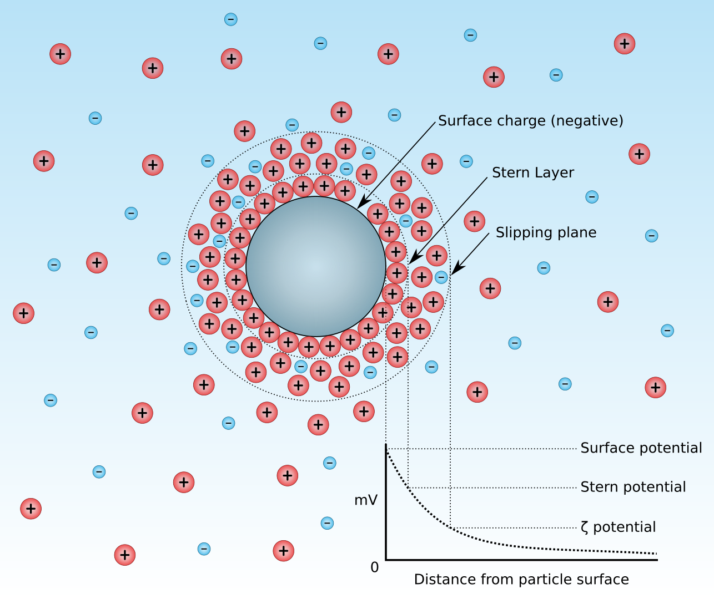
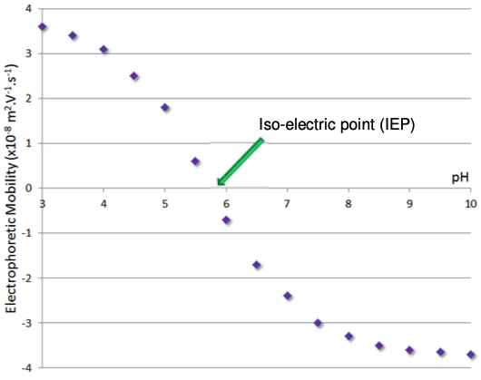
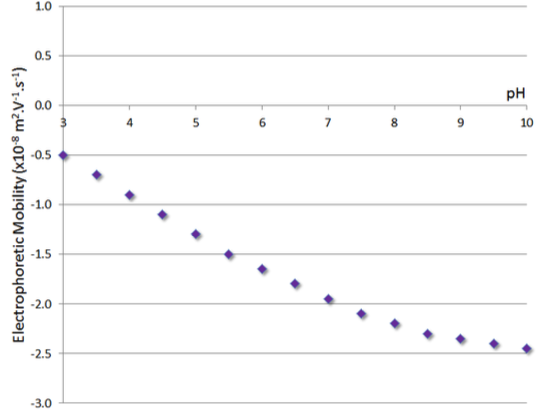

#                           Zeta Potential ($\zeta$)

With everything we've done so far, there is one fundamental issue. We can't actually measure $\Psi_0$. What we can measure instead is the $\zeta$ potential, that is, the potential at the slipping plane, which is the boundary between the EDL and the bulk. Since this is most extreme part of the EDL, it will represent the point that can interact with its surrounding. 

{: style="width: 50%; "class="center"}

## Electrophoretic mobility ($\mu$)

The catch is, however, that we can't actually measure $\zeta$, we can only infer it from the mobility of a colloidal particle within an electric field. We calculate electrophoretic mobility using the following equation:

$$
\mu=\frac{v}{E}
$$

Where:

* $\mu=$ electrophoretic mobility ($m^2\cdot(V\cdot s)^{-1}$)
* $v=$ velocity ($m\cdot s^{-1}$)
* $E=$ electronic field strength ($V\cdot m^{-1}$)

## $\mu\to\zeta$

We can calculate the zeta potential from the electrophoretic mobility using three different equations, however equations one and two are just parameterised differently and can be expressed through equation 3:

### The Henry equation

$$
\mu=\frac{v}{E}=1000\bigg(f\frac{\eo D\zeta}{\eta}\bigg)
$$

Where:

* $\mu=$ electrophoretic mobility ($m^2\cdot(V\cdot s)^{-1}$)
* $v=$ velocity ($m\cdot s^{-1}$)
* $E=$ electronic field strength ($V\cdot m^{-1}$)
* $\zeta=$ zeta potential
* $\eta=$ viscosity of the solvent ($0.8904\:cP$ - $(kg·(m·s)^{-1})$)
* $D=$ dielectric of the solvent
* $\eo=$ permittivity of a vaccum ($8.854\e{-12}$)
* $f=$ scaling value

## Scaling value ($f$)

The scaling value essentially determines which equation we're using

* Hückel equation - (small $\kappa r$) - $f=2/3$
* Smoluchowski equation - (large $\kappa r$) - $f=1$

!!! info "Example 1"
	
	A particle with a diameter that is large relative to the EDL is placed in an electric field of $80\:V\cdot m^{-1}$. The particle covers a distance of $5.0\:μm$ in $3.80$ seconds. Calculate the zeta potential of this particle.
	
	$$
	\begin{align}v&=\frac{d}{t}\\
	&=\frac{5.0\e{-6}}{3.8}\\
	&=1.316\e{-6}\\
	\\
	\mu&=\frac{v}{E}\\
	&=\frac{1.316\e{-6}}{80}\\
	&=1.645\e{-8}
	\\
	\mu&=1000\bigg(f\frac{\eo D\zeta}{\eta}\bigg)\\
	\zeta&=\frac{\mu\eta}{1000f\eo D}\\
	&=\frac{(1.645\e{-8})(0.8904)}{(1000)(1)(\eon)(78.54)}\\
	&=0.0211\:V\\
	&=21.1\:mV
	\end{align}
	$$

## Implications

It's considered that a zeta potential of $\pm25\:mV$ will produce a stable colloidal suspension. Since this is based on the situation of the EDL, $\zeta$ will change with the concentration of the [PDI](../02a/#potential-determining-ions-pdi) and we can thus titrate the systems.

When $\zeta$ is zero,  it will have no *net* charge at the slipping plane and will thus be incredibly unstable as a colloidal suspension. this is known as the Iso-Electric Point (IEP)

{: style="width: 50%; "class="center"}

Some systems can only take on a positive or a negative charge, such as the one below which is covered in carboxylic acid groups. Since they can't take on an extra proton they can only have a negative potential as the protons are stripped off the surface.

{: style="width: 50%; "class="center"}

