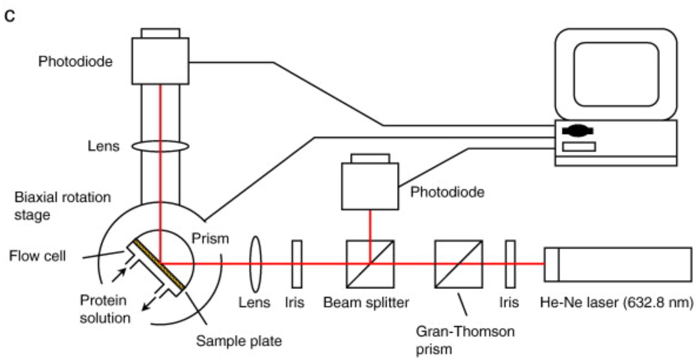
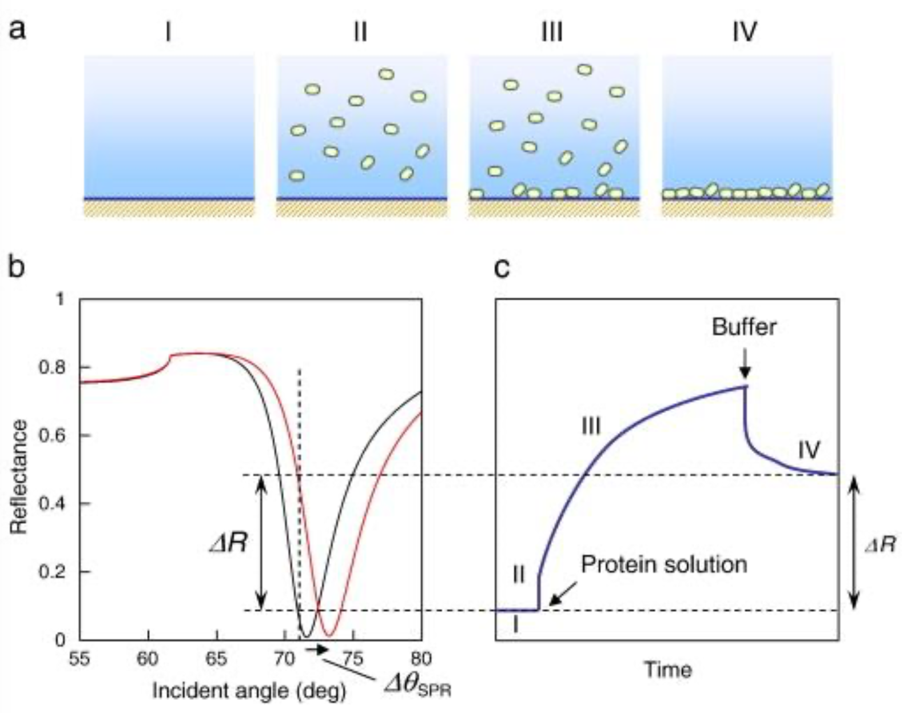
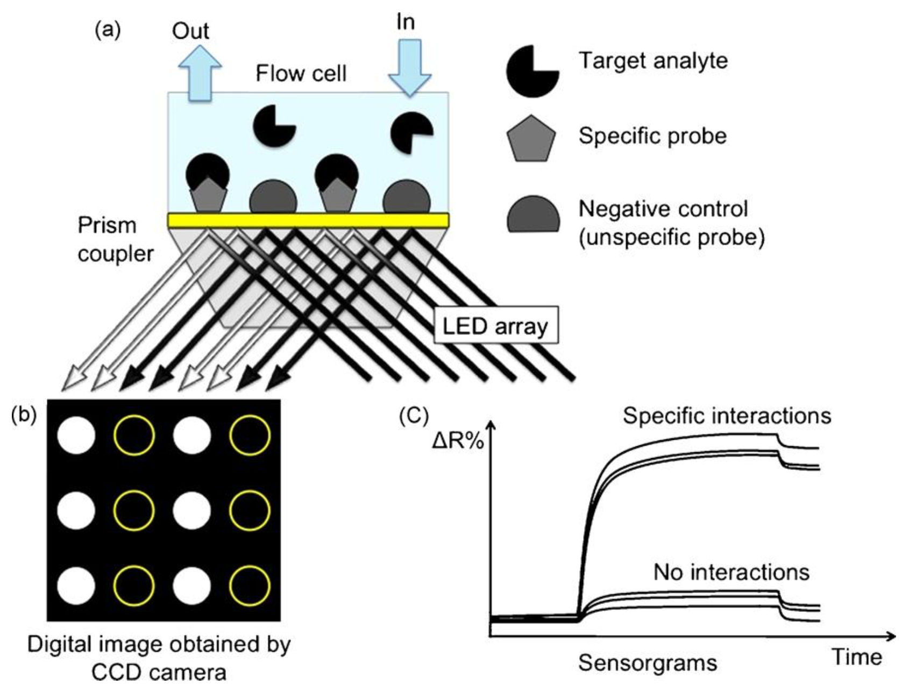
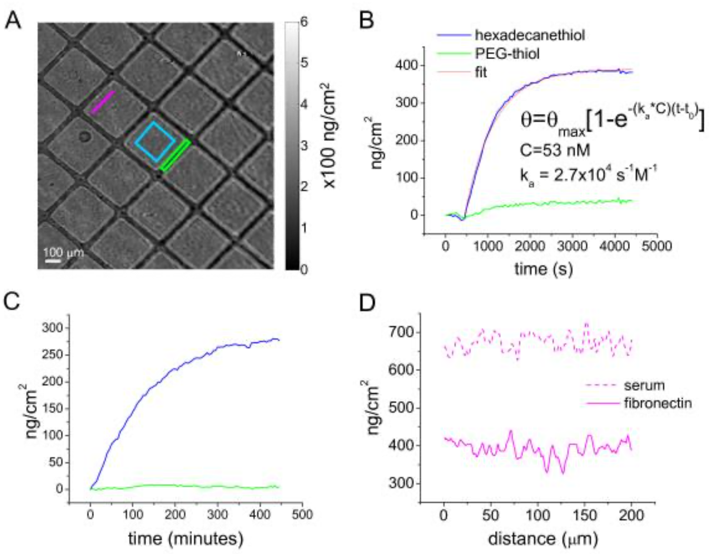
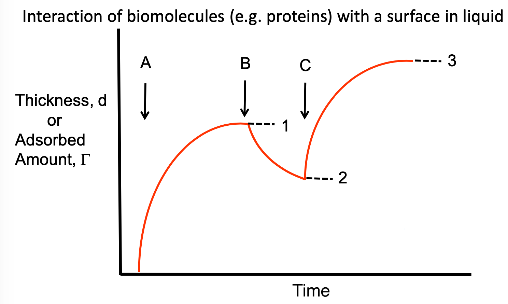
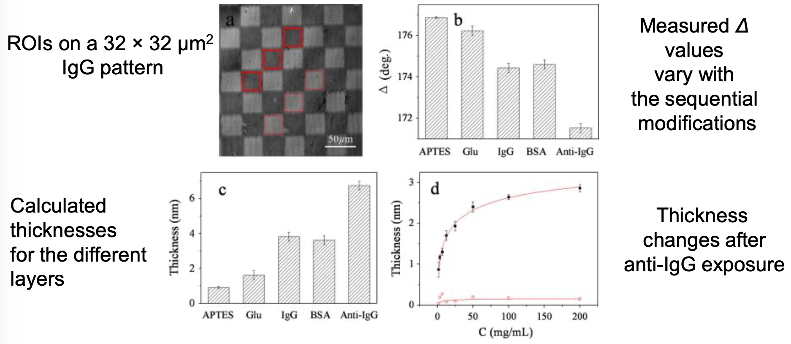

# Quantifying Protein Adsorption - 1

The techniques we use to quantify protein adsorption can be classified by their methodology.

## Biochemical Methods

These utilise the chemistry itself to measure how much binding occurs

### Radio Labelling

Proteins can be labelled with radioactive isotopes that allow them to be detected on the surface. They're typically labelled with $\ce{^125I}$ and is the most common and reliable way of quantifying adsorbed proteins.

### Enzyme Linked Immunosorbent Assay (ELISA)

Proteins adsorb on to a surface that's studded with antibodies. The antibodies are usually conjugated with an enzyme such as horse-radish peroxidase and after multiple treatments will change colour based on the binding state of the antibody.

{: style="width: 25%; "class="center"}

### Electrophoresis - SDS-PAGE

The protein is desorbed from the surface with a surfactant that will denature it before being separated electrophoretically and identified.

{: style="width: 30%; "class="center"}

## Evanescent Wave Techniques

All of the following techniques rely on ATR/evanescent waves to non-invasively/non-destructively measure the surface over a period of time.

### Surface Plasmons Resonance (SPR) Biosensor

In SPR, a polarised light source is directed at a gold film at an angle of incidence that the light will reflect. Some of the light is converted into an evanescent wave (perpendicular to the angle of reflection) that will then excite the conducting electrons in the gold, causing them to oscillate, creating another electromagnetic wave that propagates along the gold (Surface Plasmons).

As the surface plasmons interacts with the reflected light, it will interfere, causing a black spot, and as the refractive index of the solution above the surface plasmons changes the angle at which the reflected dark spot is reflected will vary.

 

{: style="width: 40%; "class="center"}

In an SPR experiment, the gold surface is prepped in a way that the proteins will bind and a flow of solution is run over the surface of this, to be able to change the conditions over a period of time. Kinetics of the protein binding can be measured if the reflectance is measured over time as the conditions are changed in a four step process:

1. The surface is equilibrated with buffer
2. The surface is exposed to the analyte solution
3. The analyte solution is equilibrated and experiences adsorption kinetics
4. The surface is rinsed with buffer and monitored for de-adsorption kinetics

-Spectrometry-1.png){: style="width: 30%; "class="center"}

From all of this, we can measure:

* The reflectance as a function of $\theta_{SPR}$ and time
* The shift in the SPR angle ($\Delta\theta_{SPR}$) as a result of the adsorbing molecules
* Thickness and quantity of the attaching molecules, using Fresnel fits
* compiling it all, we can get a realtime monitor of the biosensing event 

{: style="width: 30%; "class="center"}

It is important that the bulk solution is not too high in concentration when measuring the adsorption, as the SP wave may extend into the solution, hence the difference between points **III** and **IV**

### SPR Imaging (SPRi)

The technique couples the sensitivity of SPR with the spacial capabilities of imaging and is used to study a variety of affinity systems, such as; DNA/DNA, DNA/RNA, DNA/protein, aptamers/proteins, antibody/antigen, carbohydrates/proteins.

The process uses LED arrays rather than lasers and can measure hundreds of different interactions at once, as different regions of the surface.

{: style="width: 30%; "class="center"}

In the Example below, the surface (**A**) has been prepped with lines of polyethylene glycol (PEG) before a solution of fibronectin was passed over it. The darker regions are regions where fibronectin hasn't bound. The kinetics of the binding process were determined in **C** with comparison to the PEG coated regions. In **C**, the process was left to run for over 8 hours to see how the fibronectin would accumulate.

{: style="width: 30%; "class="center"}

### Ellipsometry

is an optical technique that's used to measure the dielectric properties of thin films, such as refractive index. It relies on measuring the properties of reflected and transmitted light from a surface. It is primarily used to study thin films, and how they build up and is very sensitive to thicknesses over $1\:\AA$ to $1\:\mu m$, including atomically thick layers.

Ellipsometry is sensitive to:

* The thickness of the layer (based on the refractive index)
* The optical constants (refractive index and extinction coefficients)
* Surface roughness (scattering)
* Composition
* Optical anisotropy

Works by measuring the change in state of monochromatic polarised light after reflection form a surface that has a surface film. The light will have a change in phase and amplitude and this can be used to calculate the thickness of the thin film, to a resolution of $0.01\:nm$. It is possible to use this to measure the surface concentration (mass/area).

{: style="width: 30%; "class="center"}

In this example experiment, A protien solution is added (**A**) and after some incubation period a plateau (**1**)was reached. After rinsing with buffer solution (**B**), desorption occurs and the second plateau level (**2**) is reached. Additional incubation with an antibody (**C**) resulted in a third plateau (**3**)

 {: style="width: 30%; "class="center"}

Ellipsometry can be used for imaging, much like SPRi. A surface has to be prepared, but this time the analysis happens from the top of the surface, rather than from the underside 

{: style="width: 40%; "class="center"}