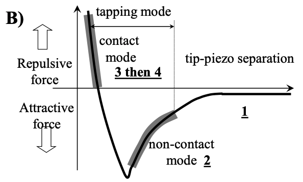
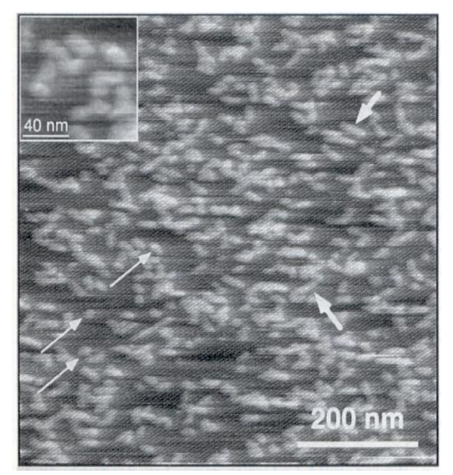
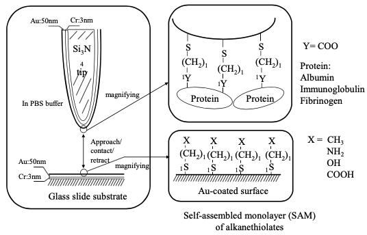
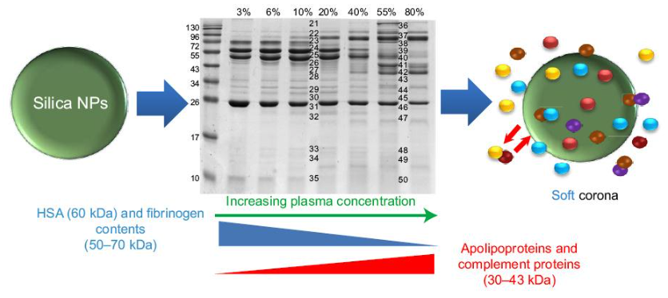
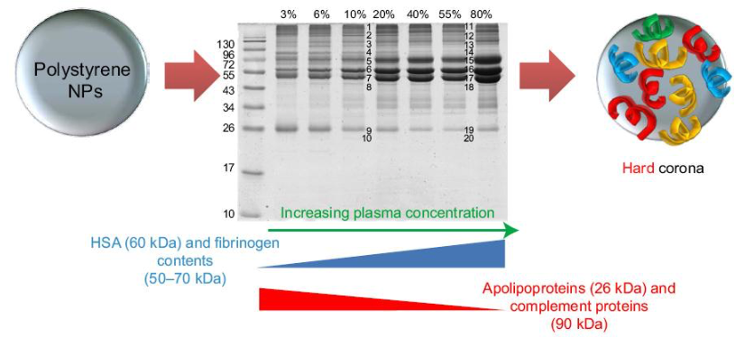

# Quantifying Protein Adsorption - 2

## Quartz Crystal Microbalance (QCM)

QCM utilises the principle of piezoelectric resonance (electricity $\ce{<=>}$ mechanical force) to measure changes in mass:

$$
\Delta f=\frac{-2\Delta mf_0^2}{A\sqrt{\rho_q\mu_q}}=-\frac{2f_0^2}{A\sqrt{\rho_q\mu_q}}\Delta m
$$

Where:

* $f_0=$ resonance frequency ($Hz$)
* $\Delta f=$ change in frequency ($Hz$)
* $\Delta m$ change in mass ($g$)
* $A=$ piezoelectrically active crystal area ($cm^2$)
* $\rho_q=$ density of quartz ($4.648\:g/cm^3$)
* $\mu_q=$ shear modulus of an AT-cut quartz crystal ($2.947\e{11}\:g/cm\cdot s^2$)

This however makes a major assumption, that the proteins adhere rigidly to the crystal surface, which leads to an underestimation of the mass.

QCM can be used to measure binging on the nanogram mass scale and is useful for measuring kinetics, both of binding and releasing. It is also possible to increase the sensitivity of the experiment by making the molecules (or complexes) that bind much larger.

### Decay ($\Delta D$)

If we suddenly turn off the current, the crystal will continue to resonate, while dissipating energy, much like a tuning fork. The rate at which this occurs is dependent on the rigidity of the proteins bound to the surface, so by pulsing the current throughout the experiment, it's possible to map both $\Delta f$ and $\Delta D$

In the image below, we can clearly see the three phases, (1) where the antigen binds to the substrate, (2) where the antibody binds to the antigen and (3) and the increase in density as the antibodies pack themselves after rinsing occurs.

{: style="width: 40%; "class="center"}

## Atomic Force Microscopy (AFM)

AFM measures the topology of a surface by measuring the forces that occur between the surface and the tip.

{: style="width: 30%; "class="center"}

 The tip is typically made from silicon or silicon nitride and can operate in thee modes:

* Contact mode - The tip is dragged along the surface
  * Only useful for hard surfaces where the tip won't damage the sample
* Tapping mode - The tip is tapped on the surface but is not dragged
* Non-Contact mode - The tip is tapped above the sample

{: style="width: 30%; "class="center"}

The different modes will feel different forces, based on how closely the surfaces interact. In non-contact mode, the vDW forces will have an overarching attractive force, where in contact mode, there will be electron repulsion. 

{: style="width: 30%; "class="center"}

Because of the resolution of AFM, it is possible to visualise individual proteins adsorbed on to surfaces, such as the image above, of lysozyme (dimensions: $3\times3\times4.5\:nm$).

{: style="width: 40%; "class="center"}

As we can measure forces using the cantilever, it is also possible to modify the surface of the tip with proteins to measure the affinity with which they bind to different regions of the surface, the results are tabulated below ($m$ is the number of tips tested, $n$ is the number of repetitive measurements):

| Tip/Surface Combination | $m$  | $n$  | $F_{ad}\:(nN)$ |
| ----------------------- | ---- | ---- | -------------- |
| Fib/$\ce{CH3}$          | 3    | 212  | 4.6            |
| Fib/$\ce{NH2}$          | 3    | 239  | 1.1            |
| Fib/$\ce{OH}$           | 3    | 229  | 0.8            |
| Fib/$\ce{COOH}$         | 3    | 248  | 0.1            |
| Alb/$\ce{CH3}$          | 3    | 185  | 4.5            |
| Alb/$\ce{NH2}$          | 3    | 208  | 0.8            |
| Alb/$\ce{OH}$           | 3    | 206  | 0.3            |
| Alb/$\ce{COOH}$         | 3    | 207  | 0              |
| IgG/$\ce{CH3}$          | 3    | 217  | 3.7            |
| IgG/$\ce{NH2}$          | 3    | 171  | 0.9            |
| IgG/$\ce{OH}$           | 3    | 208  | 0.1            |
| IgG/$\ce{COOH}$         | 3    | 183  | 0              |

## Detecting Multiple Proteins on the Surface

Real world protein complexes are complicated, so it's often important to look at the different proteins that are adsorbed

### MALDI-ToF

See [MALDI-ToF](../06c/#maldi-tof)

### SDS-PAGE

SDS-PAGE allows us to separate out proteins by size:

1. Proteins are desorbed from the surface with surfactant (denaturing agent)
2. They are separated electrophoretically and categorised by molecular weight
   1. They can then be digested and analysed by MS and sequence searched
   2. And/or immunoblotted to identify the proteins

Using this method, it is also possible to see how closely bound the proteins are to the surface, that is, whether or not they form a soft, or a hard corona:

{: style="width: 50%; "class="center"}

{: style="width: 50%; "class="center"}

In the images above, the wells scale from low to high serum concentration (100\% would represent human serum albumen).