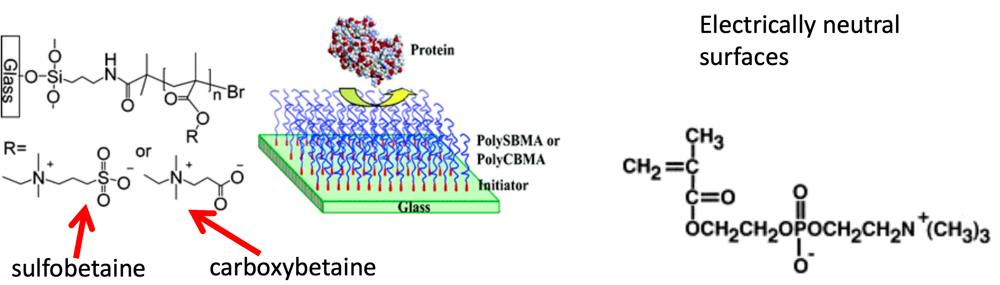
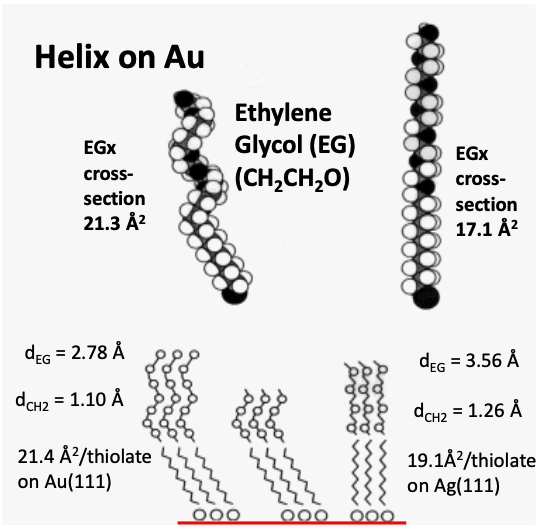
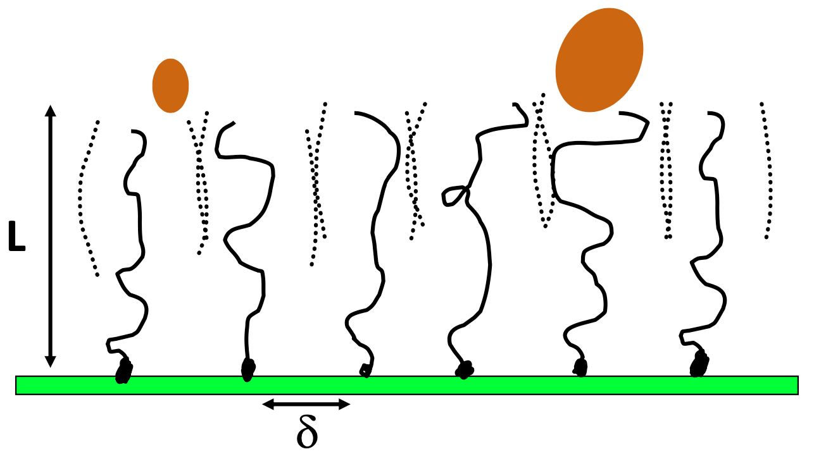
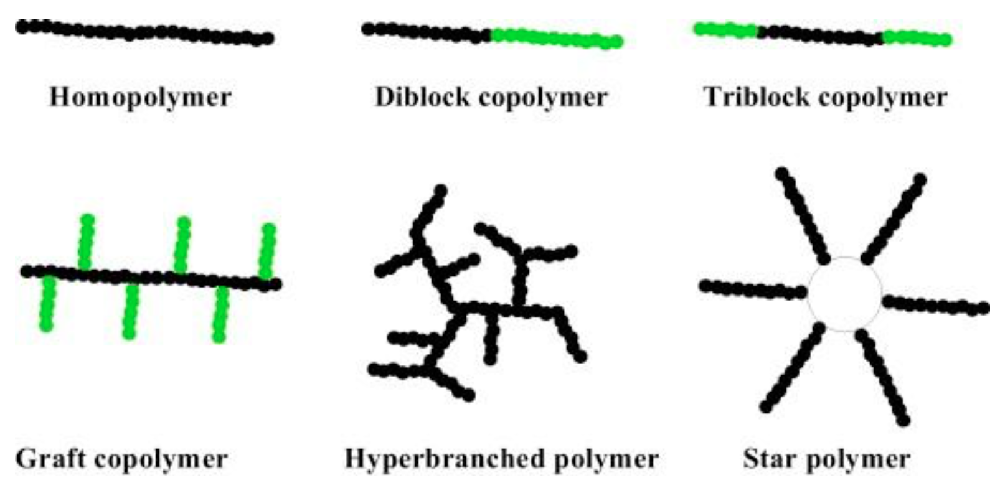
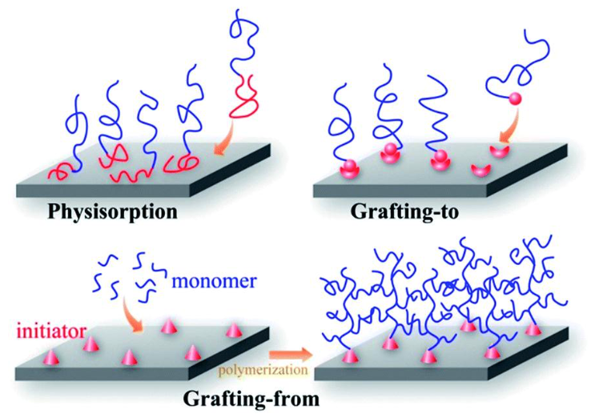

# Surfaces That Prevent Adsorption

There are a number of mechanisms of action for adsorption preventing surfaces:

* Surfaces that have a structured water layer (ice like)
* Surfaces with long, polymer chains on the surface
* Surfaces that are extremely hydrophobic - Much easier to clean, like a lotus leaf
* Natural and synthetic antifoulants - Compounds on the surface, or released by the surface that will kill anything that adheres to it
* Eroding surfaces - Surfaces that will constantly shed to remove any built up adsorbant on the surface. This may be coupled with the previous technique to gradually release antifoulants
* Switchable surfaces - surfaces that change composition with respect to their environment (pH, electronic, temperature, etc.)

## Zwitterionic surfaces

One way to accomplish an "ice like" surface is to have polymers that form incredibly strong h-bonds with water, rendering incapable of being displaced. these are typically zwitterionic, to prevent any charged interactions.

{: style="width: 60%; "class="center"}

## Thiol Self assembled Monolayer (SAM)

One way of causing polymers to bind to a surface is to use a thiol self-assembled monolayer. Thiol groups ($\ce{S-H}$) will bind quite strongly to a metal (specifically Au, Ag, Cu and Pt), forming a metal-sulphur interface with spacing that will be governed by the bulk of the adhering groups. As shown in the image below, these groups can be further functionalised to provide a greater diversity of surface properties

{: style="width: 50%; "class="center"}

Based on the metal, different packing can occur as well, leading to different functionality. The EG in the image below will only form a spiral that will interact with water if there is enough spacing for it to occur. This however will happen on a gold substrate, but NOT on silver, leaving the surface to ultimately be non functional.

{: style="width: 30%; "class="center"}

## Polymer 'Brush' Coatings

These work by providing steric hinderance that prevents any adsorbing compounds from even reaching the surface. The polymers themselves could be functionalised at the end to encourage cell desorption, or to actively kill any cells that come in contact with it.

{: style="width: 40%; "class="center"}

There are a few properties of the polymers that make them useful:

* They must have a brush structure - branched structures are less effective
* We know that the graft density should realistically be as high as possible
* They must be highly hydrated

Some effective polymers include:

??? info "Natural Polymers"
	
	| Name                | Properties                                  | Structure                                                    |
	| ------------------- | ------------------------------------------- | ------------------------------------------------------------ |
	| Dextran             |                                             | {: style="max-width: 200px; max-height: 100px; "class="center"} |
	| Pulluan             |                                             | {: style="max-width: 200px; max-height: 100px; "class="center"} |
	| Chitosan            | +ve charge $\ce{N+}$ causes cell lysis | {: style="max-width: 200px; max-height: 100px; "class="center"} |
	| Hyaluronan          | -ve charge                                  | {: style="max-width: 200px; max-height: 100px; "class="center"} |
	| Heparin             |                                             | {: style="max-width: 200px; max-height: 100px; "class="center"} |
	| Chondroitin Sulfate |                                             | {: style="max-width: 200px; max-height: 100px; "class="center"} |

??? Info "Synthetic Polymers"
	
	| Name                                        | Structure                                                    |
	| ------------------------------------------- | ------------------------------------------------------------ |
	| Poly(ethylene glycol) (PEG)                 | {: style="max-width: 200px; max-height: 100px; "class="center"} |
	| Poly(acrylamide) (PAm)                      | {: style="max-width: 200px; max-height: 100px; "class="center"} |
	| Poly-N-isopropyl- acrylamide (PNIPAM)       | {: style="max-width: 200px; max-height: 100px; "class="center"} |
	| Poly(2-hydroxyethyl – methacrylate) (pHEMA) | {: style="max-width: 200px; max-height: 100px; "class="center"} |
	| Poly(vinyl alcohol) (PVA)                   | {: style="max-width: 200px; max-height: 100px; "class="center"} |
	| Poly(vinylpyrrolidone) (PVP)                | {: style="max-width: 200px; max-height: 100px; "class="center"} |

## Polymer Nanoarchitectures

To be able to build different kinds of polymers, it's important to understand that different structures can exist. The structures with green sections might also have different functionalities, such as the triblock copolymer, which might have a different region to bind to the surface and a different head functionalisation to the main bulk of the polymer.

{: style="width: 40%; "class="center"}

## Building Surface Structures

There are three main ways of building surface structures

{: style="width: 40%; "class="center"}

### Physisorption

If the polymer has multiple regions, one of the regions may have an affinity for the surface, while the other is repelled by it.

This is quick and easy, however the polymers may be only loosely bound and could be displaced by a molecule with stronger affinity. This is also very sensitive to the environmental conditions. 

### Grafting-To

This method requires building the polymers in advance and binding them to the surface with some functionality. As the polymers can be bought in advance it can be a relatively rapid process, however the polymers cannot be customised.

### Grafting-From

This is the most powerful method, as it allows for the polymers to be built from the surface up. An initiator is required on the surface to allow polymerisation to begin, though after this, the polymers can be built in layers, simply by altering the solution from which the polymers are grown.

### Branching

The main stem of the polymer is only part of the equations, as the polymers could be branched over time based on how densely packed the initiators were, how tall the main stems were, how long the polymers are allowed to be branched for, etc.

