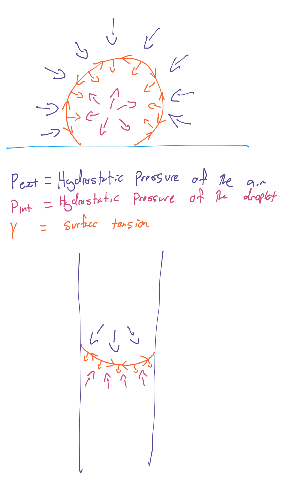
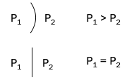
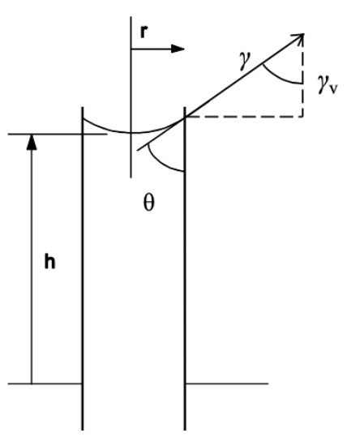
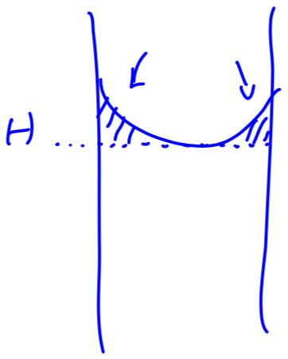
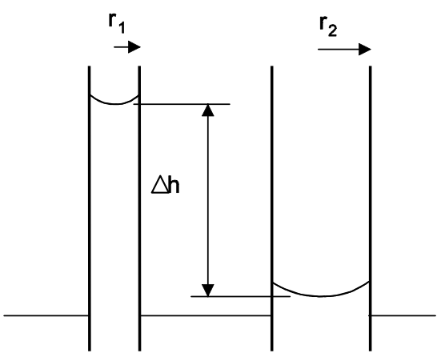
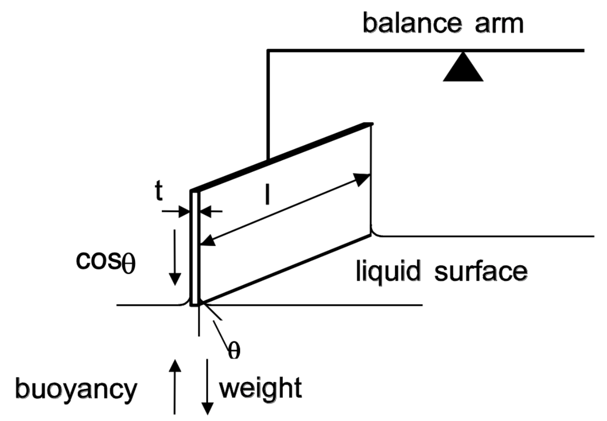
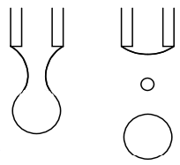

# Introduction and Surface Tension

!!! info "Definitions"
	**Interface:** an interface is the boundary between two bulk phases 
	**Surface:** a surface is a type of interface where one of the phases is vapour/gas
	
While emulsions are classified as "particles with at least one dimension in the size range of $1\:nm$ to $1\:\mu m$," droplets, bubbles and dispersions of solids often have surfaces within this size range. Colloidal surface chemistry studies the unique properties poseessed by these systems, due to their large interfacial area to mass ratio .

Colloidal systems can be divided into three particular groups:

* Colloidal dispersions
  * Defined by a dispersed phase in a continuous phase
* True solutions of macromolecules
  * Are large molecules (within the colloidal range) dissolved in an appropriate solution, such as gelatine or polyacrylamide. These must be dissolved (lyophilic - solvent loving)
* Association colloids - colloidal particles that are made of aggregate subsystems, such as micelles

!!! info "Definitions"
	**Cohesion:** is the attractive interaction between atoms/molecules of the same type 
	**Adhesion:** is the attractive interaction between different types of atoms/molecules, such as at interfaces

{: style="width: 50%; "class="center"}

## Surface Tension ($\gamma$)

!!! info "Definitions"
	"For a plane surface, the surface tension is defined as the force acting parallel to the surface and perpendicular to a line of unit length in the surface" 
	**Symbol:** $\gamma$ 
	**Units:** $mN\cdot m^{-1}$

Surface tension is the aggregate force that occurs because of uneven cohesion. While the molecules in the bulk will be pulled in every direction, resulting in a net neutral force, the surface molecules will feel a net inwards force that creates a tension parallel to the surface and inwards towards the bulk. Given this inwards force, surface tension will typically prevent vaporisation

Given this distribution of forces, without adhesion taking place a ball of liquid will naturally try and form a sphere, as it would minimise the interfacial area and thus the surface tension. Realistically, there are other forces, such as gravity that will distort the shape of the sphere, hence the typical "water drop" shape

The nature of these forces will differ between different molecules, however will follow the basic [attractive forces](../../Colloids/01c/) of Coulombic, Keesom, Debye and London.

{: style="width: 30%; "class="center"}

## Hydrostatic Pressure ($\Delta P$)

{: style="width: 30%; "class="right"}

Hydrostatic pressure is the pressure of the fluid pushing outwards onto other surfaces. The interface between the hydrostatic pressure inside of a liquid phase and outside in the air is the surface tension

The hydrostatic pressure below a flat surface is different to that of a curved surface. This essentially means that the pressure inside of a sphere will always be higher than outside, regardless of what those phases are made of.

{: style="width: 30%; "class="center"}

## Young-Laplace Equation

This relates the pressure difference across curved interfaces to the surface tension and the radius of the curvature. For a soap bubble, with multiple interfaces, we need to double the surface tension

$$
\begin{align}\text{For a droplet}\\
\Delta P&=\frac{2\gamma}{r}\\
\text{For a bubble}\\
\Delta P&=\frac{4\gamma}{r}\\
\end{align}
$$

Where:

* $\Delta P=P_{inside}-P_{outside}$ ($N\cdot m^{-2}$)
* $\gamma=$ surface tension ($N\cdot m^{-1}$)
* $r=$ radius ($m$)

!!! info "Example 1"
	Calculate the pressure inside a droplet with a radius of $100\:nm$, if the ambient vapour pressure is $1.01\e{5}\:N\cdot m^{-2}$ and the surface tension of water is $72.8\:mN\cdot m^{-1}$.
$$
\begin{align}
\Delta P&=\frac{2\gamma}{r}\\
P_{inside}-P_{outside}&=\frac{2\gamma}{r}\\
P_{inside}&=\frac{2\gamma}{r}+P_{outside}\\
&=\frac{2(72.8\e{-3}\:N\cdot m^{-1})}{100\e{-9}\:m}+1.01\e{5}\:N\cdot m^{-2}\\
&=1.56\e{6}\:N\cdot m^{-2}
\end{align}
$$

## Work Done by Surface Tension

We can calculate the work done by surface tension using the following relationship:

$$
work=\gamma\Delta SA
$$
Where:

* $A=$ surface area of the liquid

## Examples of Surface tension

| Liquid                    | $\gamma_{L/V}\text{ at } 20^\circ C (mN\cdot m^{-1})$ |
| ------------------------- | :--------------------------------------------------: |
| Heptane                  | 19.7                                                 |
| Ethanol | 22.3                                                 |
| Methanol   | 22.6                                                 |
| Chloroform | 27.1                                                 |
| Nitromethane     | 32.7                                                 |
| DMSO           | 43.5                                                 |
| Water               | 72.8                                                 |
| Mercury              | 475 – 485                                            |

## Surface Tension Measurements

All the surface tension measurements are based on the Young-Laplace equation, though they also include reference to the contact angle at the surface $\cos\theta$

$$
\Delta P=\frac{2\gamma}{r}\cos\theta\hskip{2cm}\gamma=\frac{r\Delta P}{2\cos\theta}
$$

There are three main methods for measuring the surface tension:

### Static Methods

#### Absolute Column Rise {: style="width: 20%; "class="right"}

Static methods are the most accurate but can also be the most labour intensive.

They are based on the capillary rise, that is that the: 
Vertical component of surface tension ($\gamma_v$)= weight of the liquid in the column (hydrostatic pressure)

$$
\begin{align}
2\pi\gamma\cos\theta&=\pi r^2h(\rho_l-\rho_g)g\\
\gamma&=\frac{rh(\rho_l-\rho_g)g}{2\cos\theta}
\end{align}
$$

{: style="width: 20%; "class="right"}

In these calculations, $h=$ the height above the bottom of the meniscus above the flat surface of the reservoir. a simplification can be made as with most liquids on clean (acid/base washed) glass, $\cos\theta$ approaches 1, so we get:

$$
\gamma=\frac{1}{2}rh(\rho_l-\rho_g)g
$$
Since there will be a small amount of volume above the meniscus, however, we really should account for that in our calculations to be truly accurate. For a narrow capillary, we can trat the meniscus as being hemispherical and we can treat $\cos\theta$ as1, so our equation becomes:

$$
\gamma=\frac{1}{2}r\bigg(h+\frac{r}{3}\bigg)(\rho_l-\rho_g)g
$$
#### Differential Column Rise {: style="width: 30%; "class="right"}

To avoid needing to refer to the base of the capillary, we can use the difference in height between two capillaries to measure the surface tension:

$$
\gamma=\frac{r_1r_2\Delta h(\rho_l-\rho_g)g}{2|r_1-r_2|}
$$

### Detachment Methods

#### Wilhelmy (Plate) Method

These relate the force acting on a vertical plate as its detached fro the liquid surface to the surface tension.

These methods are much more simple and automated, however they suffer from the problem that the surface of the liquid is physically disturbed. Since a new state of equilibrium needs to be reached with the plate in the liquid, these methods are typically limited to pure liquids/solids.

{: style="width: 40%; "class="center"}

Method:

1. The plate is zeroed in air
2. The plate is placed in the liquid to a point where buoyancy is negligible
3. The force on the immersed plate as an equivalent weight is the vertical component of surface tension

$$
F=2\gamma\cos\theta(l+t)=mg
$$
Where:

* $l=$ length of the plate
* $t=$ thickness of the plate

In this method, the cleanliness of the glass slide is vital, as if $\theta=0^\circ$, the equation becomes:

$$
\gamma=\frac{mg}{2(l+t)}
$$

#### Du Noüy (Ring) Method

Is similar to the Wilhelmy method, however a circular ring is used instead

#### Drop Weight/Volume Method

Drops of a liquid are allowed to build up and detach from the tip of a narrow tube. the drops are either weighed or their volumes are measured and related to their surface/interfacial tension

$$
\begin{align}
\text{For mass:}\\
\gamma&=\frac{mg}{2\pi r}\\
\text{For volume:}\\
\gamma&=\frac{V\rho g}{2\pi r}
\end{align}
$$

{: style="width: 20%; "class="center"}

### Dynamic Methods

These are suitable for non-equilibrium surfaces and can be performed very quickly after the formation of the new surface (within $10\:ms$). 

Examples include; the oscillating jet method, the falling column method, and the surface ripple/capillary wave method

## Comparison of Methods

| Method                           | Suitability (pure liquid)                                 | Suitability (solutions)              |
| -------------------------------- | --------------------------------------------------------- | ------------------------------------ |
| Capillary Height (most accurate) | Very suitable                                             | not suitable if $\theta \neq0^\circ$ |
| Wilhelmy plate (quick and easy)  | Susceptible to atmospheric contamination                  | good, suitable when ageing occurs    |
| Du Noüy method                   | suitable                                                  | not suitable                         |
| Dynamic methods                  | Very suitable when atmospheric contamination is suspected | poor when ageing occurs              |

