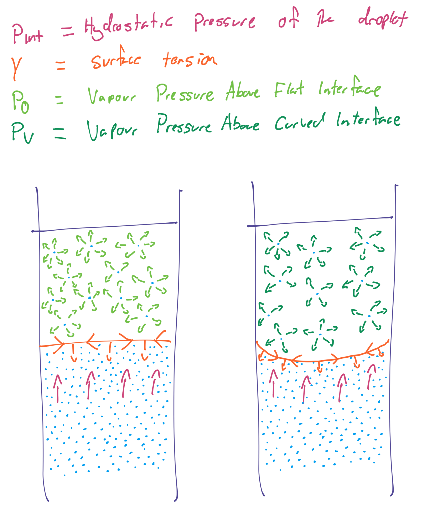
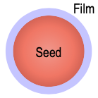
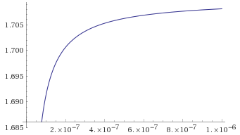

# Vapour Pressure

{: style="width: 15%; "class="right"}

All liquids will to some extent will have an equilibrium between its liquid phase and its gas phase. It's a reversible process that governed by the conditions in which it occurs.
$$
\ce{M_{(l)} <<=> M_{(g)}}
$$

Vapour pressure refers to the force exerted by the vapour, on the liquid when at its equilibrium. This can also apply to sublimation processes between solids and gasses. Evaporating molecules require enough energy to overcome surface tension which can be accomplished by heating the sample, 

## Pressure Above a Curved Interface ($p_v$)

{: style="width: 40%; "class="center"}

In comparison to a flat surface, the curve of a surface will tell you whether or not the vapour pressure is higher or lower.

$$
\begin{align}
p_0\text{ is where:}\\p_{hydrostatic}^{liquid}&=p_{hydrostatic}^{vapour}
\end{align}
$$

We can use the [Young-Laplace equation](../10a/#young-laplace-equation) in conjunction with the Kelvin equation to give a relationship between the two as a ratio. That is, we can use the Young-Laplace equation to give us $p_v$ and van use the Kelvin equation to calculate the relationship between $p_v$ and $p_0$ (the pressure above a flat surface)
$$
\ln\bigg(\frac{p_v}{p_0}\bigg)=\frac{2\gamma}{r}\frac{M}{\rho_{(l)}}\frac{1}{RT}
$$
Where:

* $p_v=$ vapour pressure above a curved surface
* $p_0=$ vapour pressure above a flat surface 
* $r=$ radius of the surface ($m$)
* $\gamma=$ surface tension of the liquid ($N\cdot m^{-1}$)
* $M=$ molar mass of the liquid {$g\cdot mol^{-1}$}
* $\rho_{(l)}=$ density of the liquid ($g\cdot m^{-3}$)
* $R=$ universal gas constant ($8.314\:\frac{m^3\cdot Pa}{K\cdot mol}\text{ or }\frac{N\cdot m}{K\cdot mol}$)
* $T=$ temperature ($K$)

For finding the pressure relationship within an air bubble (in a large volume of liquid), we have to make $\gamma$ $-ve$
$$
\ln\bigg(\frac{p_v}{p_0}\bigg)=\frac{-2\gamma}{r}\frac{M}{\rho_{(l)}}\frac{1}{RT}
$$
A relationship will typically follow:

* For droplets - the pressure will be greater than it is above a flat surface 
* For bubbles, the pressure will be lower than it is above a flat surface

$$
p_{bubble}<p_0<p_{droplet}
$$

| Radius ($nm$) | Droplet $\frac{p_v}{p_0}$ | Bubble $\frac{p_v}{p_0}$ | $\Delta P$ ($atm$) |
| ------------- | ------------------------- | ------------------------ | ------------------ |
| $\infin$      | 1                         | 1                        | 0                  |
| 1000          | 1.001                     | 0.9990                   | 1.42               |
| 100           | 1.911                     | 0.9896                   | 14.2               |
| 10            | 1.111                     | 0.9003                   | 142                |
| 1             | 2.857                     | 0.3500                   | 1420               |

!!! info "Example 1 - Find the vapour pressure surrounding a water droplet relative to that above a flat surface (i.e. $\frac{p_v}{p_0}$) with a radius of $0.1\:\mu m$, at $30^\circ C$, given the following information:"
	

	* $\gamma_{water}\text{ at }\:30^\circ C=71.2\:mN\cdot m^{-1}$
	* $M_{water}=18.012\:g\cdot mol^{-1}$
	* $\rho_{water}\text{ at }30^\circ C=995.7\:kg\cdot m^{-3}$
	
	$$
	\begin{align}
	\ln\bigg(\frac{p_v}{p_0}\bigg)&=\frac{2\gamma}{r}\frac{M}{\rho_{(l)}}\frac{1}{RT}\\
	\frac{p_v}{p_0}&=\exp\bigg(\frac{2\gamma}{r}\frac{M}{\rho_{(l)}}\frac{1}{RT}\bigg)\\
	\frac{p_v}{p_0}&=\exp\bigg(\frac{2(71.2\e{-3})}{0.1\e{-6}}\frac{18.012}{995.7\e{3}}\frac{1}{(8.314)(273+30)}\bigg)\\
	&=1.013
	\end{align}
	$$

!!! info "Example 2 - Find the vapour pressure inside a bubble with a radius of $1\:nm$ in bulk water (i.e. $p_v$) at $15^\circ C$, given the following information (assume the vapour pressure of water above a flat surface is $1.71\:kPa$):"
	
	* $\gamma_{water}\text{ at }\:15^\circ C=73.5\:mN\cdot m^{-1}$
	* $M_{water}=18.012\:g\cdot mol^{-1}$
	* $\rho_{water}\text{ at }15^\circ C=999.1\:kg\cdot m^{-3}$
	
	$$
	\begin{align}
	\ln\bigg(\frac{p_v}{p_0}\bigg)&=\frac{-2\gamma}{r}\frac{M}{\rho_{(l)}}\frac{1}{RT}\\
	p_v&=p_0\cdot\exp\bigg(\frac{-2\gamma}{r}\frac{M}{\rho_{(l)}}\frac{1}{RT}\bigg)\\
	p_v&=1.71\cdot\exp\bigg(\frac{-2(73.25\e{-3})}{1\e{-9}}\frac{18.012}{999.1\e{3}}\frac{1}{(8.314)(273+15)}\bigg)\\
	&=0.567\:kPa
	\end{align}
	$$

## Supersaturation
{: style="width: 15%; "class="right"}

Is based on the notion that in the lack of a presence of any contaminants, such as dust, there will be an activation barrier for the formation of bubbles/droplets/crystalline structures to form. This means that there will be a certain period where the activation barrier is the only thing preventing the sample from vaporising/condensing/freezing(or crystallising).

The seeding occurs, because any contaminants in the sample will have the effect of increasing the radius and changing the conditions of the kelvin equation (as per the image to the right). The new radius is the radius of the seed with the radius of the sample.

### Critical Conditions

There will be specific conditions for which without the activation energy barrier the phase change would occur, these are simply ($r'$ and $p_v'$ are the critical conditions):

$$
r<r'\text{ and }p_v>p_v'
$$

This would look something like the plot below ($r$ on $x$ and $p_v$ on $y$)

{: style="width: 50%; "class="center"}

### Rain Seeding

In the pursuit to make it rain (or snow), supersaturated rain clouds can be triggered to condense by seeding them with silver iodide, causing them to overcome their activation barrier.

## Superheating and Supercooling

These mechanisms apply the same for the phase changes of liquid --> gas (superheating) and for liquid --> solid (supercooling). The Kelvin equation can identify the critical boiling radius for certain conditions, in which the pressure will overcome 

When bubbles of the correct size are grown, boiling occurs. In this case, it's about both radius and temperature. For boiling to occur, the pressure in the bubbles, needs to equal the equivalent pressure of a flat surface, and also the external pressure:
$$
p_{ext}=p_v=p_0
$$

For cooling, as the temperature decreases, $p_0$ decreases as well, in turn increasing $\frac{P_v}{p_0}$. Since $\gamma,\:R$ and $M$ will all be (relatively) constant, $r$ will have to decrease until it eventually reaches the size of a few molecules, at which point, homonucleation can occur.

## Solubility of Fine Particles

We can also relate the pressure ratio to both solubility ratio and activity as such:
$$
\ln\bigg(\frac{p_v}{p_0}\bigg):\ln\bigg(\frac{a}{a_0}\bigg)=(n+m)\ln\bigg(\frac{s}{s_0}\bigg)
$$
Using the Kelvin equation, this is determining a relationship between a flat surface of the material and the material with a curvature of radius $r$.

For example, a general salt will dissociate:

$$
\ce{
A_{m}B_{n} <=> mA^{n+} + nB^{m-}\\
m[B^{m-}]=n[A^{n^+}]\\
K=[A^{n+}]^{m}[B^{m-}]^{n}=[mS]^{n}[nS]^{m}
}
$$

We can substitute in our solubility relationship and get:
$$
(n+m)\ln\bigg(\frac{s}{s_0}\bigg)=\frac{2\gamma}{r}\frac{M}{\rho_{(s)}}\frac{1}{RT}
$$
Where $n$ and $m$ are your molar coefficients. If the solute is solid and undissociated (not a salt), $a=S$ and $n+m=1$. As a result of this, particles less than $1\:\mu m$ have a different solubility to that of the bulk if the solid. In fact, in a solution, the fine particles will dissolve, while the larger particles grow in a process known as **'Ostwald ripening'**

!!! note
	Following an intuitive approach, $\ce{AB_{(s)} <=> AB_{(aq)}}$ will happen faster if there is more interface, compared to bulk (colloidal particles have that), allowing for the exchange to be happen more readily than in a larger particle.
	

	This also explains why we care about the equilibrium constant ($K$) and why this relates to activity.