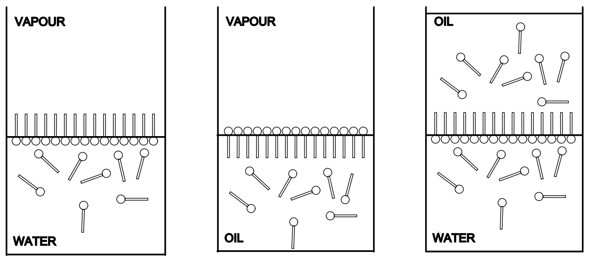
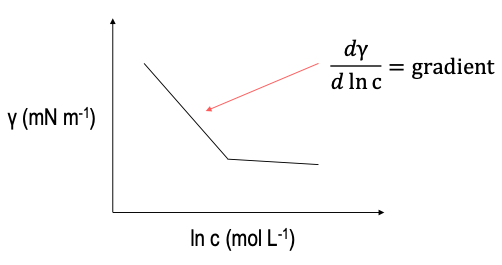
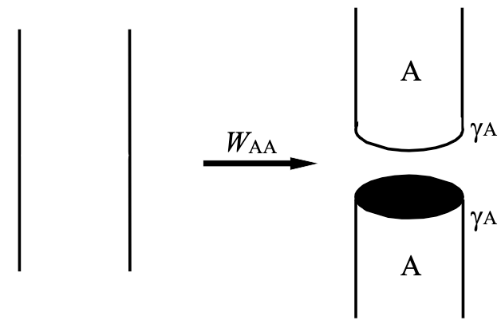
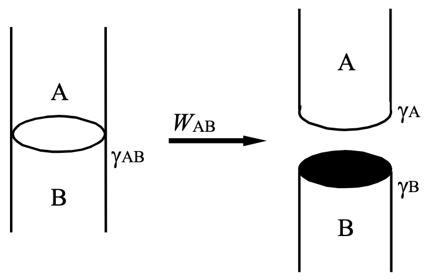
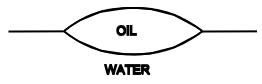
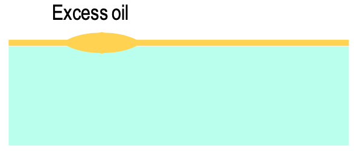

# Orientation and Spreading at Interfaces

Surface active molecules (surfactants) will tend to aggregate strongly at an interface, with an orientation dependent on their affinity for each phase.

{: style="width: 50%; "class="center"}

The surfactant is made up of a hydrophilic head ($X$) and a hydrophobic tail ($R$)

$R$ is a hydrocarbon tail, typically $\ce{C10}$ or longer

* e.g. Cetyl ($\ce{C13}$), dodecyl ($\ce{C12}$), stearic $\ce{C18}$

$X$ is a polar head group

* e.g. $\ce{-OH, -COOR, -COOH, -CN, -CONH2}$

or an ionic head group

* e.g. $\ce{-SO3^-, -OSO3^-}$ (In SDS) $\ce{, -NR3+}$ (in CTAB)

## Excess Surface Concentration

Since they have a tendency to aggregate at surfaces, we need to consider the surface concentration of the molecules. This is calculated as $mol\cdot cm^{-2}$:

$$
\Gamma=-\frac{1}{RT}\frac{dy}{d\ln c}
$$

If we plot $\Delta \gamma$ as a function of $\Delta\ln c$, we get two linear regions, the intersection of which will be the critical micellar concentration (CMC), or the concentration at which no more surfactant can squeeze into the surface 

{: style="width: 40%; "class="center"}

| Liquid         | Surfactant | $\gamma_{L/V}\:(mN\cdot m^{-1})$ ($\gamma$ liquid/vapour) (Surface tension) | $\gamma_{L/W}\:(mN\cdot m^{-1})$ ($\gamma$ liquid/water) (Interfacial tension) |
| -------------- | :--------: | :----------------------------------------------------------: | :----------------------------------------------------------: |
| Water          |     No     |                             72.8                             |                              -                               |
| *n*-octane     |     No     |                             21.8                             |                             50.8                             |
| *n*-octanol    |    Yes     |                             27.5                             |                             8.5                              |
| Heptanoic acid |    Yes     |                             28.6                             |                             6.4                              |

The interfacial tension of water and *n*-octane is so high because the two phases are immiscible, however for *n*-ocanol, and hepatnaoic acid, parts of them will cross the interface and reduce the tension.

## Work of Cohesion ($W_{AA}$)

This can be thought of as the work required to pull a column of liquid A into two sections, or how much energy does it take to make a new interface hence $W_{AA}$, two section of A. To calculate this, it's as simple as:
$$
W_{AA}=2\gamma_{A}
$$
{: style="width: 30%; "class="center"}

## Work of Adhesion ($W_{AB}$)

Similar to the work of cohesion, though this time it's the amount of energy required to split $1\:cm^2$ of  interface $AB$ into two new $\gamma_{L/V}$ interfaces, $A$ and $B$.
$$
W_{AB}=\gamma_A+\gamma_B-\gamma_{AB}
$$
{: style="width: 30%; "class="center"}

| Liquid         | $\gamma_{HC}\:(mN\cdot m^{-1})$ (Surface tension) | $W_{AA}\:(mJ\cdot m^{-2})$ (Work of cohesion) | $\gamma_{L/W}\:(mN\cdot m^{-1})$ (Interfacial tension) | $W_{AB}\:(mJ\cdot m^{-2})$ (Work of adhesion) |
| :------------- | :---------------------------------------------------: | :----------------------------------------------: | :--------------------------------------------------------: | :-----------------------------------------------: |
| Water          |                         72.8                          |                        -                         |                             -                              |                         -                         |
| Heptane        |                         20.0                          |                       40.0                       |                            50.8                            |                       42.0                        |
| Benzene        |                         28.9                          |                       57.8                       |                            34.7                            |                       67.0                        |
| *n*-octane     |                         21.8                          |                       43.6                       |                            50.8                            |                       43.8                        |
| *n*-octanol    |                         27.5                          |                       55.0                       |                            8.5                             |                       91.8                        |
| Heptanoic acid |                         28.6                          |                       57.2                       |                            6.4                             |                       95.0                        |

!!! info "Example 1"
	1. Calculate the work of cohesion for *n*-octane, water as $20^\circ C$ and water at $35^\circ C$ 
	2. Calculate the work of adhesion between *n*-octane and water
	

	* $\gamma_{water}=72.8 mM\cdot m^{-1}$ at ($20^\circ C$)
	* $\gamma_{water}=72.0 mM\cdot m^{-1}$ at ($25^\circ C$)
	* $\gamma_{n-octane}=21.8 mM\cdot m^{-1}$ at ($20^\circ C$)
	* $\gamma_{n-octane/water}=50.8 mM\cdot m^{-1}$ at ($20^\circ C$)
	
	$$
	\begin{align}
	W_{AA-octane}&=43.6\\
	W_{AA-water-25}&=145.6\\
	W_{AA-water-25}&=144.0\\
	W_{AB-water/octane}&=\gamma_{water}+\gamma_{octane}-\gamma_{{n-octane/water}}\\
	&=72.8+21.8-50.8\\
	&=43.8\:mN\cdot m^{-1}
	\end{align}
	$$

## Adhesion and Cohesion

$W_{AB}$ is high for surfactants due to the electrostatic interactions between the polar head group and water, that make it harder to pull apart. Since they increase the amount of work that it takes to separate two phases, they are well utilised as stabilising agents in emulsion.

Commercial surfactants originate from natural materials, such as; the esterification of sugars, sulphonation of alkyl/aryl mixtures, and the sulphonation of alcohols. Some examples include:

* Cetyl trimethylammonium bromide (CTAB) - $\ce{C13H27N+(CH3)3Br-}$
* Sodium dodecyl suphate (SDS) - $\ce{C12H25OSO3^-Na+}$
* Polyethoxates - $\ce{R-CO-(-OCH2CH2)_{x}CH2CH2-OH}$

## Spreading

If a drop of oil is placed on water, there are three possible outcomes:

### 1. There will be no spreading

A lens will be formed as the oil tries to minimise its surface area

{: style="width: 30%; "class="center"}

### 2. The oil will spread to give a thick layer

This will only happen if there is enough oil to form a bulk layer, such as if the vessel is small enough that the oil can make contact with the sides of the vessel. It creates two independent interfaces in this process, one oil/air and one oil/water.

{: style="width: 40%; "class="center"}

### 3. The oil will spread to give a thin layer

In this situation, there isn't of the oil to form a bulk layer, so it will spread to form a monoolecularly thick film, with any excess oil forming lenses at equilibrium. The interfaces in this situation will not be independent of each other, and the result will likely be a rainbow surface, such as you would see from an oil slick

{: style="width: 40%; "class="center"}

## Spreading Coefficient ($S_{B/A}$)

The extent to which the spreading will occur can be expressed in terms of a value, known as the spreading coefficient. this is the difference between the work of adhesion and the work of cohesion. For the spreading of $B$ on $A$, this would look like:

$$
S_{B/A}=W_{AB}-W_{BB}
$$

It can be thought of as a measure of how much $B$ likes itself more than it likes $A$. If $S_{B/A}>0$, it will spread on $A$. We can link this back to surface tensions, to get:

$$
S_{B/A}=\gamma_A-\gamma_B-\gamma_{AB}
$$

This ultimately means that initial spreading will occur if a liquid of **low** surface tension is placed on a liquid of **high** surface tension. The kinetics of spreading are proportional to $S$ and inverse to viscosity.

It's important to note that this is only **initial** spreading, as some of $B$ can dissolve in $A$, which will change the surface tension

!!! info "Example 2 - Calculate the initial spreading coefficient of *n*-octane on water."
	
	* $\gamma_{water}=72.8 mM\cdot m^{-1}$ at ($20^\circ C$)
	* $\gamma_{water}=72.0 mM\cdot m^{-1}$ at ($25^\circ C$)
	* $\gamma_{n-octane}=21.8 mM\cdot m^{-1}$ at ($20^\circ C$)
	* $\gamma_{n-octane/water}=50.8 mM\cdot m^{-1}$ at ($20^\circ C$)
	
	$$
	\begin{align}
	S_{B/A}&=\gamma_A-\gamma_B-\gamma_{AB}\\
	S_{n-octane/water}&=\gamma_{water}-\gamma_{n-octane}-\gamma_{n-octane/water}\\
	&=72.8-21.8-50.8
	&=0.2\:mM\cdot m^{-1}
	\end{align}
	$$
| Liquid        | $S_{A/W}\:(mN\cdot m^{-1})$ (Initial spreading on water) | $S_{A/Hg}\:(mN\cdot m^{-1})$ (Initial spreading on mercury) |
| ------------- | :----------------------------------------------------------: | :----------------------------------------------------------: |
| Oleic acid    |                             24.6                             |                             112                              |
| *n*-octanol   |                             35.7                             |                             102                              |
| $\ce{CS2}$    |                             -8.2                             |                             102                              |
| Vinyl bromide |                             -3.2                             |                              -                               |
| Water         |                              -                               |                              -3                              |
| Hexane        |                             3.4                              |                              79                              |

This assumes that there's no solubility of the two phases, and in the case of $\ce{CS2}$, the two would react, so there would be no spreading

* $\gamma_{\ce{H2O}}=72.8\:(mN\cdot m^{-1})$
* $\gamma_{\ce{Hg}}=480\:(mN\cdot m^{-1})$

## Effect of Impurities

We can reduce the spreading by decreasing the surface tension of the water, for example by adding *n*-octane. Since $S_{n-octane/water}$ is only 0.2, the octane only just spreads, however an impurity that would decrease the surface tension enough to prevent spreading. While octane is considered immiscible, some of it will dissolve in water and decrease the surface tension, resulting in the gradual retraction of the spread *n*-octane.

We can also increase the spreading by decreasing the surface tension of the compound that's being spread. This could be accomplished by adding a surfactant to the oil. This also makes logical sense though, as the surfactant would have an affinity for the water as well and would increase the work of adhesion. 

## Initial Spreading

To demonstrate that the spreading are only initial, benzene on water has an initial positive spreading, when the two phases are considered immiscible:

$$
S_{O/W}^i=72.8-28.9-35.0=8.0\:mN\cdot m^{-1}
$$

After mutual saturation, as $\gamma_{W/A}\to\gamma_{W,B/A}$ ($72.8\to62.2$) and $\gamma_{B/A}\to\gamma_{B,W/A}$ ($28.9\to28.8$):

$$
S_{O/W}^f=62.2-28.8-35.0=-1.6\:mN\cdot m^{-1}
$$

## Spreading and the Young Equation

Spreading coefficients and works of adhesions of liquids can be calculated using a derivation of the Young equation, which relates surface tension to their contact angle, of the angle that the liquids form with the surface over which they are spreading. Given the geometry involved in this, it's best suited to spreading over solid surfaces:

$$
\begin{gather}
W_{AB}=\gamma_A(1+\cos\theta)\\
S_{A/B}=\gamma_A(\cos\theta-1)
\end{gather}
$$

## Applications

### Suppression of Evaporation

To prevent the evaporation of water from lakes and dams, you can spread an incredibly thin layer (monomolecular) of long chain acohols. notably $\ce{C15}$ and $\ce{C18}$ alcohols, at about $0.016\:g\cdot m^{-2}\cdot day^{-1}$

### Prevention of Spreading

Most notably, you don't want the oil in devices to spread everywhere, you want it to remain in place, though it can also be used to prevent the spreading of oil slicks, by adding a strongly adsorbed surfactant that will lower the surface tension of the water.

### Sinking Ducks

To prevent ducks from swimming on lakes, it's possible to add *n*-hexanol, which will drastically reduce the surface tension of the water and make them less buoyant.