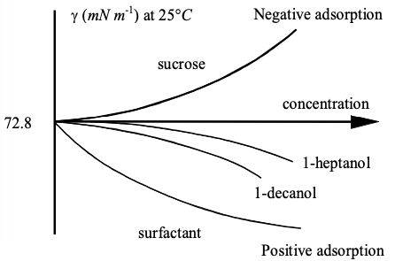
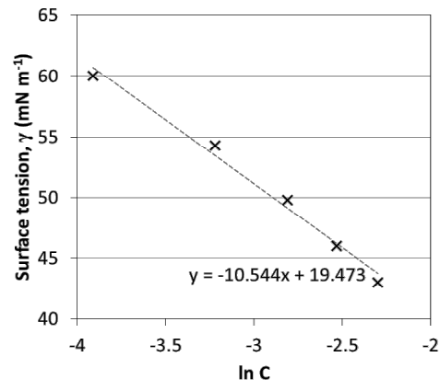
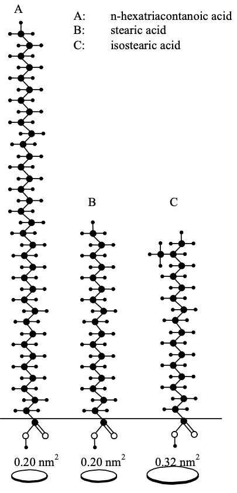

# Adsorption at Interfaces

When molecules adsorb at an interface, the surface tension will change. This means that surface tension can be used as an indicator for the amount of an analyte at the interface. Most solutes will prefer the interface to the bulk, and will as a result decrease the surface tension, in what's called **positive adsorption**. Some species, such as sucrose prefer the bulk over the surface and will increase the surface tension, in what's known as **negative adsorption**.

{: style="width: 50%; "class="center"}

## Gibb's Adsorption Equation

If the surface tension of the system is easily measurable (liquid/vapour or liquid/liquid), we can use the Gibb's adsorption equation to quantify the surface concentration $\Gamma$. It's similar to the [excess surface concentration](../11b/#excess-surface-concentration), with an added activity term ($a_B$):
$$
\Gamma_B^{(A)}=-\frac{1}{RT}\frac{d\gamma}{d\ln a_B}
$$
By measuring the surface tension at different concentrations of $B$, we can determine the degree of adsorption at the interface. The above equation only applies for two component systems (e.g. $\gamma_{L/V}$ of the bulk, with a surfactant). Given that activity is being used, we can only use the relationship $a_B\approx [B]$ in low concentrations

We can tell if there is negative or positive adsorption, by looking at the sign. If $\frac{d\gamma}{d\ln a_B}$ is negative ($\gamma$ decreases with respect to $a_B$), then the adsorption is positive, and vice versa for negative adsorption.

!!! info "Example 1 - Calculate the surface excess concentration and area per molecule of n-pentanol in 0.04 M aqueous solution at 25°C. The surface tension varies with concentration as shown in the following table:"
	
	| Concentration (M)           | 0.00 | 0.02 | 0.04 | 0.06 | 0.08 | 0.10 |
	| --------------------------- | ---- | ---- | ---- | ---- | ---- | ---- |
	| $\gamma$ ($mN\cdot m^{-1}$) | 72.6 | 60.0 | 54.3 | 49.8 | 46.0 | 43.0 |
	
	We can use the Gibb's equation and treat $a_B\approx C_B$, to use the equation:
	
	$$
	\Gamma_{\ce{ROH}}^{\ce{H2O}}=-\frac{1}{RT}\frac{d\gamma}{d\ln \ce{ROH}}
	$$
	
	If we plot $\gamma$ vs $\ln C$ we can obtain a line with gradient $\frac{d\gamma}{d\ln \ce{ROH}}$
	
	| Concentration (M)           | -    | -3.91 | -3.22 | -2.81 | -2.53 | -2.30 |
	| --------------------------- | ---- | ----- | ----- | ----- | ----- | ----- |
	| $\gamma$ ($mN\cdot m^{-1}$) | 72.6 | 60.0  | 54.3  | 49.8  | 46.0  | 43.0  |
	
	{: style="width: 50%; "class="center"}
	
	Plugging this back into the Gibb's equation, we get:
	
	$$
	\begin{align}
	\Gamma_{\ce{ROH}}^{\ce{H2O}}&=-\frac{1}{RT}\frac{d\gamma}{d\ln \ce{ROH}}\\
	&=\frac{-1}{(8.314)(298)}(-10.54\e{-3})\\
	&=4.25\e{-6}\:mol\cdot m^{-2}
	\end{align}
	$$
	
	From here we can calculate the area per molecule by inverting $\Gamma$:
	
	$$
	\begin{align}
	\Gamma_{\ce{ROH}}^{\ce{H2O}}&=4.25\e{-6}\:mol\cdot m^{-2}\\
	\frac{1}{\Gamma_{\ce{ROH}}^{\ce{H2O}}}&=\frac{1}{4.25\e{-6}\:mol\cdot m^{-2}}=2.351\e{5}\:m^2\cdot mol^{-1}\\
	A/molecule&=\frac{1}{\Gamma_{\ce{ROH}}^{\ce{H2O}}N_A}\\
	&=3.922\e{-19}\:m^2\\
	&=39.2\:\AA^2
	\end{align}
	$$

## Area Per Molecule

{: style="width: 20%; "class="right"}

It's been found that long chain aliphatic molecules have a similar packing density and area/molecule, with variation only really coming from any methylations and double bonds. that would reduce the packing density. This is also largely in part due to the fact that only the head is within the liquid phase.

## Dissociating Solutes

For cases where the solute dissociates, we need to add an extra term to account for this. For a 1:1 dissociation:
$$
\Gamma_B^{(A)}=-\frac{1}{\color{red}2\color{black}RT}\frac{d\gamma}{d\ln a_B}
$$
This value should effectively be the sum of the dissociating components, so a 1:2 dissociation would be $3$.

While we expect $\frac{d\gamma}{d\ln a_B}$ to be linear, we may not always get this, so we might need to find the gradient at a specific point

!!! info "Example 2 - The surface tensions of aqueous solutions of sodium dodecyl sulphate (SDS) were obtained at 20°C and plotted (on the next slide) as a function of ln *C*, where *C* is the bulk concentration of this strong electrolyte."
	
	**(a) Give the Gibbs adsorption equation for this strong electrolyte solution.**
	
	SDS dissociates as a 1:1 salt, so the equation would be:
	
	$$
	\Gamma_B^{(A)}=-\frac{1}{2RT}\frac{d\gamma}{d\ln a_B}
	$$
	
	**(b) Calculate the area occupied by each adsorbed molecule of SDS when the adsorption rate is at maximum, at 20 °C. $\frac{d\gamma}{d\ln a_b}=-16.5\e{-3}$.**
	
	$$
	\begin{align}
	\Gamma_{\ce{SDS}}^{\ce{H2O}}&=-\frac{1}{2RT}\frac{d\gamma}{d\ln a_{\ce{SDS}}}\\
	&=-\frac{1}{2(8.314)(293)}(-16.5\e{-3})\\
	&=3.39\e{-6}\:mol\cdot m^{-2}\\
	A/molecule&=\frac{1}{\Gamma_{\ce{ROH}}^{\ce{H2O}}N_A}\\
	&=\frac{1}{(3.39\e{-6}\:mol\cdot m^{-2})(6.022\e{23})}\\
	&=4.89\e{-19}\:m^2\\
	&=48.9\:\AA^2
	\end{align}
	$$

