# X          Contact Angle

For a droplet on a solid surface, there are lots of forces acting on it, notable as there are three distinct interfaces (liquid/vapour, liquid/solid, solid/vapour).

Of the three vectoral forces ($\gamma$ is a vector after all), only $\gamma_{L/V}$ can be easily measured. We can however obtain information about $\gamma_{S/L}$ from $\theta$. If the drop isn't expanding or contracting $\gamma_{S/L}=\gamma_{S/V}$:

$$
\gamma_{L/V}\cos\theta+\gamma_{S/L}=\gamma_{S/V}
$$
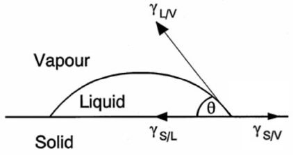{: style="width: 40%; "class="center"}

From a previous lecture, we spoke about [Spreading and the Young Equation](../11b/#spreading-and-the-young-equation). This is where the equations are derived from:

!!! info "Derivation"
	
	For the work of adhesion:
	
	$$
	\begin{align}
	\gamma_{L/V}\cos\theta+\gamma_{S/L}&=\gamma_{S/V}\\
	\therefore\gamma_{S/V}-\gamma_{S/L}&=\gamma_{L/V}\cos\theta\\\\
	W_{AD}&=\gamma_{L/V}+\gamma_{S/V}-\gamma_{S/L}\\
	&=\gamma_{L/V}+\gamma_{L/V}\cos\theta\\
	&=\gamma_{L/V}(1+\cos\theta)\:(J\cdot m^{-2})
	\end{align}
	$$
	
	For the spreading coefficient:
	
	$$
	\begin{align}
	\gamma_{L/V}\cos\theta+\gamma_{S/L}&=\gamma_{S/V}\\
	\gamma_{L/V}\cos\theta&=\gamma_{S/V}-\gamma_{S/L}\\\\
	S_{L/S}&=\gamma_{S/V}-\gamma_{S/L}-\gamma_{L/V}\\
	&=\gamma_{L/V}\cos\theta-\gamma_{L/V}\\
	&=\gamma_{L/V}(\cos\theta-1)\:(N\cdot m^{-1})
	\end{align}
	$$

## Classifying Contact Angles

We can classify a surface's affinity for water based on the contact angle that water makes with the surface:

| Superhydrophilic $\theta\to0^\circ$ | Hydrophilic $\sim10^\circ<\theta<90^\circ$ | Hydrophobic $90^\circ<\theta<\sim150^\circ$ | Superhydrophobic $\theta\to180^\circ$ |
| :------------------------------------: | :-------------------------------------------: | :--------------------------------------------: | :--------------------------------------: |
| 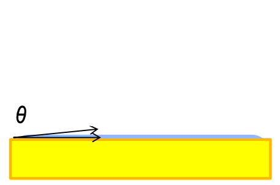                      | 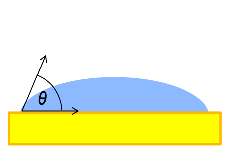                             | 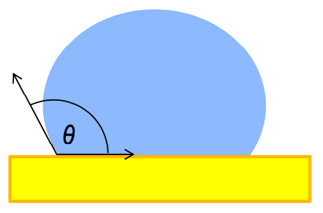                              | 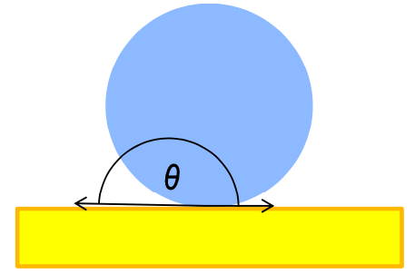                        |

We can never reach $180^\circ$, as this would be tangental and technically not-touching the surface at all.

## Contact Angle Hysteresis

There will be a different contact angle for when the interface is advancing or receding. The difference between these is the contact angle hysteresis

$$
CAH=\theta_A-\theta_R
$$

{: style="width: 40%; "class="center"}

## Surface Roughness

When a surface isn't perfectly smooth, the angles we perceive may not be entirely correct representations. in the image below, the angles on the left are the **perceived** angles and the angles on the right are the **true** angles.

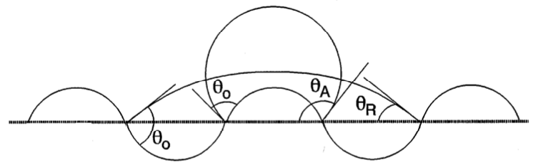{: style="width: 50%; "class="center"}

This might not just occur from topological roughness, but could also be a product of **chemical roughness**, that is, the result of a chemically heterogeneous surface. This would result in a composite angle forming, as per the equation:

$$
\begin{gather}
\cos\theta_c=\sum_if_i\cos\theta_i\\
\text{where }\sum_if_i=1
\end{gather}
$$

## Measuring Contact Angles - Surfaces

When we measure contact angles it's really as simple as putting a small droplet on a plate of the sample and taking a high enough quality image to be able to measure the angle it makes with the plane. We can measure advancing and receding angles by adding volume into the droplet or taking volume out of the droplet.

Since there are two supplementary angles in the equation we can measure both the inner and outer angles to get both the contact angle of the droplet in the bulk and of the bulk in the droplet.

In the example below, we can see a hydrophilic surface pushing an air droplet away in favour of the water and we can see the water sticking strongly to the surface of the material.

| Air bubble in water Receding air Advancing water | Water droplet in air Advancing water Receding air | Air bubble in water Advancing air Receding water | Water droplet in air Receding water Advancing air |
| :--------------------------------------------------------: | :---------------------------------------------------------: | :--------------------------------------------------------: | :---------------------------------------------------------: |
|                     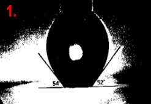                     |                     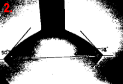                      |                     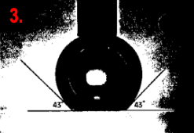                     |                     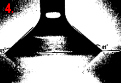                      |

## Measuring Contact Angle - Particles

Since we can't measure the contact angle directly on the surface of a particle, and since the surface of a particle is typically quite rough, we need a different way to measure their contact angle.

Equilibrium methods use the the pressure required to prevent a liquid from entering a packed bed and relates it to $\cos\theta$ using the [Laplace equation](../10a/#surface-tension-measurements). These have the potential to be more accurate than dynamic methods, though it requires us to know the pore size (the space between particles), which can be difficult. 

Dynamic methods involve using the rate of penetration of a liquid into a packed bed of the particles and relates it to $\cos\theta$. They can bypass the pore size by factoring it out of the equation entirely. The trick is that one of the liquids has to completely wet the surface $\cos\theta=0$, which is incredibly difficult and may require surfactants to accomplish.

## Washburn Equation

The contact angle of the particles is measured using the following equation:

$$
\frac{l^2}{t}=\frac{\kappa(\gamma_{L/V}\cos\theta)}{2\eta}
$$
 Where:

* $\gamma_{L/V}=$ surface tension of the liquid
* $\eta=$ viscosity of the liquid
* $\kappa=$ tortuosity factor - accounts for the differences in particle packing (network of capillaries through the material)
* $\frac{l^2}{t}=$ rate of penetration of the liquid ($m^2\cdot s^{-1}$)

The experiment itself is practically run by putting the base of a packed column of the particles into a bed of the liquid and looking at how quickly it rises up the column. In the plot below, we can see that the steeper line represents a more hydrophilic particle as the water has been sucked up the column much faster.

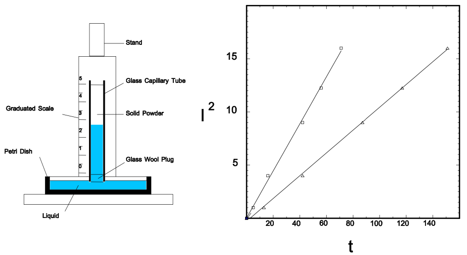{: style="width: 70%; "class="center"}

While the equation is useful if we know $\kappa$, if we don't we need to cancel it out with a non wetting liquid.

$$
\frac{\bigg(\frac{l^2}{t}\bigg)_{NW}}{\bigg(\frac{l^2}{t}\bigg)_{W}}=\frac{\frac{\kappa(\gamma_{NW/A}\cos\theta_{NW})}{2\eta_{NW}}}{\frac{\kappa(\gamma_{W/A}\cos\theta_{W})}{2\eta_{W}}}
$$

This leaves us with the equation:

$$
\cos\theta_{NW}=\Bigg(\frac{\big(\frac{dl^2}{dt}\big)_{NW}}{\big(\frac{dl^2}{dt}\big)_{W}}\Bigg)\Bigg(\frac{\gamma_{W/A}\eta_{NW}}{\gamma_{NW/A}\eta_{W}}\Bigg)
$$

!!! info "Example 1 - The pressure required to prevent liquid from entering a plug of a finely divided solid is twice as great for a liquid of surface tension $50\:mN\cdot m^{-1}$ , which completely wets the solid, as it is for a liquid for surface tension $70\:mN\cdot m^{-1}$ , which has a finite contact angle with the solid. Calculate this finite contact angle."
	
	For this we need to substitute the [Laplace equation](../10a/#surface-tension-measurements) into out relationship:
	
	$$
	\begin{align}
	\text{Wetting liquid 1:}\\
	\Delta P_1&=\frac{2\gamma_1\cos\theta_1}{r}\\
	\gamma_1&=70\:mN\cdot m^{-1}\\
	\theta_1&=o^\circ\\
	\text{Non-Wetting liquid 2:}\\
	\Delta P_2&=\frac{2\gamma_2\cos\theta_2}{r}\\
	\gamma_2&=50\:mN\cdot m^{-1}\\
	\Delta P_2&=2\Delta P_1\\\\
	\text{The Relationship:}\\
	\frac{\Delta P_2}{\Delta P_1}&=\frac{\frac{\cancel{2}\gamma_2\cos\theta_2}{\cancel{r}}}{\frac{\cancel{2}\gamma_1\cos\theta_1}{\cancel{r}}}\\
	\frac{\Delta P_2}{\Delta P_1}&=\frac{\gamma_2\cos\theta_2}{\gamma_1\cos\theta_1}\\
	\frac{2\cancel{\Delta P_1}}{\cancel{\Delta P_1}}&=\frac{\gamma_2\cos\theta_2}{\gamma_1\cos\theta_1}\\
	2&=\frac{\gamma_2\cos\theta_2}{\gamma_1\cos\theta_1}\\
	\cos\theta_1&=\frac{\gamma_2\cos\theta_2}{2\gamma_1}\\
	\theta_1&=\cos^{-1}\bigg(\frac{\gamma_2\cos\theta_2}{2\gamma_1}\bigg)\\
	&=\cos^{-1}\bigg(\frac{(50\e{-3})\cos(0^\circ)}{2(70\e{-3})}\bigg)\\
	&=\cos^{-1}\bigg(\frac{(50\e{-3})\cos(0^\circ)}{2(70\e{-3})}\bigg)\\
	&=69
	\end{align}
	$$
