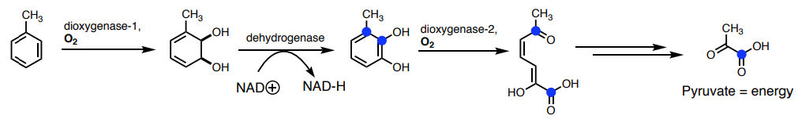
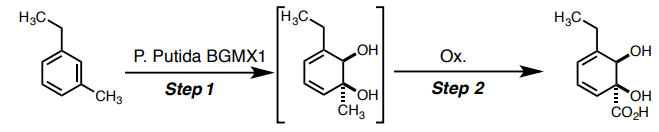
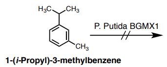
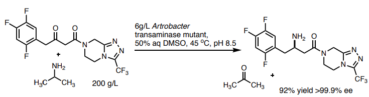

# Biocatalysis

Some biocatalysis content is on the [previous page](../09a/#catalytic-antibodies)

Biocatalysis uses enzymes to achieve reactions that have a commercial value, outside of the biological context in which they were 'designed' to work in. These enzymes come from two primary sources:

* Naturally occurring enzymes that serve a convenient function
* Enzymes that are made via directed evolution

## Naturally Occurring Enzymes

The use of naturally occurring enzymes to synthesise useful chemical products is typically done as a "whole cell" process (the whole microbe is used), so there are limitations in:

* How the substrate can gain access to the enzyme - membrane permeability, osmotic pressure, etc.
* How the product is to be isolated - the cells need to be destroyed and the product extracted

For example, various bacteria have evolved to exploit toluene and convert it into pyruvate. The method it uses is essentially a 2+2 cycloaddition with $\ce{O2}$ which is added across one of the aromatic bonds enzymatically. this is incredibly difficult to do without a catalyst.

{: style="width: 90%;" class="center"}

If we take the enzyme responsible (dioxygenase-1) and clone it into a new bacteria that doesn;t have the dehydrogenase we can make new and useful products as shown below.

{: style="width: 60%;" class="center"}

### Characteristtics

Based on how these enzymes are formed, they will typically be based on the manipulation of cheap and readily available compounds, such as those found in natural systems.

They will also often utilise chemistry that we can't accomplish in the lab, due to the nature of how enzymes work, though enzymes also have an incredibly finite scope of working conditions. starting materials with slight differences might not work with the enzyme that's been isolated. As shown below, even an extra methyl group can be enough to prevent the substrate from reacting.

{: style="width: 35%;" class="center"}

## Directed Evolution Biocatalysis

It is possible to encourage the evolution of enzymes on a particular direction that will work in our favour. This occurs in a feedback cycle between $\ce{mutation <=> selection}$. By carefully controlling the environment in which these bacteria evolve, we can slowly direct the evolution in our favour.

One big limitation is that enzymes are almost always aqueous, yet organic chemistry is often not. In the example below, we have a situation in which the enzymes have been selected enough that they operate in 50% DMSO, high temperature and at a high pH, which allowed for high solubility of the starting material.

{: style="width: 80%;" class="center"}