# Transition Metal Catalysis 1

## LUMO Lowering Through Lewis Acids

We didn't really cover it last week, despite using it for some chemistry, so here is the Michael Addition. Simply put, a Michel acceptor is an α,β-unstaurated ketone, enone or enal, and the Michael donor is a carbon nucleophile.

As spoken about in last weeks's lecture, they can be accelerated through the formation of iminium, or through LUMO lowering from a Lewis acid.

???+ info "Mechanism"
	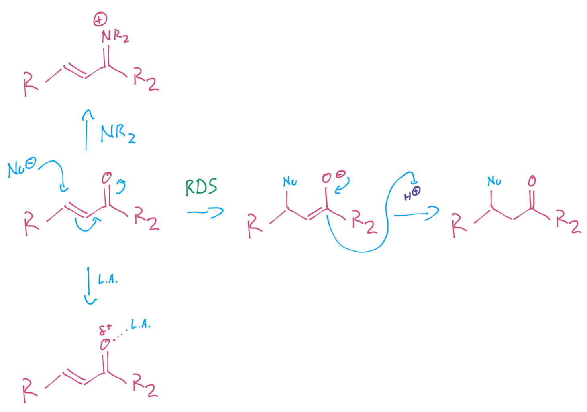{: style="width: 70%;" class="center sharp"}

### TM Lewis Acids

Transition metals can make quite a good choice as a Lewis acid, as they can be made to have specific chiral ligands that will promote the formation of a specific reactant (stereochemically).

> "If We can coordinate a Lewis acid with a carbonyl, we can lower its LUMO"

In this particular reaction, it doesn't require catalysing to proceed, but we can make it happen faster and with a more favourable enantiomeric outcome.

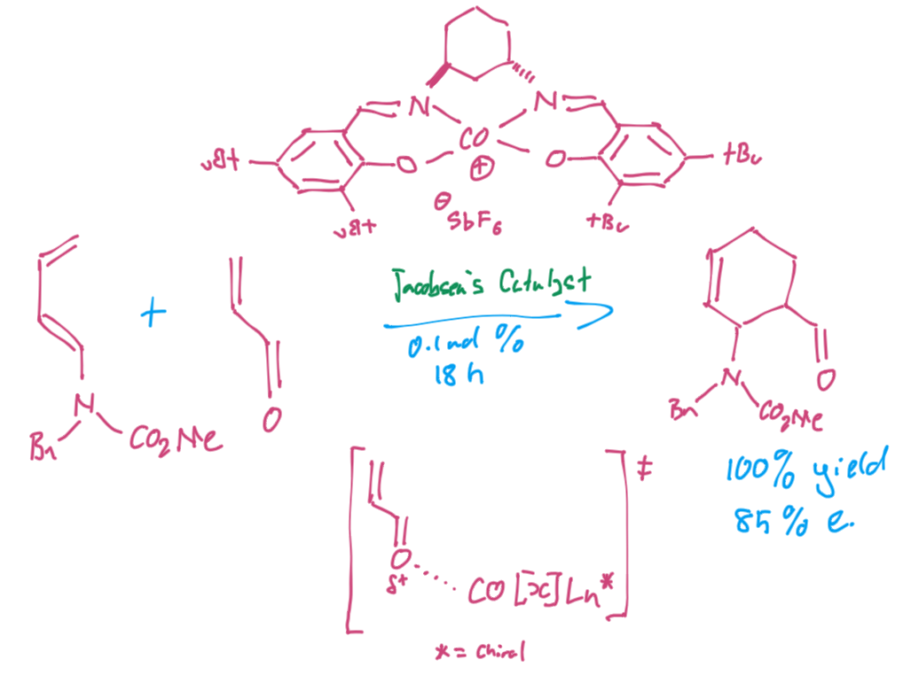{: style="width: 60%;" class="center sharp"}

### LUMO lowering of Michael Addition (Ni)

We can use a bidentate ligand to coordinate with both the carbonyl and the thiocarbonyl, withdrawing electron density from both of them.

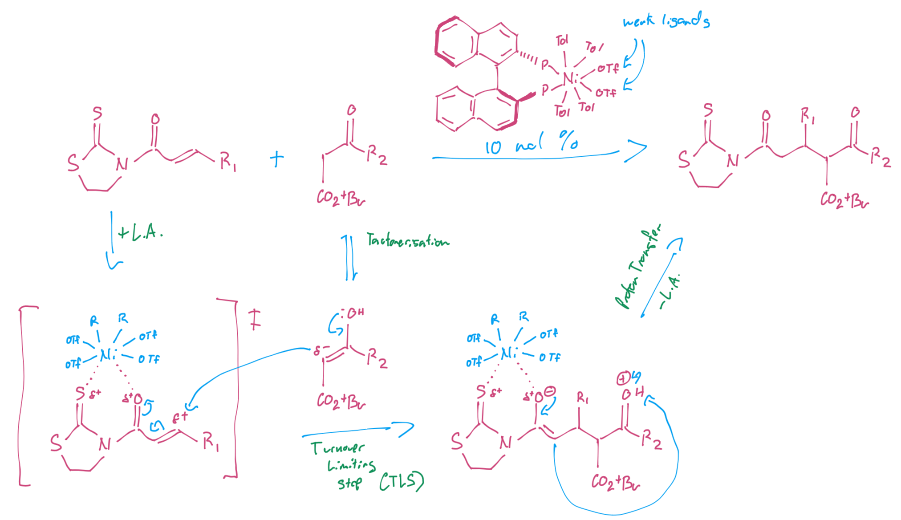{: style="width: 90%;" class="center sharp"}

In this situation the thiocarbonyl section is also there to force the TM catalyst to orient itself properly and place one of the aromatic groups over the Michael acceptor. Through π-stacking interactions, this blocks the top face and ensures the Michael donator can only attach form the other side, promoting a specific stereochemistry.

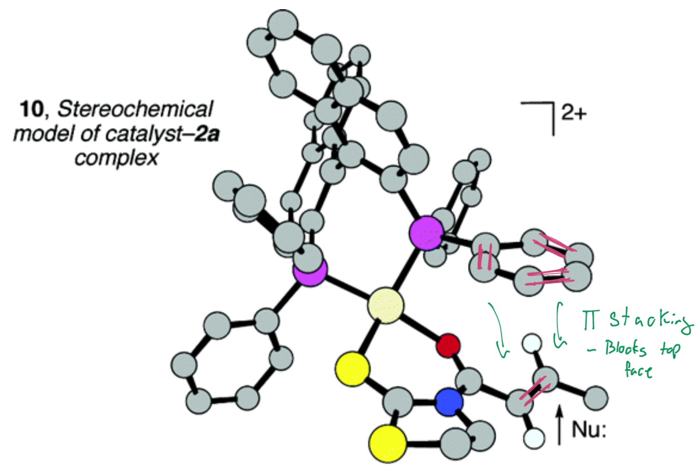{: style="width: 40%;" class="center sharp"}

This reaction continues further though to form a cyclic product and removing the thiocarbonyl group at the same time.

The proton that's being pulled off will be the most acidic as the resonance structure of its intermediate will be stabilised. It also exists α to two different carbonyl groups and will be highly labile as a result.

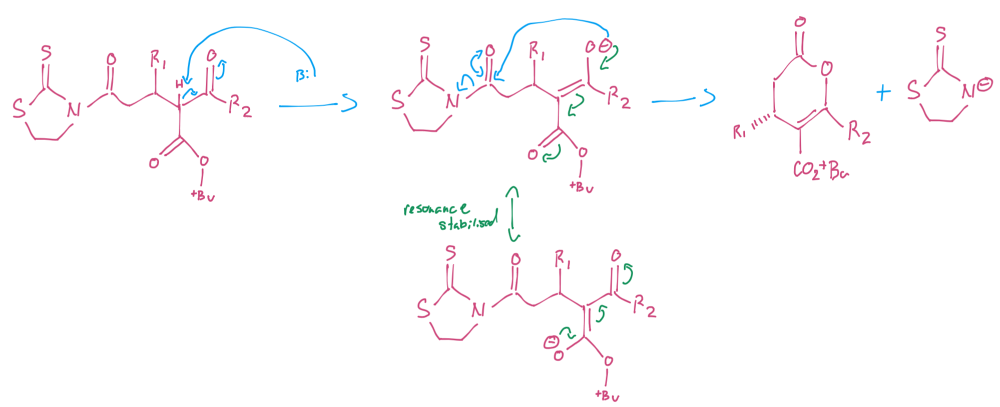{: style="width: 90%;" class="center sharp"}

## Transition Metal Reaction Types

To be able to describe the behaviour of transition metals in organic chemistry, we need to learn the terminology of organometallic chemistry:

### Ligand Association/Dissociation

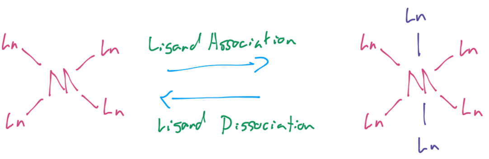{: style="width: 60%;" class="center sharp"}

### Oxidative Addition/ Reductive Elimination and Transmetalliation

By removing or adding components we can oxidise and reduce the TM, changing it's nucleophilicity/electrophilicty, and we can also move ligands from one metal centre to another. These metal centres may not be quite typical, such as alkali metals, or even boron compounds. These processes are the backbone of cross coupling.

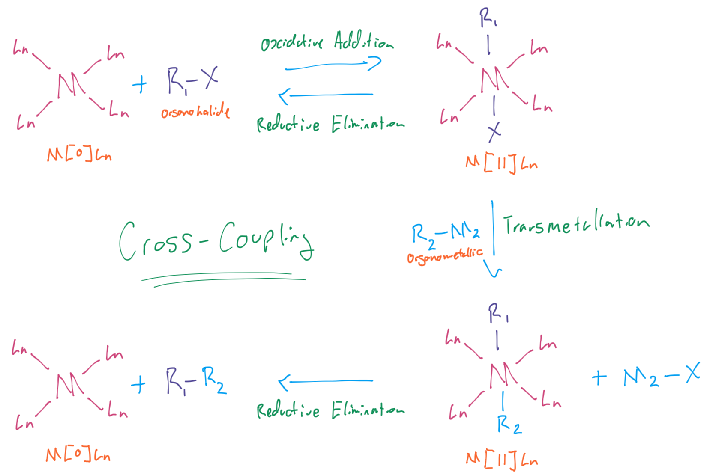{: style="width: 80%;" class="center sharp"}

### Nucleophilic Attack

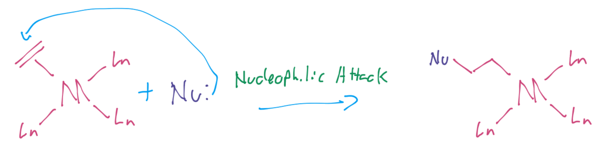{: style="width: 60%;" class="center sharp"}

### Migratory Insertion and β-Elimiation

These are more trick and involve the ligands reacting with each other, or the metal reacting with one of the ligands.

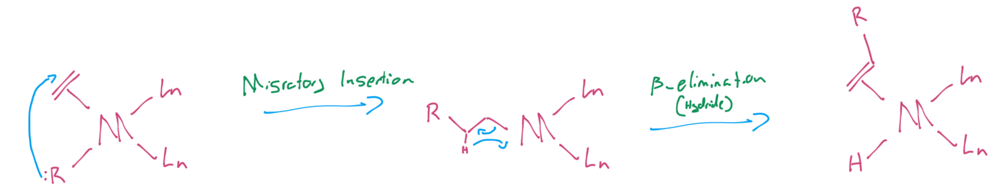{: style="width: 90%;" class="center sharp"}

## Cross Coupling

### Stille Cross Coupling

Stille cross coupling was one fo the first cross coupling methods and is incredibly value due to how generalise the method is.

It is at it's core, a reaction that binds a $\ce{C(sp^2)}$-halide to a $\ce{C(sp^2)-Sn(R)3}$ compound through the use of a $\ce{Pd[0]Ln/Pd[II]Ln}$ catalytic cycle.

Common palladium catalysts include $\ce{Pd2(dba)3}$ and $\ce{Pd(Ph3P)4}$, (formed as $\ce{Pd(ACo)2 + Ph3P ->Pd(Ph3P)4}$).

Unfortunately, it's use is limited as tin is a toxic metal, so this can't be used for medical chemistry applications.

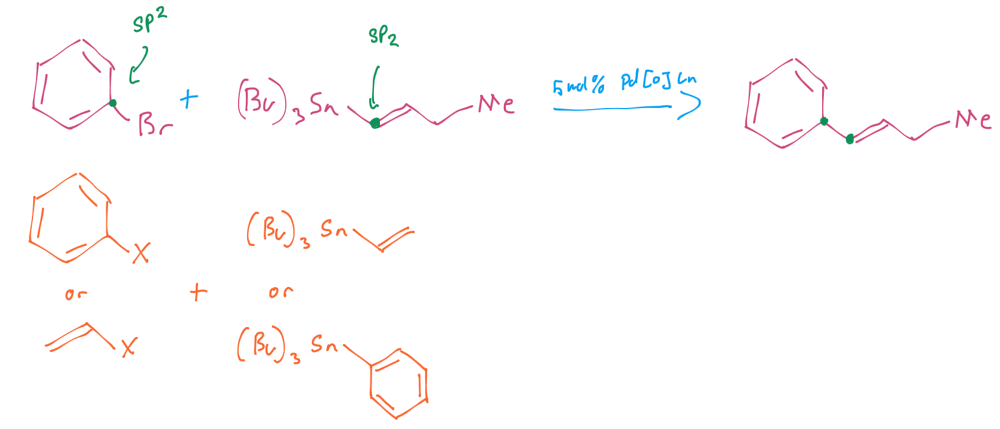{: style="width: 80%;" class="center sharp"}

These catalytic cycles occur in three mechanistic steps:
Oxidative addition → Transmetallation → Reductive elimination

???+ info "Catalytic Cycle"
	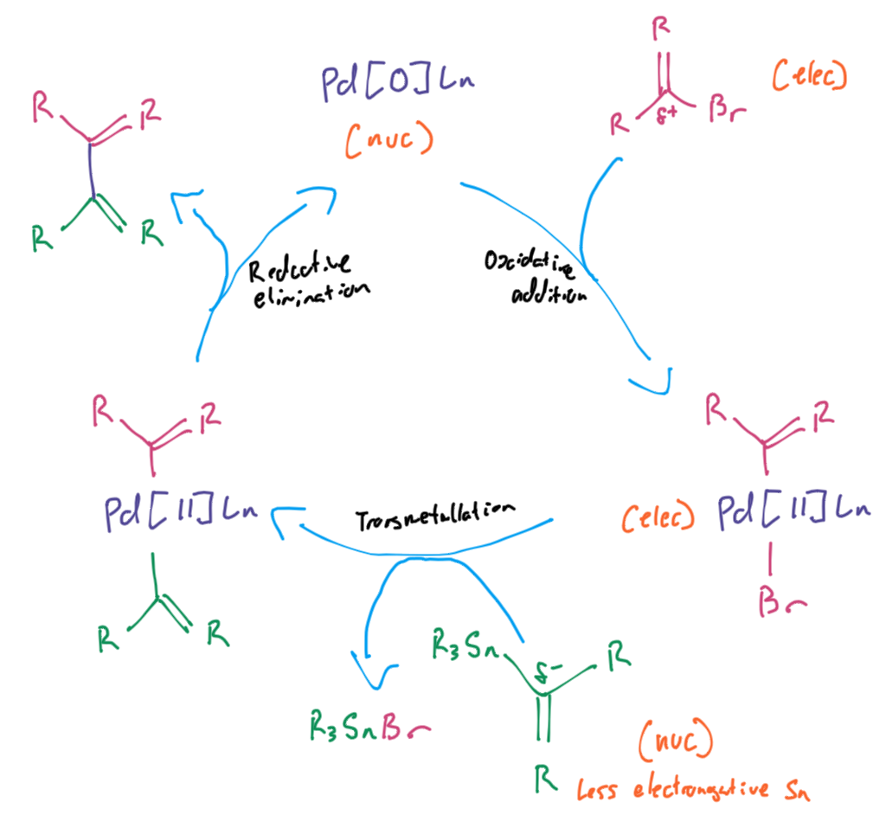{: style="width: 60%;" class="center sharp"}

#### Why $sp^2$?

If you try to cross couple with an $sp^3$ hybridised carbon, if there's a proton free, it will undergo β-hydride elimination and form a double bond in it's place.

{: style="width: 60%;" class="center sharp"}

### Suzuki-Miyaura

To try and remove the limitation of using tin based catalysts, the Suzuki-Miyaura cross coupling method was invented, winning Akira Suzuki the Nobel prize in 2010, as it's the "most important cross coupling tool".

It is almost identical to the Stille cross coupling method except that instead of using tin, it uses boronic acids or boronic esters, and it also requires the use of a salt-hydroxide source to operate. This works because boron sits on the cusp of being a metal and non-metal, so in this circumstance it can be used as an organoborane which behaves like an organometal.

!!! note
	While the Suzuki-Miyaura cross coupling has been an invaluable tool for the med-chem community, it's become such a crutch for cross coupling that the majority of drugs that exist, include $\ce{C(sp^2)-C(sp^2)}$ bonds. The issue here is that aromatic chemistry is quite often not the most functional in terms of drug design, and has resulted in a plethora of non-useful drugs entering testing, without necessarily being the best candidates.

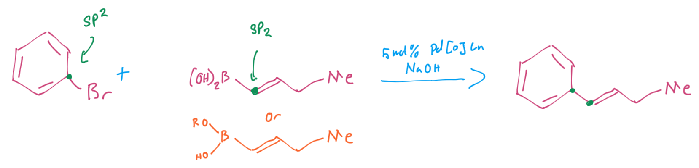{: style="width: 70%;" class="center sharp"}

The hydroxide source has multiple functions, but one is to activate the boron to form the boronate ion that's needed for the cross coupling to work.

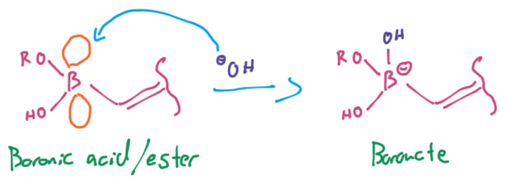{: style="width: 40%;" class="center sharp"}

The Suzuki-Miyaura cycle also has an extra transmetallation step involved in which the halogen ligand will be substituted for the hydroxide.
???+ info "Catalytic Cycle"
	{: style="width: 70%;" class="center sharp"}

### Suzuki-Miyaura in the Synth of Losartan

Looking a the structure of the drug Losartan, we can use retrosynthesis to figure out how it might have been made, by breaking the $\ce{C(sp^2)-C(sp^2)}$ bonds and cutting next to heteroatoms.

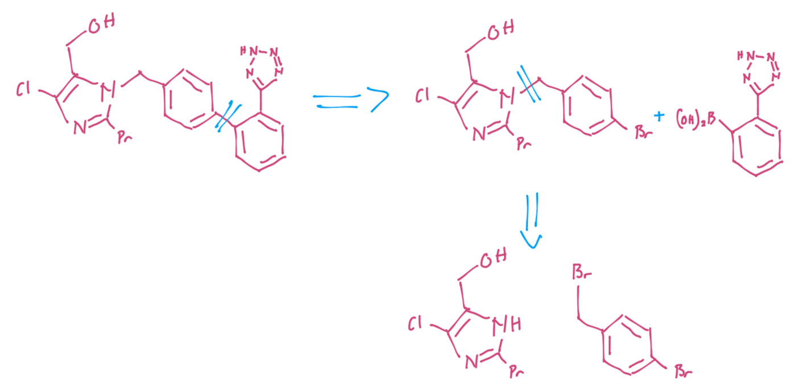{: style="width: 70%;" class="center sharp"}

If we look at how it's actually synthesised, we can see that this is exactly how they did it, with a few minor additions.

We can see that the first connection is a simple addition of the pyrrole anion in an $SN_2$ reaction. The proton can be removed with a weak acid as the anion is resonance stabilised. The next step just involves reducing the ketone to an alcohol, before undergoing our cross coupling reaction.

!!! note
	This synthesis uses a method called "telescoping" in which multiple steps are chained together to avoid trying to purify out difficult to separate intermediates. here, the telescoping means that the second intermediate can be left in solution for reduction.
	

	This synthesis also stars with a relative complex molecule, however since it's not protected under patent, it can be manufactured in China for very little cost and imported to other countries to be finished.

As we'll see later, these cross coupling reactions can be chemoselective to different halides (leaving groups), so the bromine will be attacked rather than the chlorine.

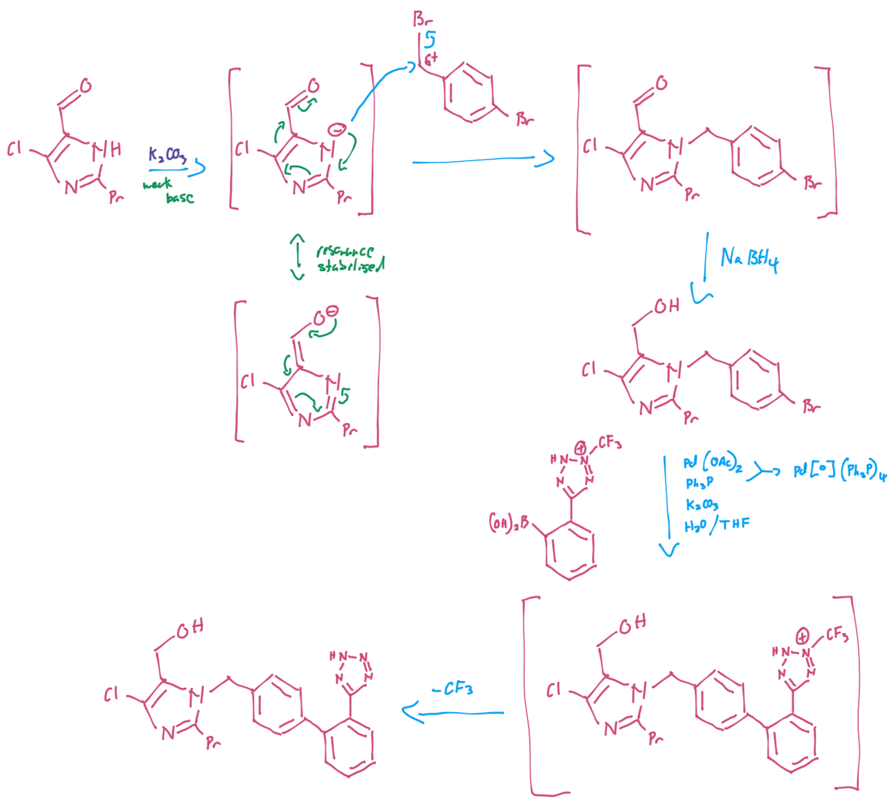{: style="width: 80%;" class="center sharp"}

### Synthesising Lipitor

As an example of a commercial product, we can retrosynthetically analyse the molecule Lipitor, to see how it could be made.

We can see that his molecule can be broken down into sections with each section having a specific reactivity for building it:

* The two fluorobenzene groups  are joined in an $\ce{C(sp^2)}$-$\ce{C(sp^2)}$ bond, that implies that they were likely cross coupled on
* The classic aromatic group next to a carbonyl (amide) can easily be accomplished with a Friedels-Craft alkylation
* The core pyridine ring can be made from the dehydration of a 1,4-diketone 
* And the hydroxylated fatty acid tail is made of 1,3-oxy components, implying simple, normal polarity nucleophilic addition between the carbonyl groups.

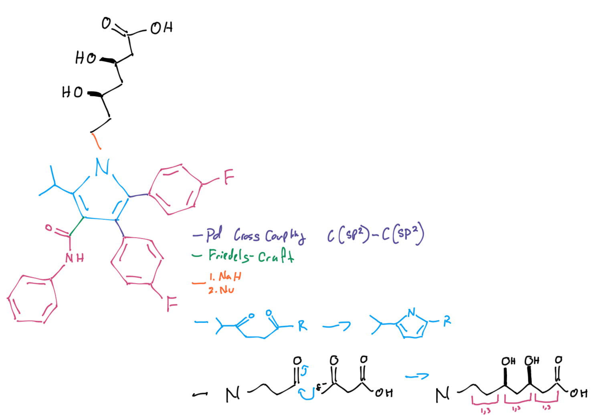{: style="width: 80%;" class="center sharp"}

### Replacing Pd with Ni

There's a few big reasons to replace palladium with nickel:

1. It's significantly less toxic
2. Nickel is much cheaper, at \$58/kg, compared to palladium's \$13,632/kg
3. Nickel has a unique reactivity compared to palladium

#### Unique Reactivity of Ni

This particular reaction is one that's been able to be accomplished with Ni instead of Pd

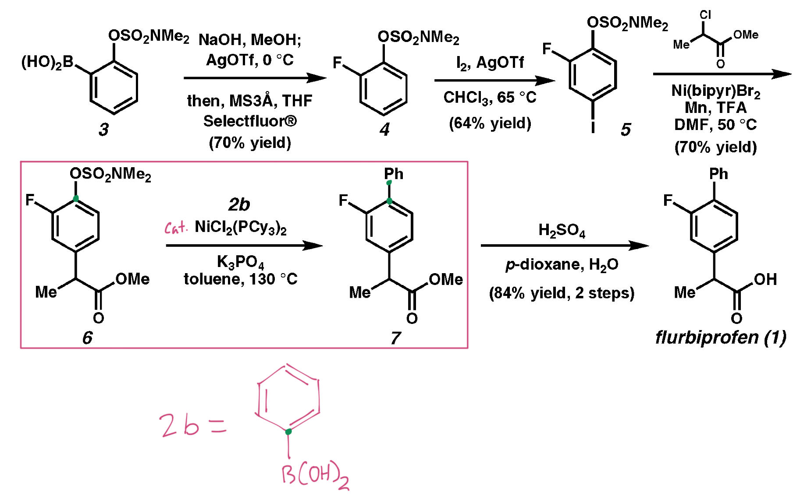{: style="width: 80%;" class="center sharp"}

Because it has distinctive reactive properties, Ni will react with the pseudo-halide (sulphonate group) instead of the fluorine group

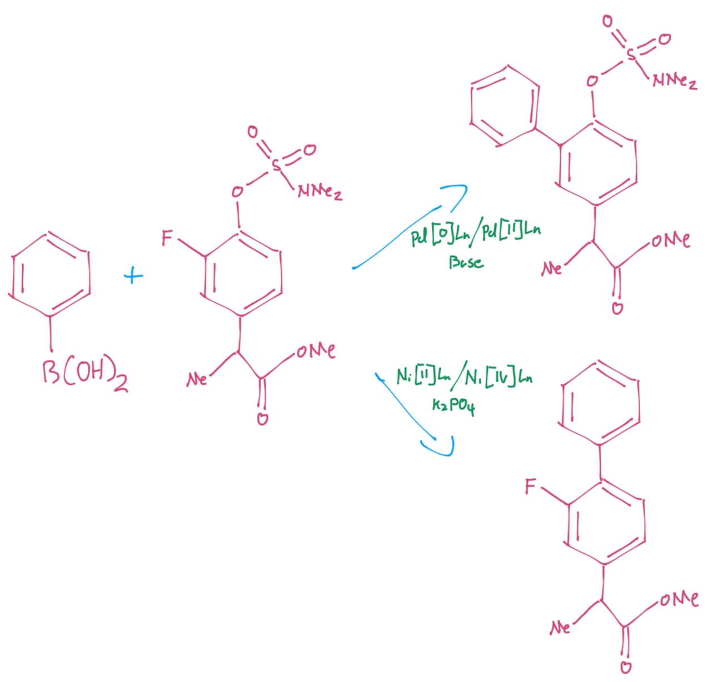{: style="width: 60%;" class="center sharp"}

### Leaving Groups (Chemoselectivity)

Which means that we need to talk about the effectiveness of the leaving groups. While formally, we need halides, we can also use sulphonate groups to give us similar reactivity to bromine. It's worth noting that fluorine isn't on this list, and that's because it has other considerations (beyond this unit) and isn't truly comparable.

{: style="width: 60%;" class="center sharp"}
