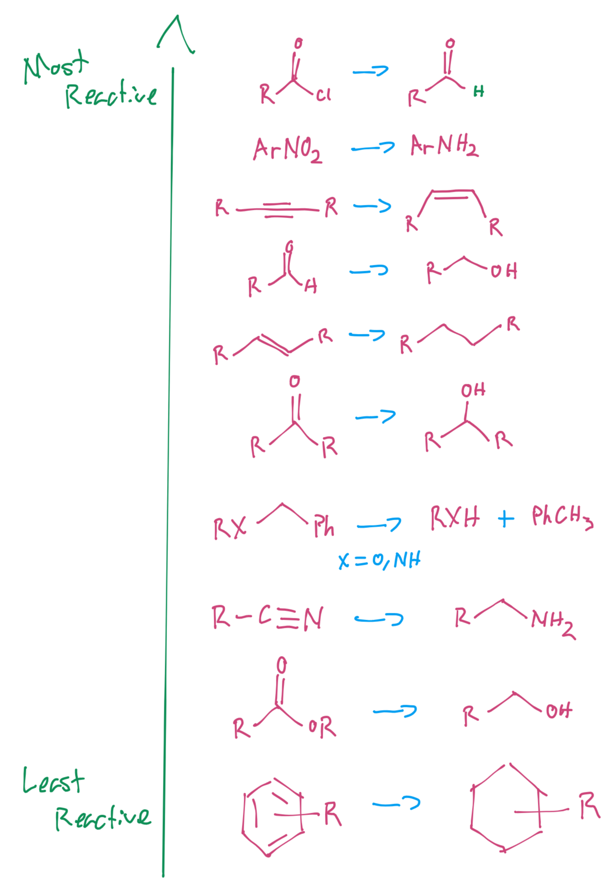
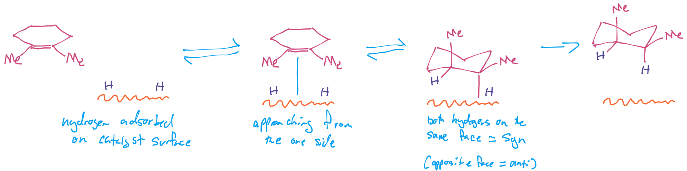
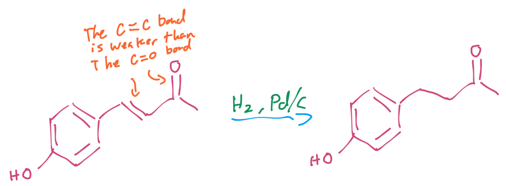
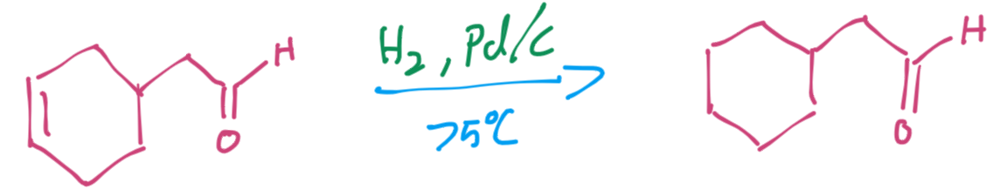
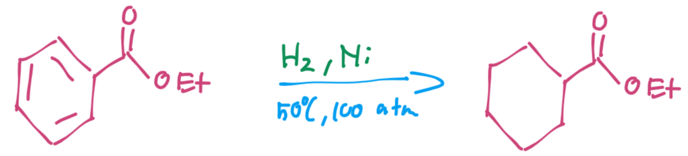
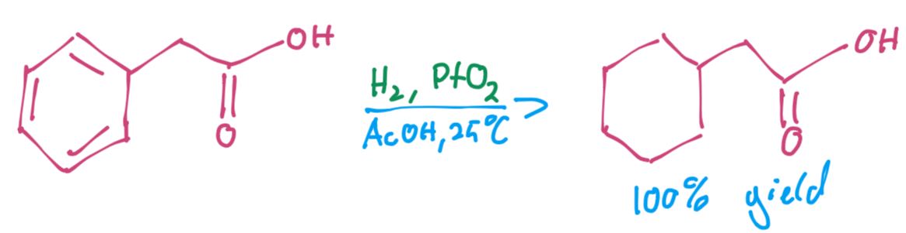
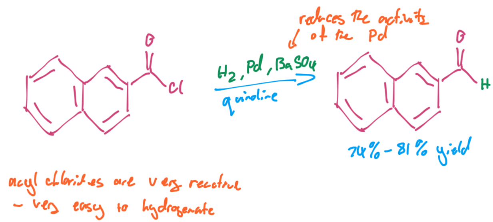
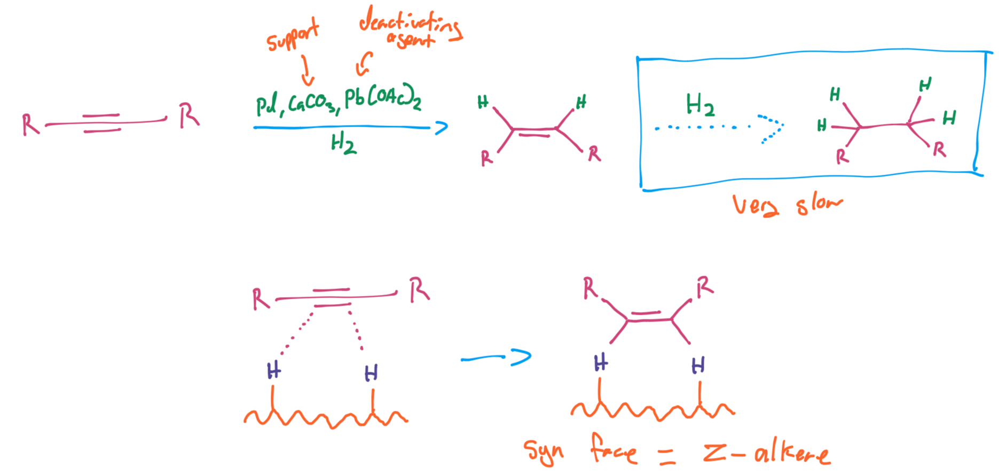
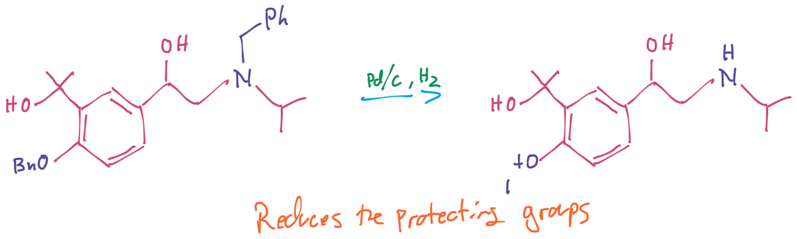

# Chemoselectivity - Hydrogenation

{: style="width: 40%;" class="center sharp"}

| Reagent                                                      | Name                                | Function                                                     |
| ------------------------------------------------------------ | ----------------------------------- | ------------------------------------------------------------ |
| $\ce{-H2, Pd/C}$ in $\ce{MeOH}$ or $\ce{EtOH}$ at $75^\circ C$ | Palladium on carbon                 | mild - won't hydrogenate aromatics $\ce{RC#CR -> H2RC-CRH2}$ $\ce{}$  $\ce{R2C=CR2 -> HR2C-CR2H}$ $\ce{OR -> OH}$ $\ce{NR_{x} -> NH_{x}}$ |
| $\ce{-H2, Pd/BaSO4}$                                         | Reagents for the Rosenmund Reaction | deactivating substrate                                       |
| $\ce{-H2, Pd/CaCO3, Pb(OAc)2}$                               | Lindlar’s catalyst                  | deactivating substrate and $\ce{Pb(OAc)2}$ alkyne → alkene (→ alkane is very slow) |
| $\ce{-H2, PtO2}$ in $\ce{AcOH}$ at $25^\circ C$              | Adam’s catalyst                     | aromatics → cyclic alkane                                    |
| $\ce{-H2, Ni}$ at $50^\circ C, 100\:atm$                     |                                     | aromatics → cyclic alkane                                    |

| Substrate                                 | Usual choice of metal           |
| ----------------------------------------- | ------------------------------- |
| Benzyl amine or ether (protecting groups) | Pd                              |
| Alkene                                    | Pd, Pt, or Ni                   |
| Aromatic ring                             | Pt, or Rh, or Ni under pressure |

## Surface Catalytic Hydrogenation

the process of catalytic hydrogenation is different to nucleophilic reducing agents in that it takes place on the surface of metal particles. The metal particles are finely divided and mixed with a support.

!!! note
	
	Since it is a surface catalytic process, the products will be on the same face (syn configuration).

{: style="width: 80%;" class="center sharp"}

## Hydrogenation of alkenes

This is pretty simply done with palladium on carbon (Pd/C)

{: style="width: 50%;" class="center sharp"}

And will work on cyclic structures as well as linear ones

{: style="width: 50%;" class="center sharp"}

## Hydrogenation of Aromatic Rings

Stronger catalysts will also be able to hydrogenate aromatic rings to cyclic alkanes, such as nickel under pressure, or $\ce{PtO2}$

{: style="width: 50%;" class="center sharp"}

{: style="width: 50%;" class="center sharp"}

## Hydrogenation of Acyl chlorides → Aldehydes (Rosenmund Reaction)

Acyl chlorides are really easy to hydrogenate, so to ensure that nothing else is reacted, we can use ==the $\ce{BaSO4}$ support which will allow the products to escape before being over-reduced to an alcohol==. It is a deactivating substrate.

{: style="width: 50%;" class="center sharp"}

## Alkyne → Alkene (Lindlar's Catalyst)

Lindlar's catalyst is selective for the alkyne to alkene hydrogenation. Alkenes are typically easily hydrogenated to alkanes, but the reagent is on a deactivating substrate, as well as being "poisoned" with the lead. This causes the reduction form alkene → alkane to be manageably slow.

{: style="width: 80%;" class="center sharp"}

## Hydrogenolysis of Benzyl Ethers and Amines (Protecting Groups)

Protecting groups are useful for ensuring that only the correct groups will react, however once the reaction is done, they need to be lysed back to their intended form. In this case, back to a tertiary alcohol and secondary amine

{: style="width: 50%;" class="center sharp"}

{: style="width: 60%;" class="center sharp"}