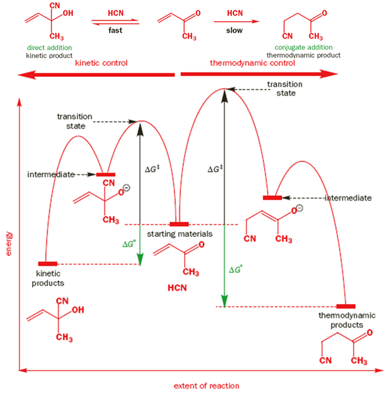
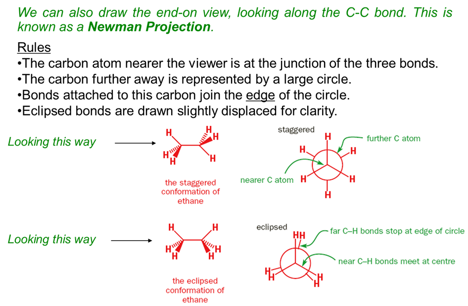
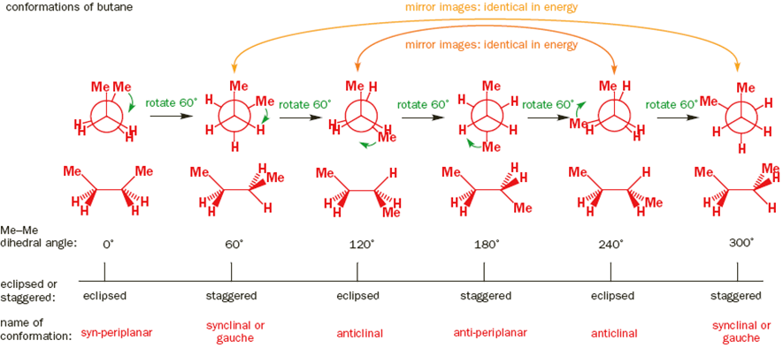
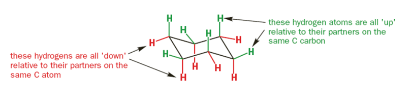
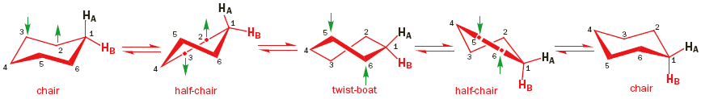
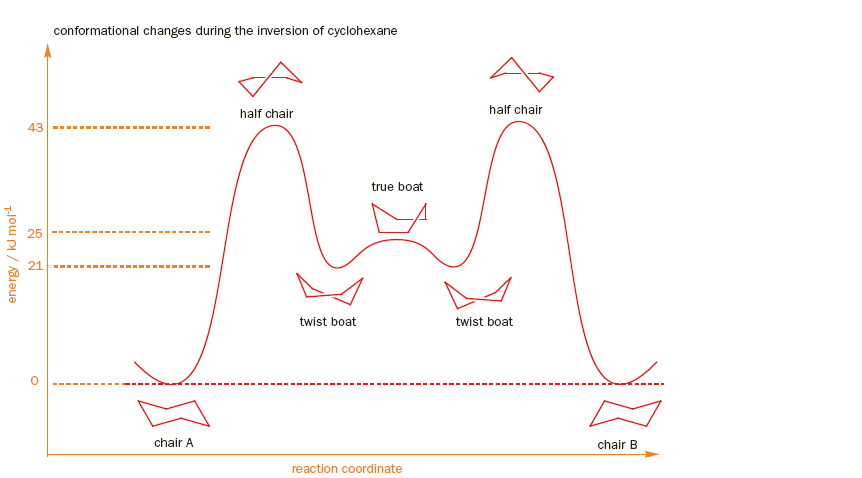
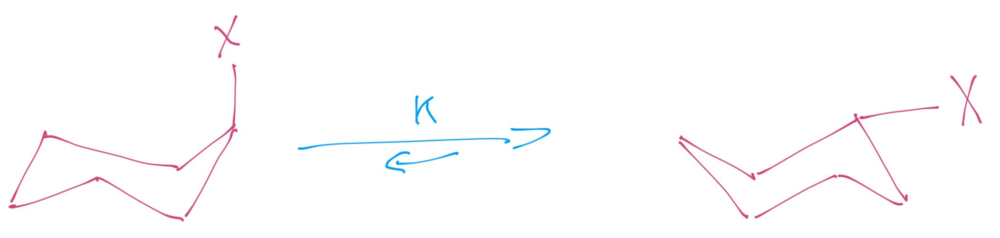
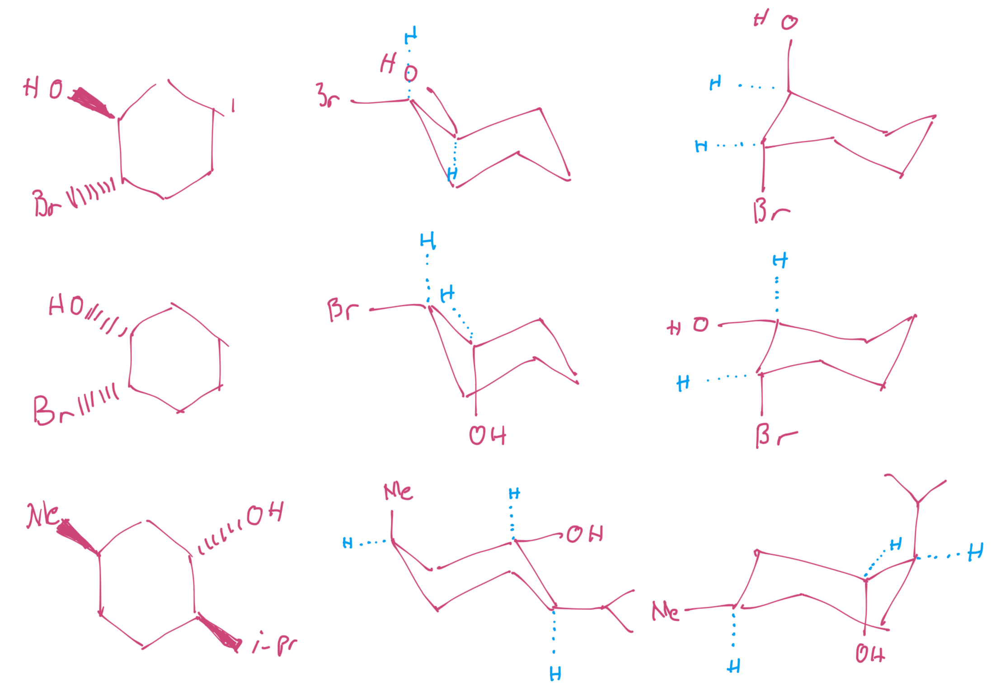
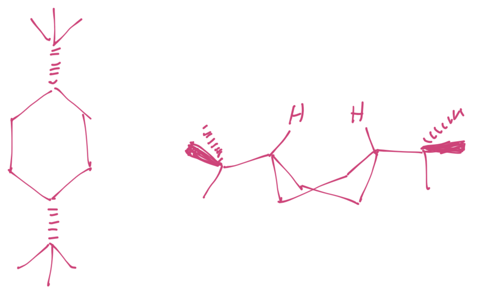

# Thermodynamic Control and Conformational Analysis of Linear/Cyclic Alkanes

## Thermodynamic Control

!!! info "Definition"
	Kinetic Products: Are the rapidly forming products with low energy barriers 
	Thermodynamic Products: Are the products with the lowest total energy. while these may have a higher energy barrier, if enough energy is provided to overcome it, the kinetic reaction can travel backwards and produce this product. It is an irreversible reaction.

In the figure below, the kinetic reaction results in different products than the thermodynamic reaction, meaning that there is a *regioselective* property to this process. The kinetic product can be selected for by limiting the temperature of the reaction.

**Kinetic chemoselectivity** is where the reaction at one functional group is faster than the other. **Thermodynamic Chemoselectivity** is where the most energetically most stable product predominantes 

{: style="width: 60%;" class="center sharp"}

## Conformational Analysis of Linear Alkanes

As we know from second year organic chemistry, alkanes can have rotamers, each with different energy configurations based on how much steric hinderance the groups experience. These can be represented in Newman Projections along the length of the bond to assess the amount of hinderance. The configurations can either be staggered (offset) or eclipsed (in line)

{: style="width: 60%;" class="center sharp"}

As we rotate through the full dihedral of the bond ($-180^\circ -> 180^\circ$), we will go though different amounts of steric hinderance, with each of the eclipsed conformations being a local maxima (energy barrier).

{: style="width: 60%;" class="center sharp"}

## Conformational Analysis of Cyclic Alkanes

Things get slightly more complex for cyclic alkanes, as carbon in a cycloalkane ring will alternate in an up or down fashion. While we can't classify the position of the carbons, we can classify the structure by whether the substituents ==point out from the ring (equatorial), or up/down from the ring (axial).==

{: style="width: 60%;" class="center sharp"}

However, these are not fixed and the ring can "invert" so that all of the equatorial substituents become axial and all the axial substituents become equatorial.

{: style="width: 60%;" class="center sharp"}

There is an energy barrier involved in the process however, just as there is with the rotation of a rotamer.

{: style="width: 60%;" class="center sharp"}

When they ring flip, the two conformers will change the nature of their substituents in an equilibrium between the two geometries

{: style="width: 40%;" class="center sharp"}

Depending on the substituent and how bulky they are, these will have a drastically different equilibrium between the two

{: style="width: 60%;" class="center sharp"}

| X           |   K   | Energy difference ($KJ\cdot mol^{-1}$) | % equatorial |
| ----------- | :---: | :------------------------------------: | :----------: |
| $\ce{H}$    |   1   |                   0                    |      50      |
| $\ce{Me}$   |  19   |                  7.3                   |      95      |
| $\ce{Et}$   |  20   |                  7.5                   |      95      |
| $\ce{i-Pr}$ |  42   |                  9.3                   |      98      |
| $\ce{t-Bu}$ | >3000 |                  \>20                  |    \>99.9    |
| $\ce{OMe}$  |  2.7  |                  2.5                   |      73      |
| $\ce{Ph}$   | 11.7  |                  11.7                  |      99      |

For multiple substituents, we can simply compare the hinderance that each conformer will experience to determine the most stable configuration

{: style="width: 60%;" class="center sharp"}

Though sometimes, when the hinderance is just too great, we'll end up with a twist boat, as the two groups avoid each other

{: style="width: 40%;" class="center sharp"}