#  Conformational Analysis

!!! note "Definitions"
	
	**Enantiomers:** stereoisomers that are mirror images of each other 
	**Diastereoisomers:** stereoisomers that are not mirror images of each other 
	**Stereogenic/chiral centres:** centres which have a distinct chirality 
	**Stereospecific reactions:** reactions where there is no choice in stereoisomer formation, as the starting reactants is already the correct chirality 
	**Stereoselective reactions:** reactions in whicht he pathway determines the isomer formed. one stereoisomer may be more favourable than another 
	**Prochiral centre:** a prochiral centre is a centre that can be made into a chiral/stereogenic centre

## Nucleophilic Addition to a Cyclic Carbonyl Group

Generally speaking, an axial attack on the carbonyl is preferred

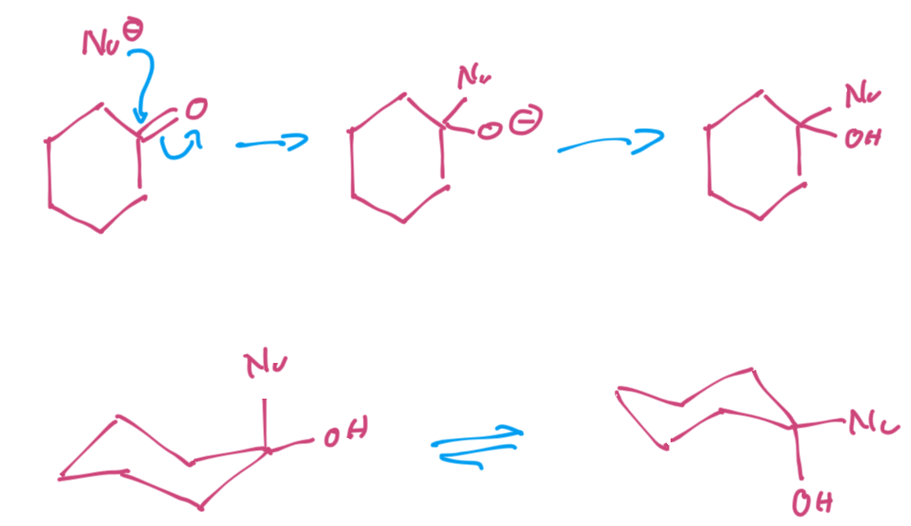{: style="width: 40%;" class="center sharp"}

### Prochirality

Prochirality can come in different forms, such as those that can form diastereomers, and those that can form enantiomers. The acetone is not prochiral, as it's symmetric. 

|         Diastereotopic faces         |          Enantiotopic faces          |           No prochirality            |
| :----------------------------------: | :----------------------------------: | :----------------------------------: |
| 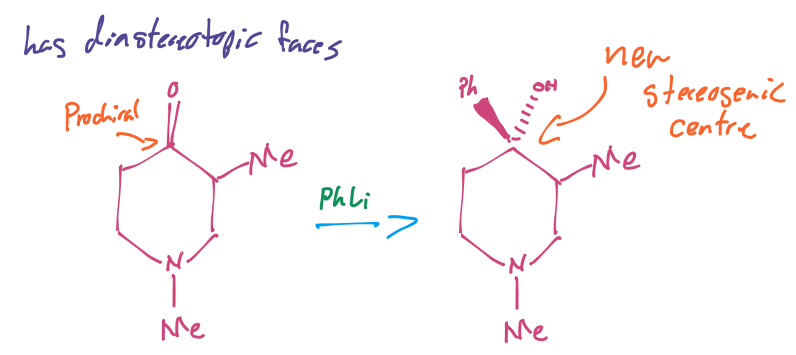 | 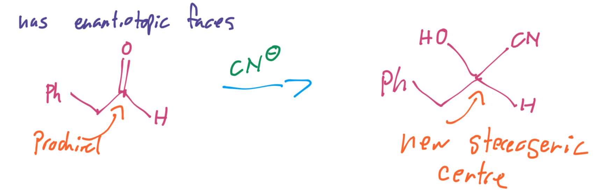 | 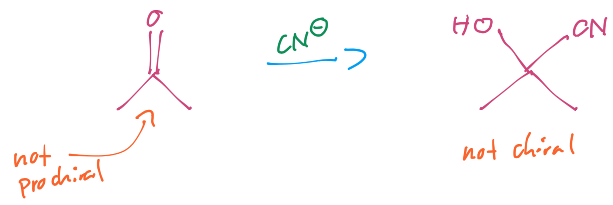 |

### Angle of Attack

The angle of attack for a nucleophile on a carbonyl compound is 107°, which is known as the Bürgi-Duniz trajectory. it's a happy medium bedium the maximum overlap with the π* orbital at 90° and the repulsion of the π orbital

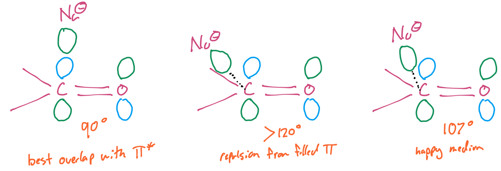{: style="width: 50%;" class="center sharp"}

While this means that carbonyl carbons can be approached from two faces, they also will follow the preference for axial approach on cyclic molecules.

This will hold true for small nucleophiles as there isn't too much steric hinderance

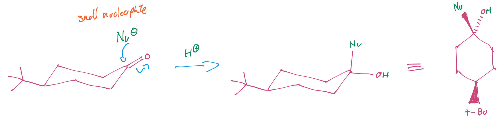{: style="width: 60%;" class="center sharp"}

For big nucleophiles though, they need to attack equatorially.

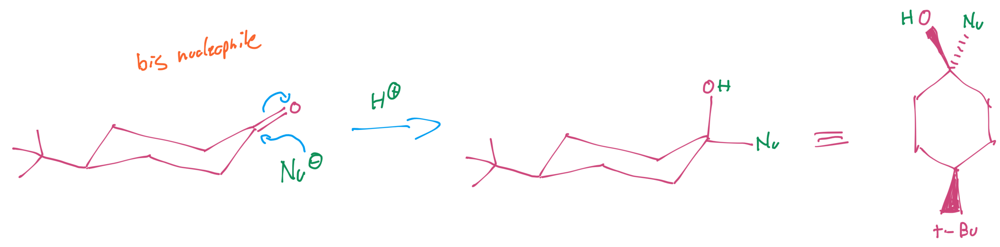{: style="width: 60%;" class="center sharp"}

We can use this to our advantage, however and use a large or a small reducing agent to control the chirality of the new stereogenic centre.

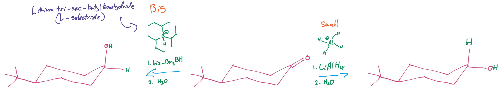{: style="width: 80%;" class="center sharp"}

!!! note
	In both of these cases, the $\ce{t-Bu}$ group is there to ensure that the ring doesn't flip.

The size effect of the nucleophile on the direction of attack can be quantified

| Nucleophile     | % Axial Attack | % Equatorial Attack |
| --------------- | :------------: | :-----------------: |
| $\ce{HC#CNa}$   |       88       |         12          |
| $\ce{MeLi}$     |       35       |         65          |
| $\ce{PhLi}$     |       42       |         58          |
| $\ce{MeMgBr}$   |       41       |         59          |
| $\ce{EtMgBr}$   |       29       |         71          |
| $\ce{i-PrMgBr}$ |       18       |         82          |
| $\ce{t-BuMgBr}$ |       0        |         100         |

## Freedom of Rotation

In molecules that have large degrees of freedom (floppy molecules) there isn't too much risk of the groups on an adjacent carbon interacting

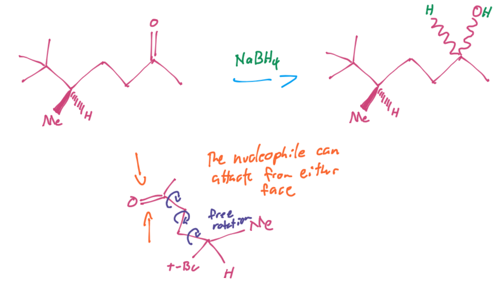{: style="width: 60%;" class="center sharp"}

But if we move the groups closer together, there is a fair amount of hinderance and there will be a resulting preference for one conformation over the other

|                        $\ce{LiAlH4}$                         |                        $\ce{EtMgBr}$                         |
| :----------------------------------------------------------: | :----------------------------------------------------------: |
| 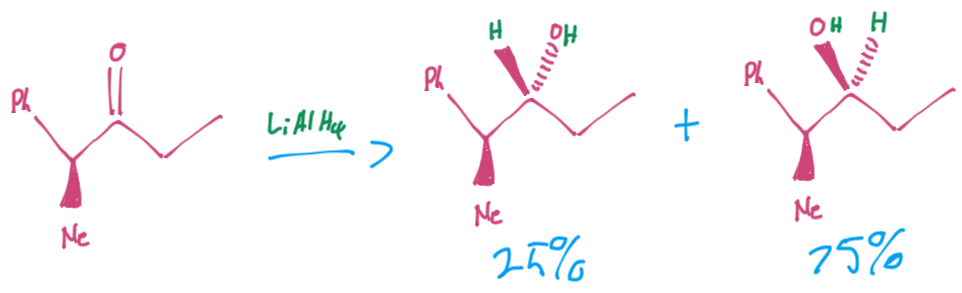{: style="width: 100%;" class="center sharp"} | 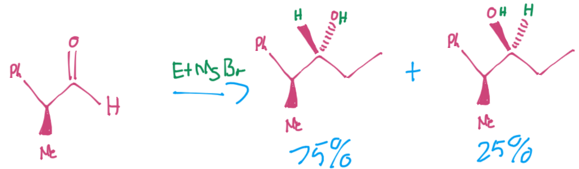{: style="width: 100%;" class="center sharp"} |

### Quantifying Rotational Hinderance (Felkin-Anh Model)

We need to be able to quantify which rotamers will be the most stable. So that means we have to draw out the rotamers in a Fischer projection.

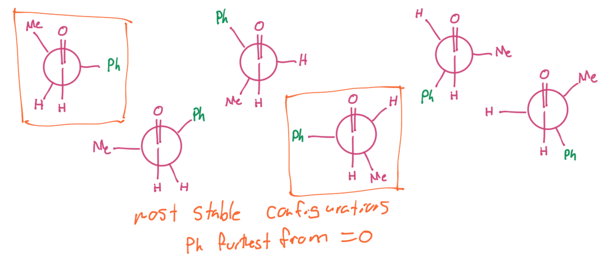{: style="width: 60%;" class="center sharp"}

It should be pretty easy to see that the most stable rotamers will be with the largest group perpendicular to the $\ce{C=O}$ bond, so we only need to compare them.

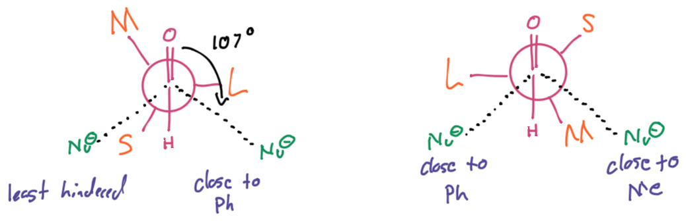{: style="width: 60%;" class="center sharp"}

When we do so and we consider the 107° angle of attack of the nucleophile, we can see that there will be a clear preference for one of the rotamers over the other. And now we need to perform the reaction in the Newman projection and we can convert the geometry back into our stick formula that we know, paying attention to which side of the plane the substituents lie.

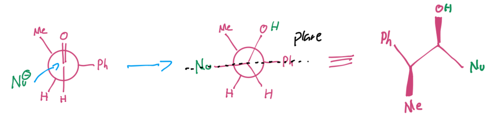{: style="width: 60%;" class="center sharp"}

## The Felkin-Anh Model in Process

1. Start with your geometry and identify the bond that you're going to project along
2. Draw your two Newman projections with the largest group perpendicular to the $\ce{C=O}$ bond and find which face will have less hinderance for the nucleophilic attack
3. Perform the reaction, paying close attention to how the substituents on the from carbon rotate away from the new bond
4. Rotate the front carbon so that the longest carbon chain substituent is on the plane
5. Convert the Newman projection back into a line representation

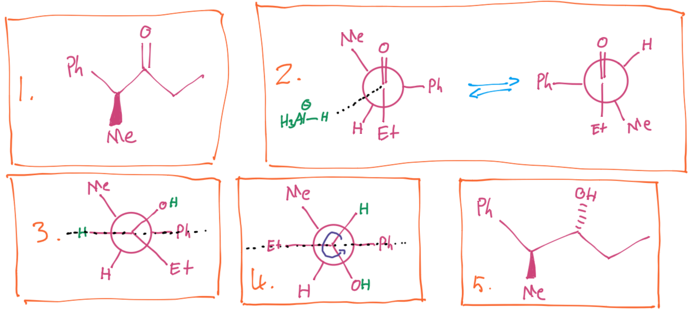{: style="width: 70%;" class="center sharp"}

## Chelation

It's possible to force a specific rotamer to occur by chelating two of the substituents. In this case, the process is much the same, but now after we find our optimal geometry, we need to rotate the chelated atoms together and carry out the process. 

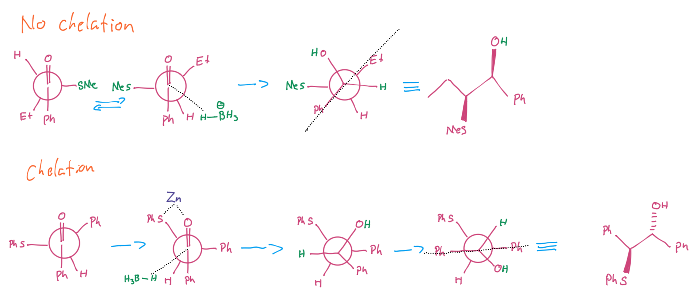{: style="width: 80%;" class="center sharp"}
