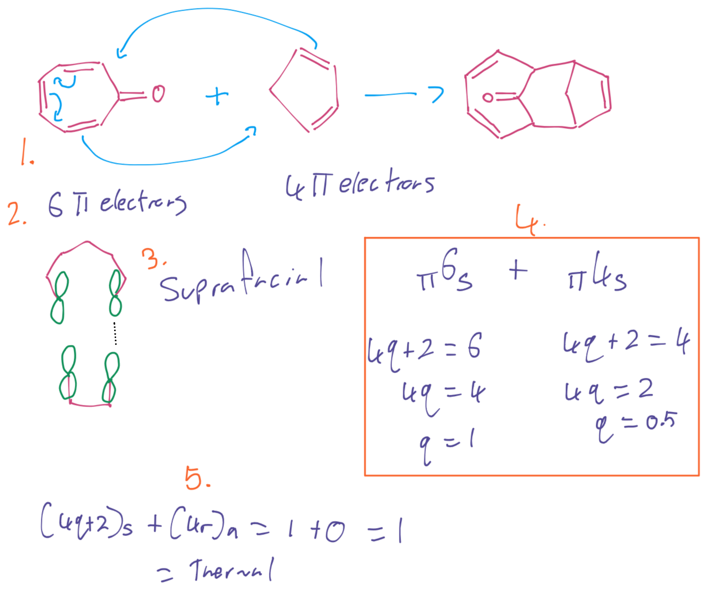
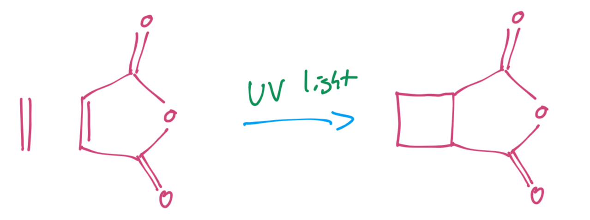
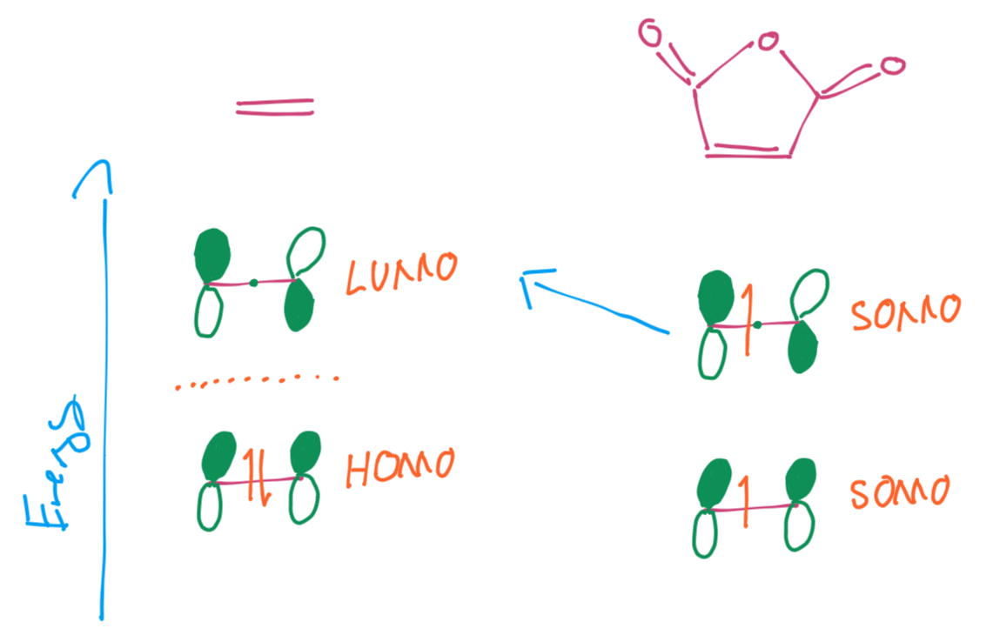
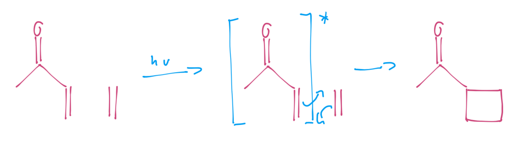
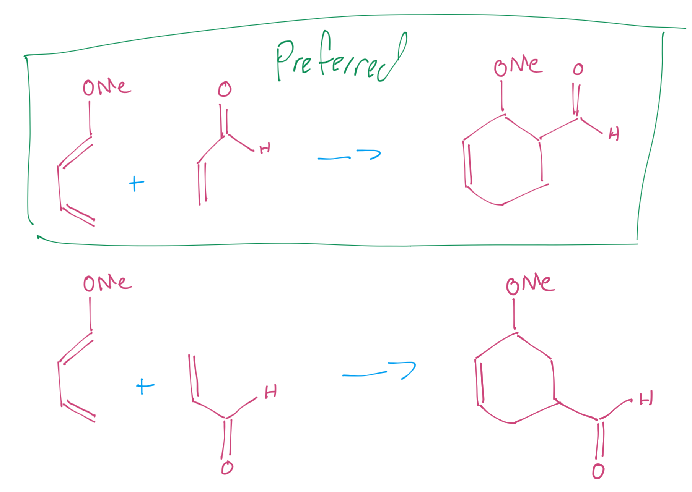
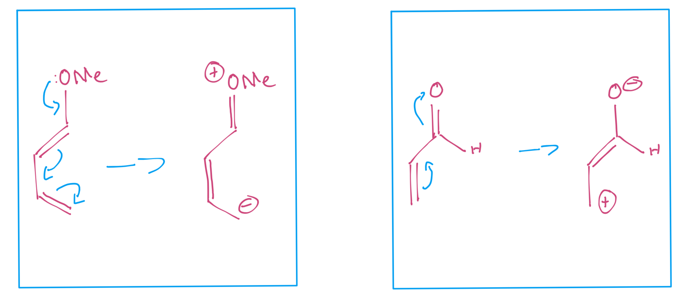
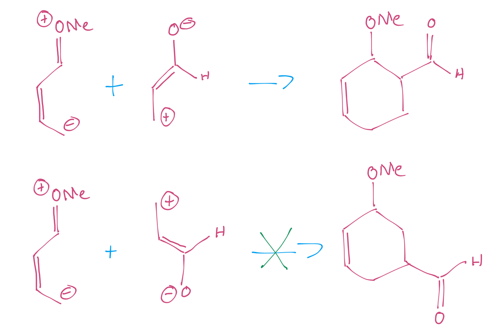
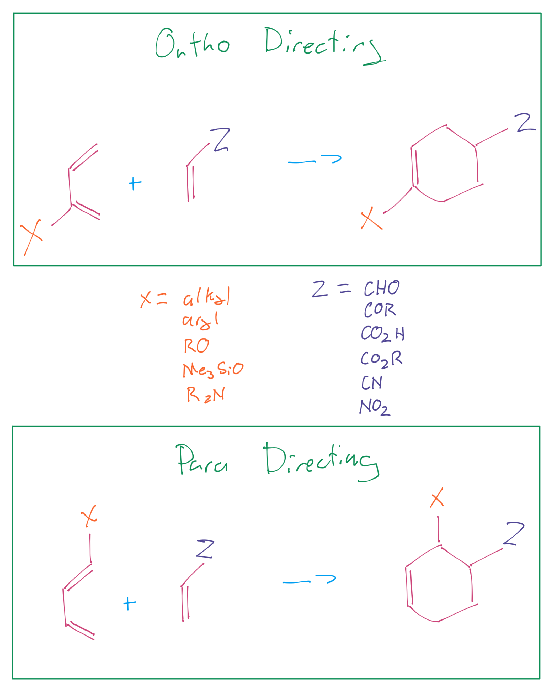

# Cycloadditions

??? note "Woodward Hoffman Exmaple"
	{: style="width: 60%;" class="center sharp"}

Cycloadditions are pericyclic reactions which involve the breaking or forming of two σ bonds concertedly ($\Delta\sigma\pm2$).

To build FMO diagrams we can use this process:

1. Count the bonds, to determine the number of p orbitals and the resulting number of π MOs
2. Add increasing nodes to the MOs from the bottom up. The lowest energy MO will have zero nodes
3. Assign electrons from the lowest energy up and assign your HOMO/LUMO

We know that [4+2] cycloadditions are themal, however [2+2] cycloadditions aren't. We can activate them with UV light though to make them react

{: style="width: 40%;" class="center sharp"}

This happens because when we activate them, we excite one of the HOMO electrons to the LUMO, to create SOMOs (Singly/Semi Occupied Molecular Orbitals)

{: style="width: 40%;" class="center sharp"}

When we do so, we also change the orbital energies, dropping the LUMO, allowing for bonding to happen between species.

{: style="width: 40%;" class="center sharp"}

When we draw the transition state, we need to show that it's an excited state. ==This process is now non-reversible==

{: style="width: 60%;" class="center sharp"}

## Regioselectivty

We spoke about stereoselectivity in the previous section, but we also need to consider regioselectivity

{: style="width: 60%;" class="center sharp"}

There are really two big ways to think about this, we can think of the diene as a nucleophile (donating electrons from its HOMO) and the dienophile as an electrophile (accepting electrons into its LUMO)

In this case, we want to think about the resonance structures that the EDGs and EWGs will have

{: style="width: 60%;" class="center sharp"}

We can clearly see that there's only one *nice* way for these species to interact, giving rise to our regioselectivity

{: style="width: 60%;" class="center sharp"}

There is however a much simpler way to think about this

!!! note "DA reactions are OP directing"
	{: style="width: 60%;" class="center sharp"}