# Sigmatropic Rearrangements

??? note "Woodward Hoffman Exmaple"
	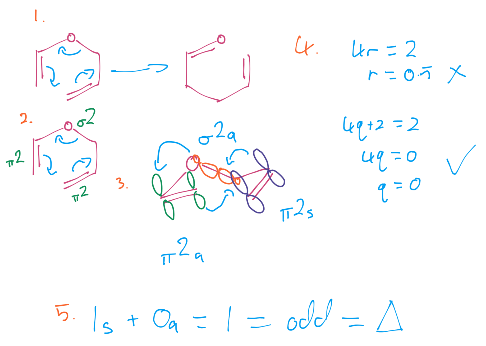{: style="width: 60%;" class="center sharp"}

Are pericyclic reaction in which there is no net increase or decrease in the number of σ bonds across the reaction ($\Delta\sigma=0$). They occur in a concerted mechanism and are described by the number of atoms the bond 'hops'.

With the numbering, the smaller number will always come first.

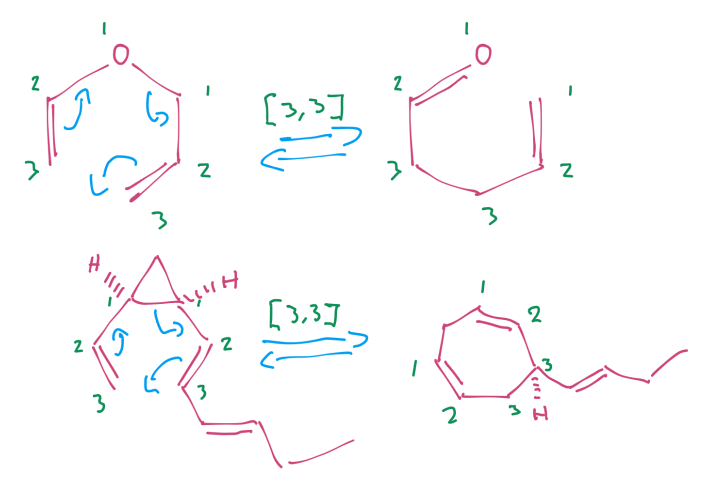{: style="width: 50%;" class="center sharp"}

## Named Sigmatropic Reactions

### Claisen Rearrangement

The Claisen rearrangement is a two step process, in which a [3,3]-sigmatropic rearrangement is followed by a proton transfer

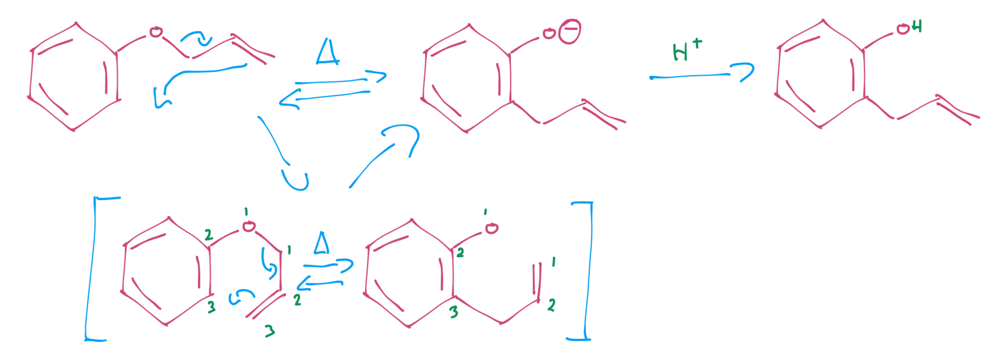{: style="width: 80%;" class="center sharp"}

### Cope Rearrangement

The Cope rearrangement is the simplest and is a [3,3] carbon only sigmatropic rearrangment

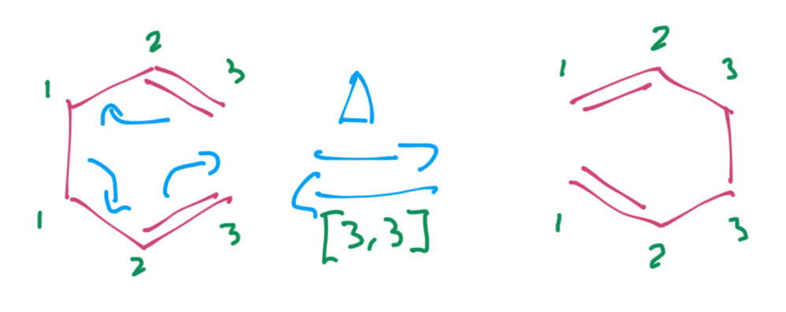{: style="width: 40%;" class="center sharp"}

### Aliphatic Claisen Rearrangement (Claisen-Cope)

The last is the aliphatic, that is the conversion of a vinyl ether into a carbonyl compound

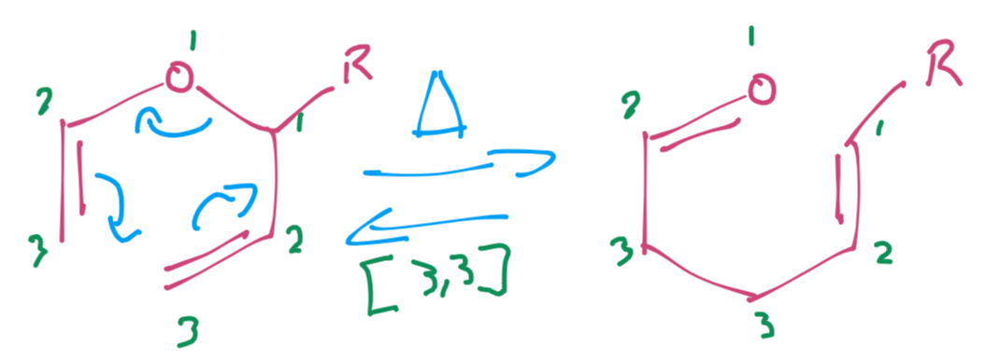{: style="width: 40%;" class="center sharp"}

When there are substituents, it's important to remember that they'll want to be in the equatorial position as we draw the 3D reaction. this will ultimately result in the formation of a trans (E) isomer.

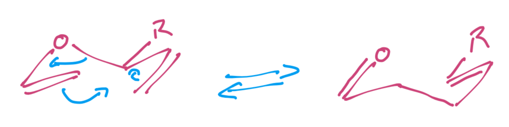{: style="width: 40%;" class="center sharp"}

### [1,5]-sigmatropic rearrangement ([1,5]H shift)

The [1,5]H shift is a sigmatropic rearrangement in which the result of the reaction is to move a conjugated system of π bonds around an unevenly numbered ring, or (from another perspective) to move a proton around the ring

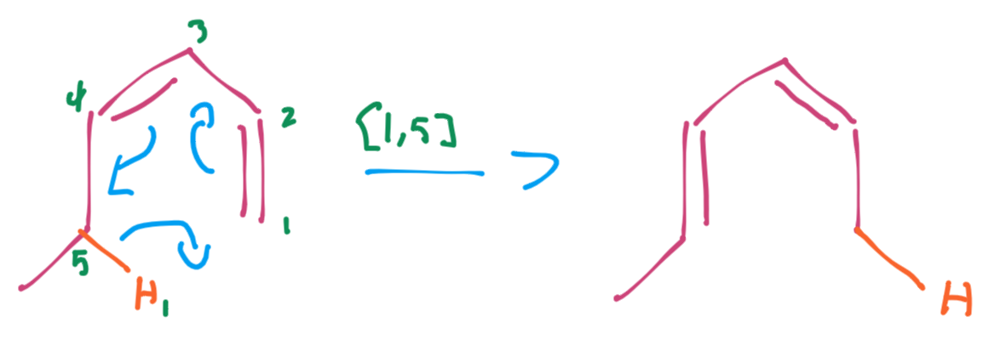{: style="width: 40%;" class="center sharp"}

This is quite an important reaction, because if you can move a proton around a ring, you can move an attached substituent as well.

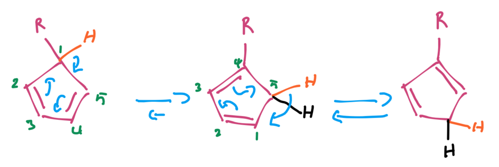{: style="width: 50%;" class="center sharp"}

For small molecules, this might not be so bad, but this can wreak havoc for subsequent reactions

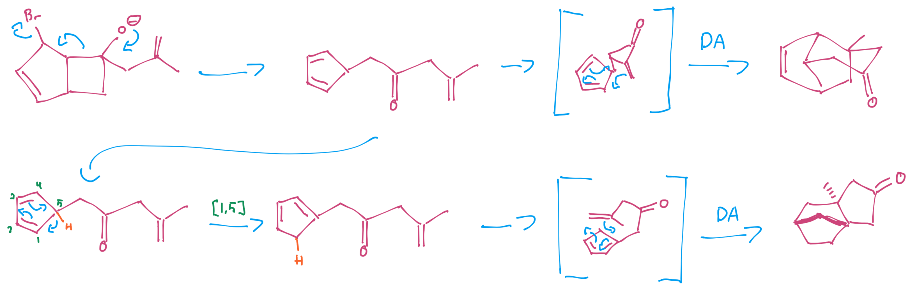{: style="width: 80%;" class="center sharp"}

## Woodward-Hoffman

When going through the WH formalism, since we're dealing with a system that includes both π and σ electrons, we need to consider each bond that moves as a separate component.

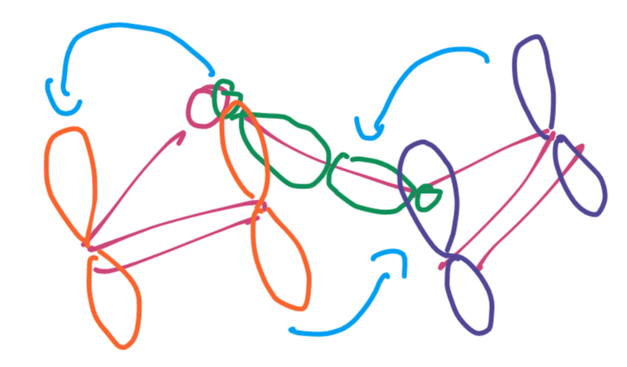{: style="width: 20%;" class="center sharp"}

We then need to follow some new WH rules to determine whether they are suprafacial or antarafacial.

* With π bonds it's pretty simple, are the interactions happening with lobes on both the top and the bottom
* With σ bonds, we need to look at whether the interactions are happening from both the big lobes (retention), both the small lobes (inversion) or a mix of both the big and small lobes.

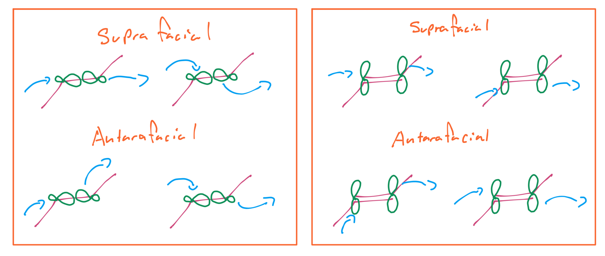{: style="width: 70%;" class="center sharp"}

The important thing to remember here is that the bonds that move are the components, ==not the new bonds that form==.

!!! note
	Within the above example, only the π-π interaction that will form the σ bond is strict. for the others, we could have the electrons moving on either side of the bonds and the WH rules would still hold true. 
	e.g. $_\sigma2_s\:+\:_\pi2_a\:+\:_\pi2_a\:=1+0+0$ 
	e.g. $_\sigma2_s\:+\:_\pi2_s\:+\:_\pi2_s\:=1+1+1$ 
	However we mush be cautious to note that these π bondas are *NOT* conjugated, so we can't consider them as a single component
### Woodward-Hoffman for [1,5]H

Since we do have a conjugated system here, we should consider the π electrons as a single $_\pi4_s$component

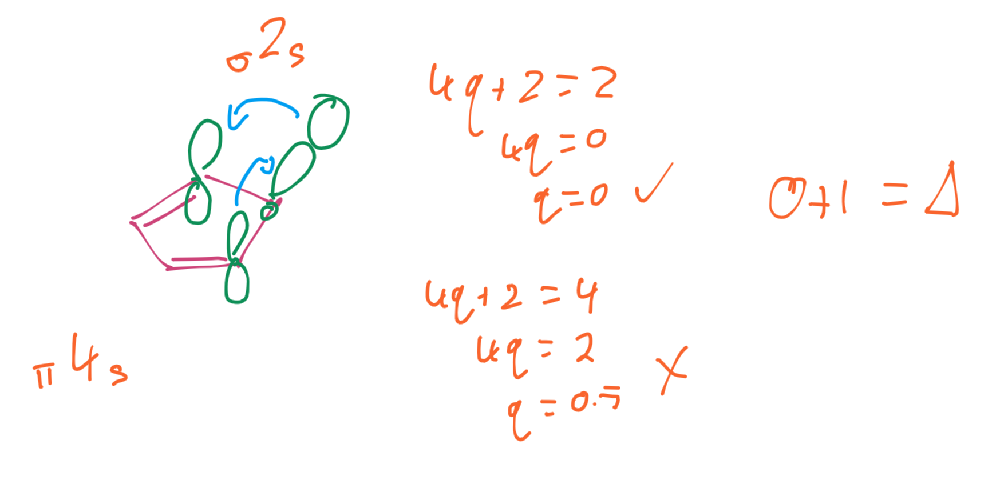{: style="width: 70%;" class="center sharp"}

Based on this we can come to a few conclusions about the H-shift, such as, we know that [1,3] and [1,7] shifts will be antarafacial and [1,5] shifts will be suprafacial. We can also consider what kind of rotation the geometry will allow, to be able to say that thermally, the:

* [1,3]H shift is antarafacially impossible, since it can't rotate and contort to form a chair
* [1,5]H shift is suprafacially easy, since there's no rotation required
* [1,7]H shift is antarafacially possible, depending on the geometry a strained ring *could* form

In the example below, the geometry forbids the [1,7]H shift from happening thermally, but it will occur photochemically

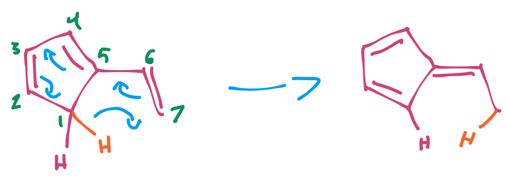{: style="width: 40%;" class="center sharp"}