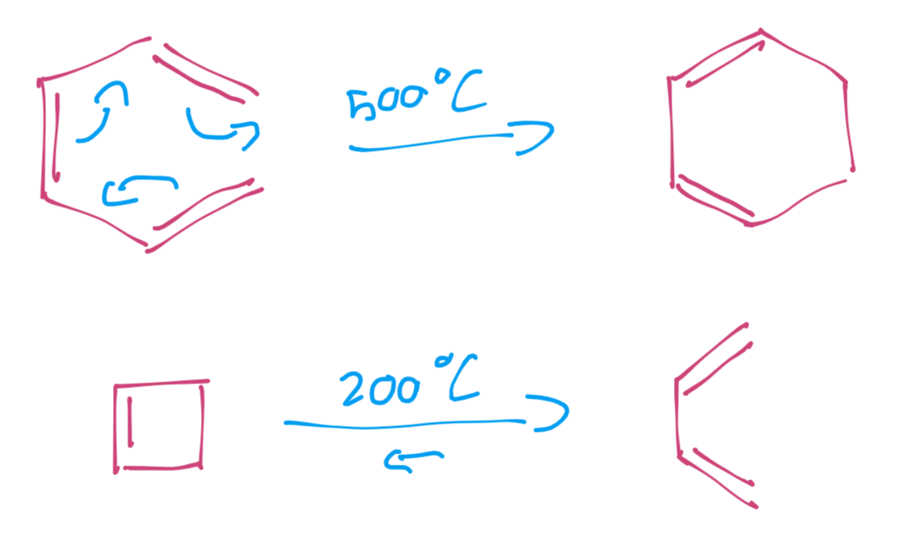
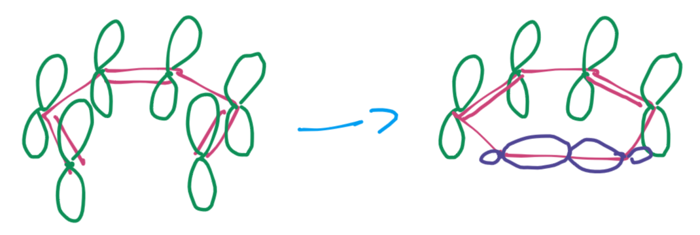
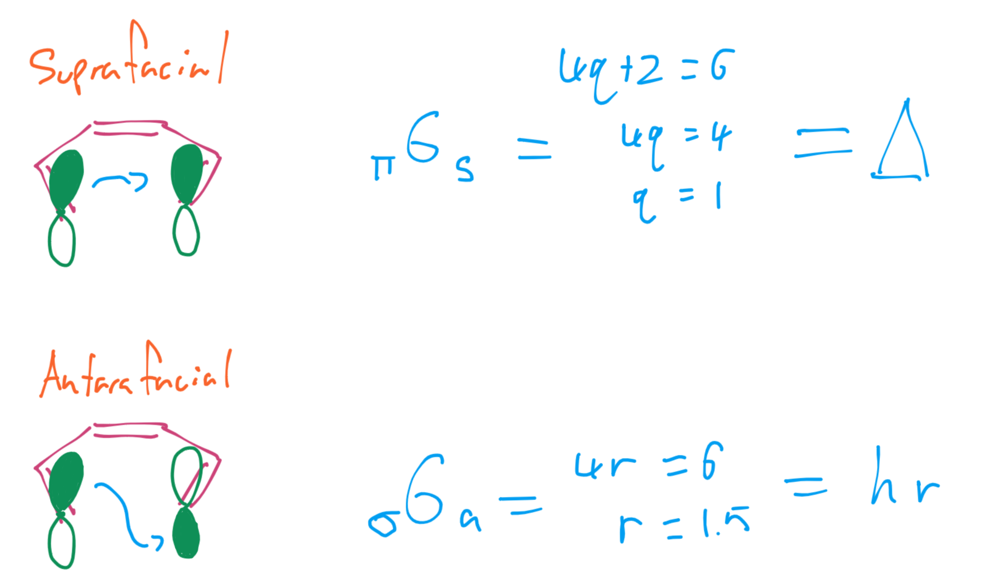
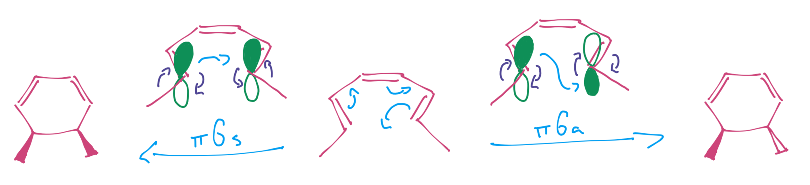
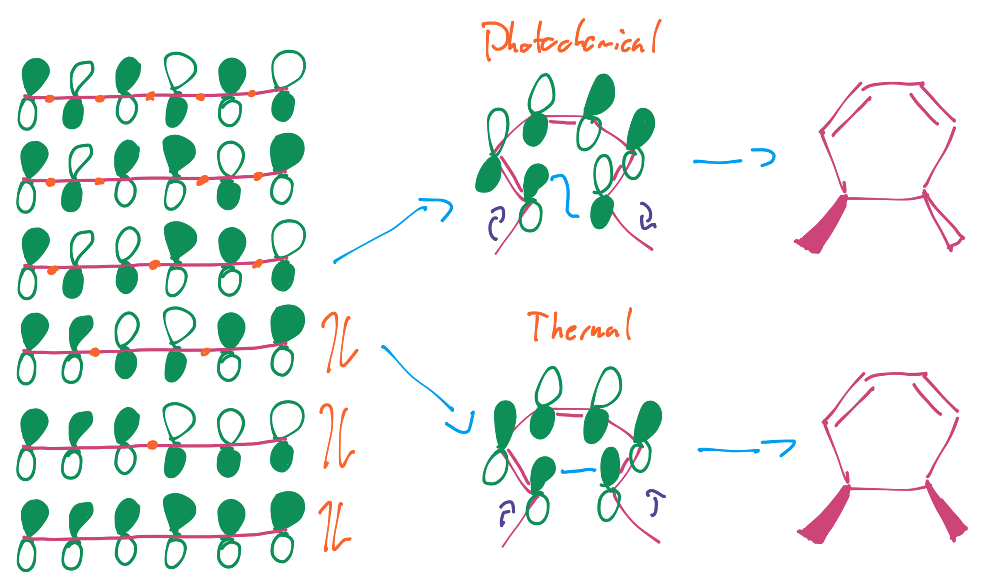
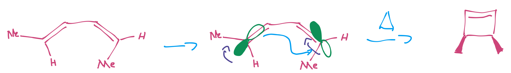

# Electrocyclic Reactions

Electrocyclic reaction involve the formation or breaking of a single σ bond ($\Delta\sigma\pm1$).They form between two ends of a conjugated system, so the WH rules treat it as a single component.

{: style="width: 40%;" class="center sharp"}

When we consider the formation of the new σ bond, we need to look at the configuration of the two end π bonds

{: style="width: 40%;" class="center sharp"}

These bonds can be in a configuration that will result in either a supra or antarafacial bonding configuration. In the example below, we can see that these may not always end up being thermal reactions.

{: style="width: 50%;" class="center sharp"}

We can however, use this to our advantage to be able to control the resulting stereochemistry.

As the π bonds will need to rotate to form the resulting σ bond, they will either be:

* Conrotatory from antarafacial transfer (both groups rotate in the same direction)
* Disrotatory from suprafacial transfer (both groups rotate in the the opposite direction)

In the example below, the $_\pi6_s$ system will be allowed to be ==disrotatory thermally== and ==conrotatory photochemically==

{: style="width: 80%;" class="center sharp"}

!!! note
	This can be generalised to: 
	$(4n+2)\pi$ systems will react suprafacially (disrotatory) 
	$(4n)\pi$ systems will react antarafacially (conrotatory)

## FMO

Given that our only system is a conjugated π system, we can use FMO to consider how this reaction will proceed. We only really care about the end orbitals, but it should be pretty easy to see that the ends of the HOMO determine the thermal behaviour and the ends of the LUMO determine the photochemical behaviour.

{: style="width: 70%;" class="center sharp"}

## Starting Geometry

Even though the orbitals determine the rotation, the overall stereochemistry is determined by the starting material. In the example below, we can see that the (E,Z)hex-2,4-diene will form the syn conformation of our end product, though, the (E,E) isomer would form the anti conformation.

{: style="width: 70%;" class="center sharp"}