# NMR Coupling

!!! note "Coupling Constant Formula"
	$$
	^nJ=(|\delta_1\:ppm-\delta_2\:ppm|)(\text{Frequency of NMR (MHz)})
	$$
Realistically, in NMR, all protons within a molecule will couple to each other, however their coupling constants will decrease as their distance increases, to a point that their splitting is indistinguishable.

The coupling experienced by a proton can be described as follows, where $J$ is the coupling constant, $^nJ$ denotes how many bond distances away they are ($^3J$indicating adjacent protons), the $_{H_e-H_g}$ indicating which protons are coupling and the frequency indicating the coupling constant. The example below is of a triplet of doublets.

$H_e$ is coupling to $H_f$ and $H_d$ as a triplet, then that is being split a second time into a doublet with $H_g$.

$$
H_e\:\delta=7.29,\:t (J^3_{H_e-H_f-H_d} 5.6\:Hz)\:d (J^4_{H_e-H_g} 1.2\:Hz)\:2H
$$

In the table below we can see how we count the coupling distance. The $^5J$ splitting wold be virtually impossible to detect.

| $^3J$ Coupling | $^5J$ Coupling |
| :------------: | :------------: |
| 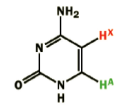  | 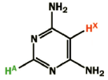  |

## Splitting

### Triplets

This concept is more difficult to conceptualise, bu we can look at splitting diagrams to help us understand it.

If we look at a simple triplet, we can think of it like this:

1. The proton is split by the first adjacent proton, giving us a doublet of distance $J$
2. Each split of the doublet now splits again with the same $J$, giving an overlap in the middle peak

When the two splits occur with the same $J$, they combine to form peaks in the ratios of Pascal's triangle

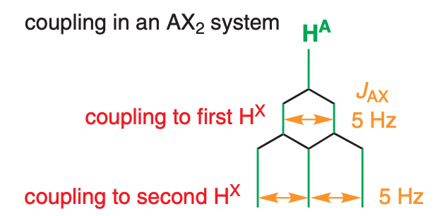{: style="width: 30%;" class="center sharp"}

### Doublet of Doublets

When we consider a proton that is split by two protons of *different* $J$, we now have a scenario in which the middle two protons ==do not combine== into a double height peak. This time, the first doublet is split into another set of doublets with a new coupling constant.

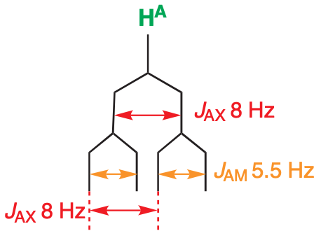{: style="width: 25%;" class="center sharp"}

### Doublet of Triplets

Now in a more difficult scenario to consider, the proton couples to one proton with coupling constant $J_1=11\:Hz$, and splits to two other protons that have the same coupling constant $J_2=4\:Hz$. This gives us a doublet of triplets. We need to be careful about which  peaks measure the distance between to determine these coupling constants.

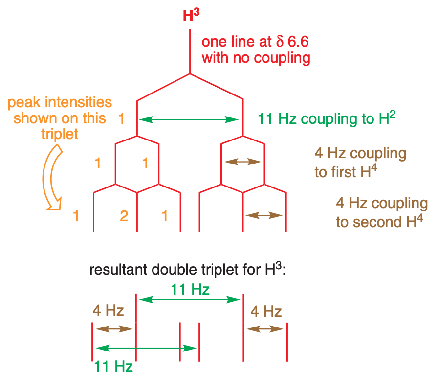{: style="width: 35%;" class="center sharp"}

### Second Order Coupling

We should also remember the effects of second order coupling from last semester. This can be quantified by looking at the difference in shift between two coupled protons ($\Delta\delta$) and comparing it to the coupling constant ($J$)

{: style="width: 30%;" class="center sharp"}

## Dispersion

When we look at the resolution of a n NMR spectrometer, it's important to recognise that because the splitting is measured in Hz, but the x axis of the spectrum is plotted in ppm, the peaks will appear more spaced out. this is know as dispersion.

## Coupling Constants

So how big coupling constants will be depends on a number of factors

### Bond Count

We can first consider how far away the protons are from each other

| $^2J_{HH}$  | $^3J_{HH}$ | $^4J_{HH}$ | $^5J_{HH}$  |
| :---------: | :--------: | :--------: | :---------: |
| $12-16\:Hz$ | $6-9\:Hz$  | $0-3\:Hz$  | $\sim0\:Hz$ |

### Dihedral Angle (ϕ)

For $^3J$ coupling, we can also consider the Karplus equation, which tells us the relationship between the NMR coupling constant and the dihedral angle of the two protons.

We can pretty simply see that the strongest interaction will be for protons that are trans to each other, with being cis to be the next.

{: style="width: 35%;" class="center sharp"}

Putting this into action, we can build the table below. Benzene has a lower coupling constant because it has a longer bond length than the alkenes, owing to its conjugation.

|           Free rotation           |      Benzene ring       |         Cis alkene          |          trans alkene           |
| :-------------------------------: | :---------------------: | :-------------------------: | :-----------------------------: |
| 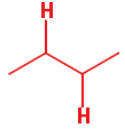 | 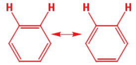 | 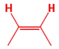 |  |
|         $^3J\approx7\:Hz$         |     $^3J=8-10\:Hz$      |       $^3J=10-12\:Hz$       |         $^3J=14-18\:Hz$         |

The coupling constants can be significantly reduced beyond this, by introducing an electronegative group into the bond

|          Cis alkene           |      Cis enol ether       |           Trans alkene            |       Trans enol ether        |
| :---------------------------: | :-----------------------: | :-------------------------------: | :---------------------------: |
| 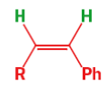 | 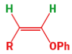 | 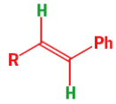 | 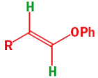 |
|     $^3J_{cis}=11.5\:Hz$      |    $^3J_{cis}=6.0\:Hz$    |      $^3J_{trans}=16.0\:Hz$       |    $^3J_{trans}=12.0\:Hz$     |