# Aromatic NAS

Nucleophilic aromatic substitution occurs whn the aromic ring is bonded to EWG that draw away the electron density form the ring and the protons, making them less strongly bonded. This makes the ring electron deficient, compared to EAS which is activated by making the ring electron rich.

In MO terms, the more electronegative atom/group lowers the HOMO energy level (less nucleophilic), but also lowers the LUMO energy level (more electrophilic)

|                           Benzene                            |                        Aniline                        |                         Nitrobenzene                         |                        Pyridine                         |
| :----------------------------------------------------------: | :---------------------------------------------------: | :----------------------------------------------------------: | :-----------------------------------------------------: |
| {: style="max-height: 150px"} | 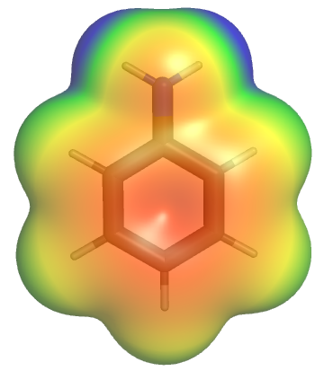{: style="max-height: 150px"} | 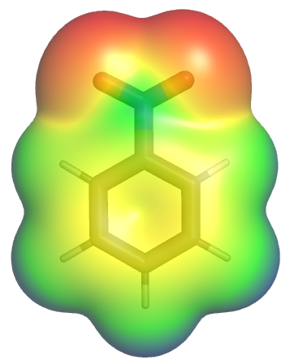{: style="max-height: 150px"} | 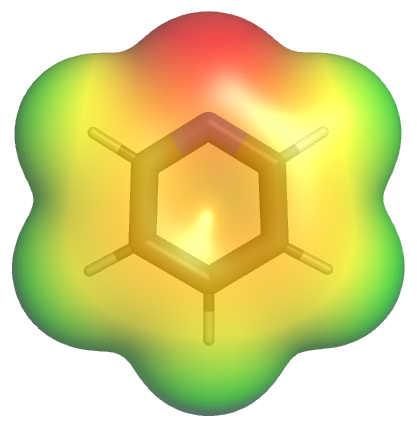{: style="max-height: 150px"} |

{: style="width: 40%;" class="center sharp"}

The nitrogen in the pyridine withdraws the electron density, activating the ortho and para positions to nucleophilic attack

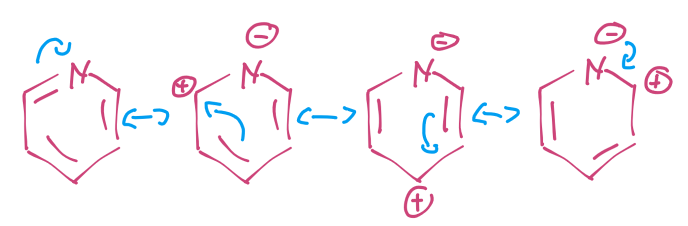{: style="width: 50%;" class="center sharp"}

As we can see here, if the meta position is attacked, there's nowhere for the electrons to go to allow the NAS to proceed

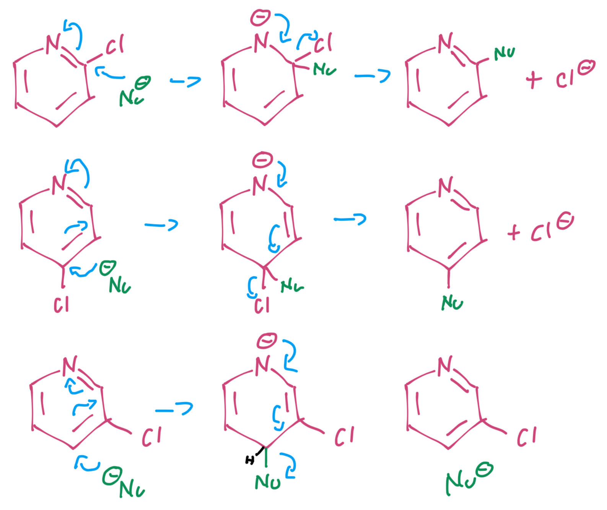{: style="width: 60%;" class="center sharp"}

!!! note
	It's really important to note that this is NOT and SN2 reaction. The electrons flow up and back out of the intermediate, they aren't just displaced as with an SN2 reaction

### Nitro EWG

And in many cases the EWG can also serve to stabilise the intermediate

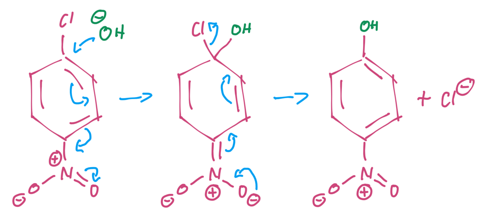{: style="width: 55%;" class="center sharp"}

### Ketone EWG

We can also have the ketone EWG which takes the charge into the the ketone oxygen

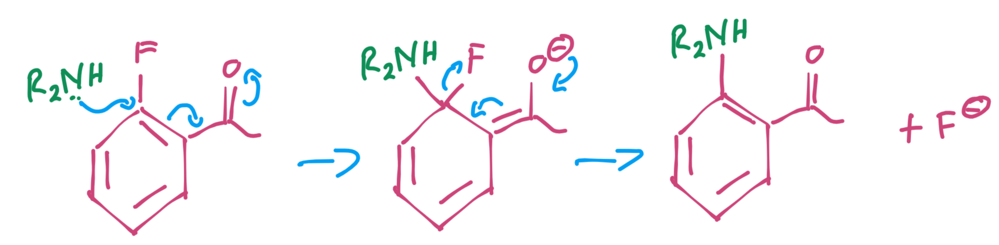{: style="width: 60%;" class="center sharp"}

### Halogen EWG

The EWG could also be a halogen, in particular, in the case of two fluorine atoms

|                           Benzene                            |                        Fluorobenzene                         |                     *o*-difluorobenzene                      |
| :----------------------------------------------------------: | :----------------------------------------------------------: | :----------------------------------------------------------: |
| {: style="max-height: 150px"} | 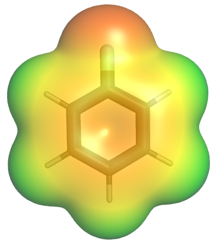{: style="max-height: 150px"} | 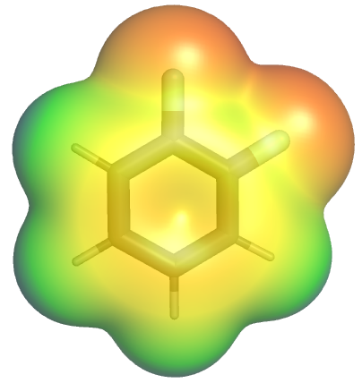{: style="max-height: 150px"} |

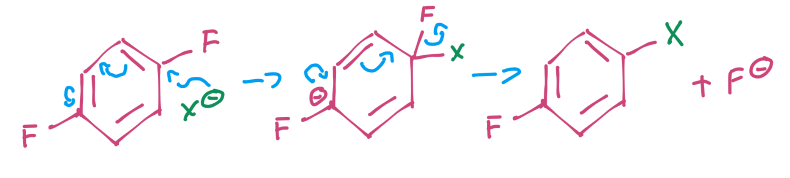{: style="width: 60%;" class="center sharp"}

## Effect of the Leaving Group

The leaving group has more of an effect for it's behaviour as an EWG than as an effective leaving group, because the rate limiting step isn't the elimination/re-aromatisation, it's the addition step, as we can see with this azide additon.

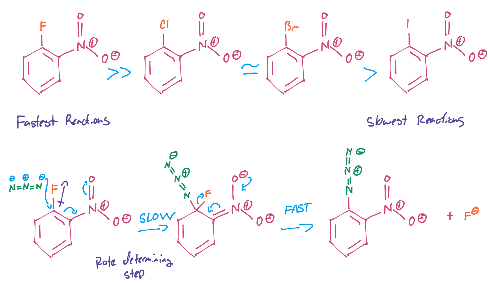{: style="width: 80%;" class="center sharp"}

## Effect of the EWG

The effect of the EWG is pretty much entirely dependent on how EWG it is

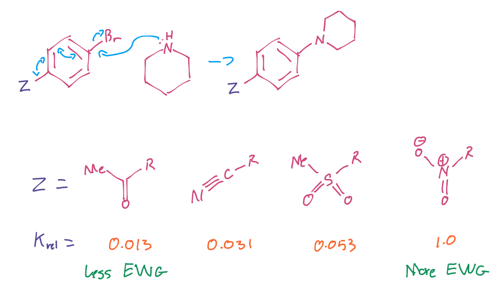{: style="width: 70%;" class="center sharp"}

!!! note "Important Chemistry"
	The synthesis of the analgesic flupirtine is a good example of NAS. it also involves hydrogenating the nitro group after the NAS is complete to form an amine and adding on an ethyl ether.

	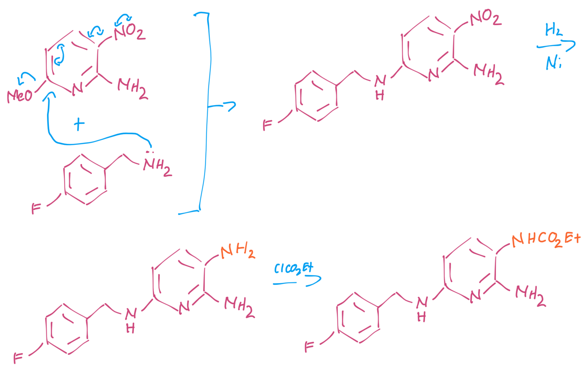{: style="width: 70%;" class="center sharp"}

## Diazonium Salts

Are really useful intermediates in organic chemistry, as they can be REALLY good leaving groups

{: style="width: 55%;" class="center sharp"}

??? info "Diazonium Mechanism"
	
	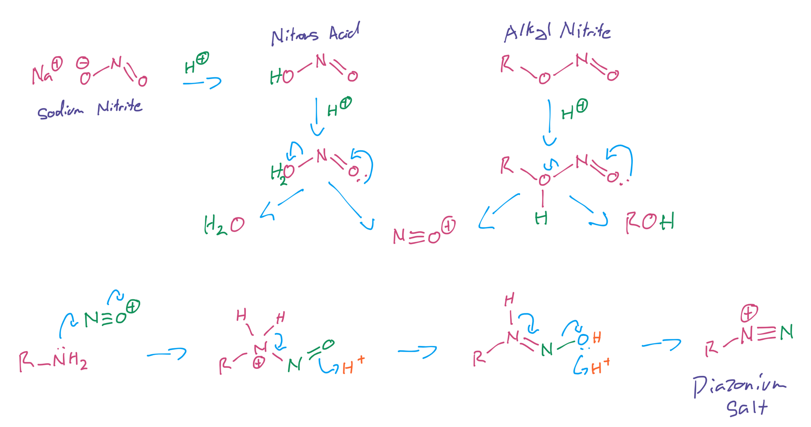{: style="width: 90%;" class="center sharp"}

such good leaving groups, in fact, that they will leave with heat (in water) to form an aryl cation, that can be easily added to by a nucleophile such as a simple halogen.

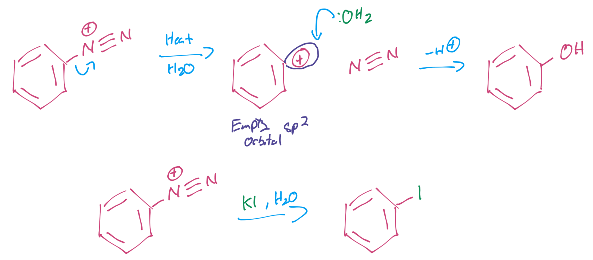{: style="width: 70%;" class="center sharp"}

## Combining it all

We can utilise a whole lot of this chemistry to find a way to direct, interconvert and remove groups how we want to.

Here's a couple of synthetic strategies:

!!! info "Strategy 1"
	
    1. Nitrate the aryl group and hydrogenate it to an amine
    2. Diazotise it
    3. Strip it off in water to convert it to a hydroxyl
    
    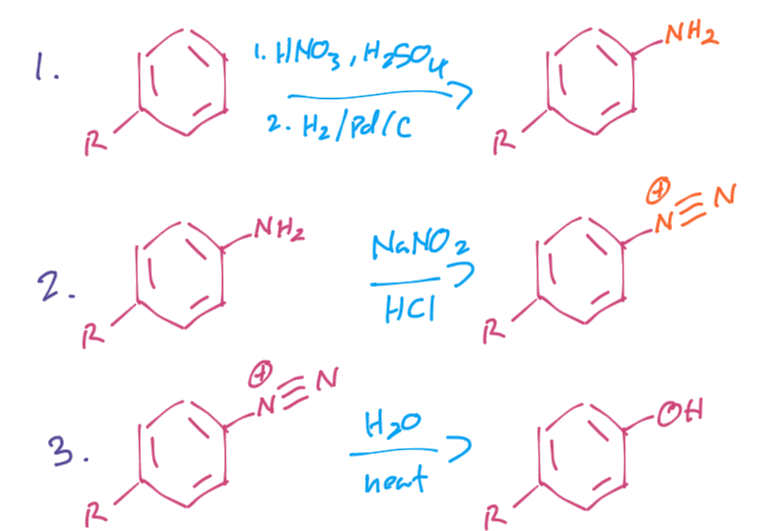{: style="width: 50%;" class="center sharp"}

!!! info "Strategy 2"
	This allows for the bromine to be added strictly meta to the R group
	
	1. Nitrate the aryl group and hydrogenate it to an amine
	2. Acylate it to deactivate it from EAS
	3. Add bromine in an EAS reaction
	4. De-acylate the amine
	5. Diazotise the amine
	6. Eliminate the diazo as $\ce{N2}$
	
	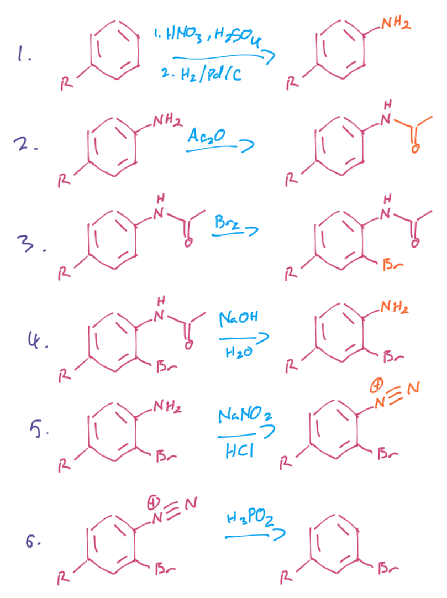{: style="width: 50%;" class="center sharp"}

## Benzyne (the Abomination)

We can also use the EWG to render the aryl protons labile, allowing them to be stripped off. this creates an aryl anion that can form a benzyne (sodium amide in liquid ammona.very important).

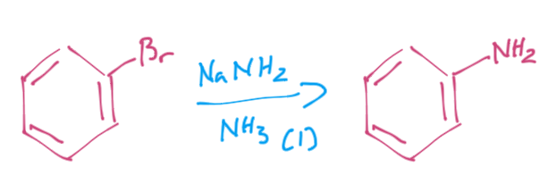{: style="width: 40%;" class="center sharp"}

Benzynes are really highly strained and therefore highly reactive, so when we produce them they can readily react. in this case we can aminate the aryl group to substitute out the bromine substituent.

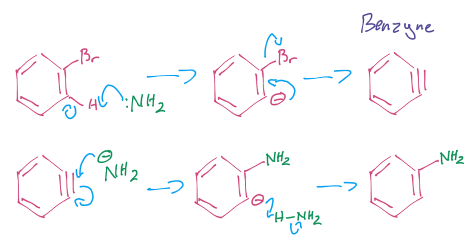{: style="width: 60%;" class="center sharp"}

When we add across the benzyne bond though, the addition could happen on either side of the bond and so we will get a roughly 50:50 split of the products

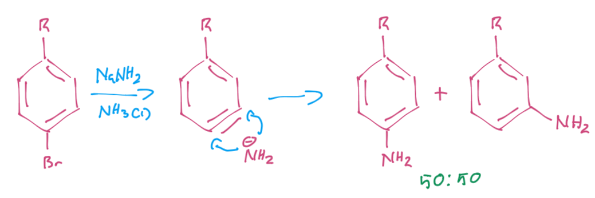{: style="width: 60%;" class="center sharp"}

We can however direct the nucleophile across the benzyne with other substituents

{: style="width: 70%;" class="center sharp"}