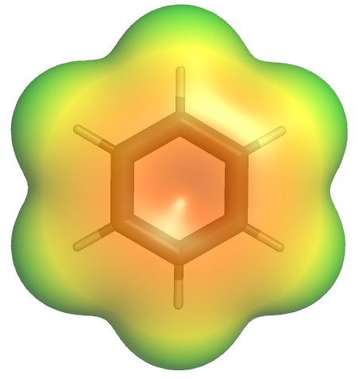
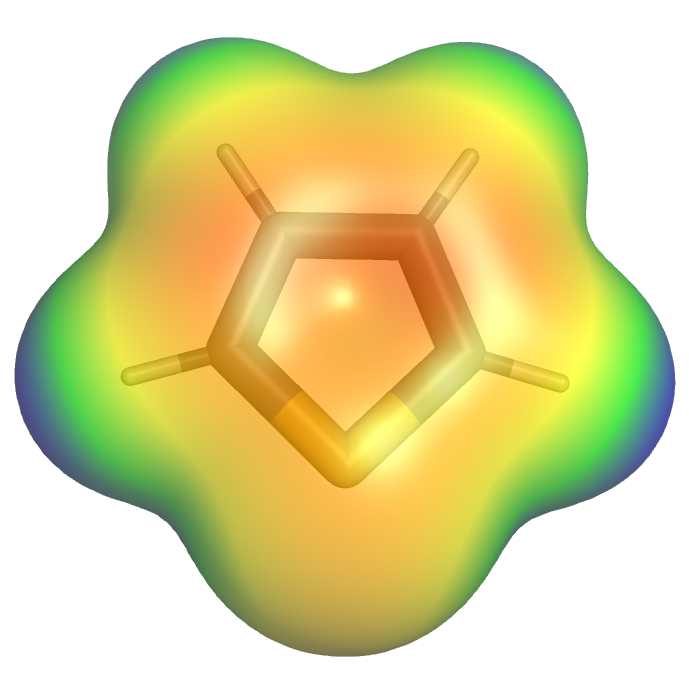

# Furan and Thiophene

|                           Benzene                            |                       Furan                       |                        Pyrrole                        |                         Thiophene                         |
| :----------------------------------------------------------: | :-----------------------------------------------: | :---------------------------------------------------: | :-------------------------------------------------------: |
| {: style="max-height: 150px"} | {: style="max-height: 150px"} | {: style="max-height: 150px"} | {: style="max-height: 150px"} |

{: style="width: 40%;" class="center sharp"}

Oxygen is more electronegative than nitrogen and is a proper electron donor making the ring less electron rich. In the case of thiophene, it has a lower electronegativity than nitrogen, so you might expect it to also be a decent electron donor, however the LPE sit on a higher orbital (3p instead of 2p), so has a much smaller overlap with the aromatic system. Thiophene is actually so deactivated by this poor overlap that it has similar reactivity to benzene.

Furan is much less reactive in EAS but is much more reactive in Diels-Alder reactions.

## Acylations

Both furan and thiophene can undergo selective, mono acylations with acetic anhydride. The resulting products are deactivated enough by the acyl group that they will not undergo further EAS

{: style="width: 80%;" class="center sharp"}

## Nitrations

This is now also deactivated enough to undergo nitration in typical EAS conditions without polymerising

{: style="width: 50%;" class="center sharp"}

Thiophene can also be nitrated under EAS conditions, however we can also use acetyl nitrate, as with pyrrole

{: style="width: 60%;" class="center sharp"}

## Chlorosulphonation

We can also add a sulfonyl group 

{: style="width: 60%;" class="center sharp"}

## Lithiation

And we can also lithiate furan and thiophene to make them more appropriate for further reactions

{: style="width: 70%;" class="center sharp"}

The mechanism for which is pretty simple:

{: style="width: 50%;" class="center sharp"}

These products are useful for a whole bunch of organometallic coupling reactions, but also for simple nucleophilic-electrophilic type reactions

{: style="width: 50%;" class="center sharp"}
