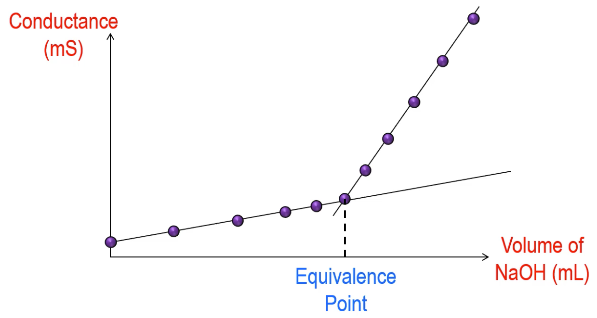

# Lab - Conductimetry and Gravimetry

## Conductivity

### The Units

| Measure              |  Symbol  |      Units      |
| -------------------- | :------: | :-------------: |
| Voltage              |   $V$    |       $V$       |
| Current              |   $I$    |       $A$       |
| Resistance           |   $R$    |    $\Omega$     |
| Conductance          |   $L$    |       $S$       |
| Cell Constant        |  $d/A$   |    $cm^{-1}$    |
| Specific Conductance | $\kappa$ | $S\cdot m^{-1}$ |

### The Relationships

$$
\begin{align}
V&=IR\\
L&=\frac{1}{R}=\frac{\kappa A}{d}\\
\text{Cell Constant}=\frac{d}{A}\\
\kappa&=(\text{Cell Constant})L
\end{align}
$$

### Specific Conductance

Specific conductance varies greatly between material. Metals have the largest $\kappa$, as their charge carriers are electrons. For solutions it's more complicated, as we need to consider both the charge and the relative mobility, as well as other solution phenomena.

| Solution                  | Tap water | 0.1 M $\ce{CH2COOH}$ | 0.1 M $\ce{HCl}$ | 0.1 M $\ce{KCl}$ | 1.0 M $\ce{KCl}$ |
| ------------------------- | :-------: | :------------------: | :--------------: | :--------------: | :--------------: |
| $\kappa\:(S\cdot m^{-1})$ | 0.000085  |        0.052         |       3.91       |      1.288       |      11.18       |

 This means that for solutions of the same concentration, we need to primarily consider the ion mobility.

The proton and hydroxide have the highest mobility due to proton hopping, the sulphate is the next highest because of its charge and the rest are all ordered by their relative ion size.

| Ion                                                    | $\ce{H+}$ | $\ce{Na+}$ | $\ce{K+}$ | $\ce{OH-}$ | $\ce{Cl-}$ | $\ce{NO3-}$ | $\ce{Ac- (CH3COO^{-})}$ | $\ce{SO4^{2-}}$ |
| ------------------------------------------------------ | :-------: | :--------: | :-------: | :--------: | :--------: | :---------: | :---------------------: | :-------------: |
| Mobility $\e{-8}$  ($m^2\cdot V^{-1}\cdot s^{-1}$) |   36.23   |    5.19    |   7.62    |   20.64    |    7.91    |    7.40     |          4.24           |      8.29       |

### Conductivity Titration

If we want to titrate against a charged species, we can use a conductivity titration to do so.\

$$
\ce{CH3COOH + NaOH -> Na+ + CH3COO^{-} + H2O}
$$

{: style="width: 60%;" class="center"}

The equivalence point will be the point at which all of the $\ce{CH3COOH}$ has been deprotonated by the $\ce{OH^{-}}$ . The conductivity continues to increase as we add are also adding more $\ce{Na+}$, however when an excess of $\ce{NaOH}$ is added, we are now adding $\ce{OH^{-}}$ which is significantly more conductive. We can find the equivalence point by looking at the intersection of the two linear regions, however the steeper linear region may curve slightly, as the molar conductivity will decrease. 

## Gravimetry

A good precipitating agent should be:

* Cheap
* Selective for the analyte
* Have a high molecular mass, to ensure a greater accuracy

We want to add our precipitating agent slowly, so that we can produce larger crystals. These will have a higher purity and be much easier to handle. The crystals can then be separated form everything else by filtration or centrifugation.

It's a good idea to add more precipitant to the supernatant to check that no more of the analyte will come out of solution

To recap from pervious years:

### Average Deviation

Average of the multiple results, $\pm$ the average of the deviation of those results

### Typical Error analysis

$$
\frac{\delta\text{result}}{\text{result}}=\frac{\delta\text{measurement 1}}{\text{measurement 1}}+\frac{\delta\text{measurement 2}}{\text{measurement 2}} + \frac{\delta\text{measurement 3}}{\text{measurement 3}} \cdots
$$

