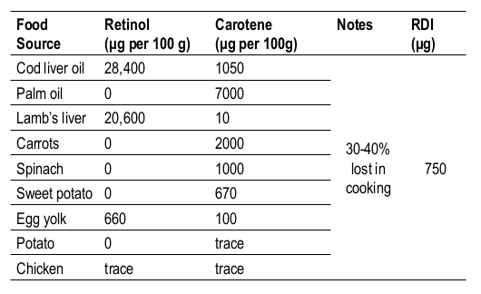

# Vitamins

Vitamins are organic compounds with a variety of functions, that are required in trace amounts to prevent a deficiency disease. Their name is derived from the words "vital" and "amines", as they were first thought to be amino acids.

Essential nutrients are either not synthesise by the human body or are utilised much faster than the human body can synthesise them. These are **extrinsic**, whereas vitamins that we can produce are **intrinsic**. These vitamins are actually not produced by us, but are produced by our gut microbes, with the singular exception of vitamin D.

Vitamins act as coenzymes or cofactors to general metabolic and homeostatic functions.

There are 13 principal Vitamins:

A, B1, B2, B3, B5, B6, B7, B9, B12, C, D, E, K

## Dietary Reference Intake (DRI)

These are four basic guides for nutritional intake that we can compare to. they are quantitative approximations of nutritional needs for healthy people and can act as a set of recommendations for the proper intake on nutrients.

### Estimated Average Requirement (EAR)

This is the amounts od nutrients estimated to meet the nutrient requirements of half of the healthy people in a particular population. It is used to assess the adequacy of a population's food supply and is used to  calculate the RDAs

### Recommended Daily Intake/Allowance (RDA/RDI)

Average daily dietary intake levels sufficient to meet the nutrient requirements of ~97% (2 standard deviations above the EAR) of the healthy people in particular group

### Adequate Intake (AI)

The nutrient intake levels of healthy people (with adequate nutritional status) and are typically thought to exceed the requirement for the nutrient,

Tolerable Upper Intake Levels (UL)

Highest intake level for a nutrient that is not likely to cause any risk of adverse health to almost any people in the ahe and gender specific groups.

## Vitamins as Food Additives

Vitamins are added to food to compensate for loss of nutritional value though of the food product. e.g. reconstituting juice or refining of cereals. This can be especially important for less stable vitamins such as C and B1.

Vitamins can also be added to generally fortify the food, though only vitamins A, B1, B2, B12, C, and D are added.

All vitamins have different structures and associate functions, however not all vitamins have a single structure. Some such as vitamin A have multiple forms with different levels of activity.

In foods, the vitamins may also not be added as the final active form of the vitamin, but may be added as a pre-vitamin, such as with vitamin D, that requires UV light to convert the molecule within the body.

## Classifying Vitamins

Vitamins are classified by their solubility, with A, D, E, and K being fat soluble and all of B group and C being water soluble

## Fat Soluble Vitamins

Due to them being fat soluble, they are less susceptible to being leeched out into cooking water, and the boy can also store them in adipose tissue (E), as well as in the liver (E, D, K). Due to this, they can build up to toxic levels if consumed in excessive amounts, and are more readily available through cooking.

### Vitamin A

Comes in two forms, retinol, the active form and β-carotene, the precursor.

#### β-Carotene

Is obtained through plant sources, such as dark yellow or green plants (particularly carrots) and due to its inefficiency in conversion to retinol, is though to have 1/6 the activity. Other carotenes have even less, at only 1/12 the activity.

<iframe class="center" style="width: 100%; height: 200px;" frameborder="0" src="https://embed.molview.org/v1/?mode=balls&cid=5280489"></iframe> 

Retinol directly comes from animal sources, such as dairy products and liver (offal)

<iframe class="center" style="width: 100%; height: 200px;" frameborder="0" src="https://embed.molview.org/v1/?mode=balls&cid=445354"></iframe> 

A deficiency in vitamin A causes a thickening of the skin ans night blindness, however is very rare in Australia

{: style="width: 60%;" class="center sharp"}

### Vitamin D

Is found in animals and plants as a pro-vitamin.

Cholcalciferol (D3) is obtained from the ultaviolet reaction of pre-vitamin D3 through photolysis

Ergcalciferol (D2) is obtained from ergosterol through ultraviolet light

These can be hydroxlated in the liver to form the pre-hormone calcidiol, which is converted to calcitriol (D) in the kidenys.

It's function in the body is to promote calcium resorption in the intestine, maintain optimal calcium levels in the kidneys and bones and induces the synthesis of proteins that are involved in the structure of bone matrix and calciferation

It is mostly obtained through sunlight mediated synthesis in our skin (recommendations for 5-15 mins of sunlight 4-6 times per week), however ist can also be obtained from oily fish, meat, eggs, spinach and cabbage, as well as fortified food, such as margarine, milks and milk products.

Dark skin people require more sunlight (6x), due to the extra melanin in their skin, and there are risks for veiled women, and institutionalised people, as well as seasonal issues (winter lack of sunlight, summer fear of sun). Breast milk is often a poor souce of vitamin D for infants

The RDI is more than 5 μg/day, with elderly, pregnant women and children requiring more.

The average estimated dietary intake is 2.6-3.0 μg/day for men and 2.0-2.2 μg/day for women

Deficiency in vitamin D may result in rickets in children (inadequate calcification of cartilage) and softening/weakening of bones in adults.

## Water Soluble Vitamins

Can't be stored in the body and are usually eliminated through urine quite quickly which means that toxic levels are hard to reach. the vitamins can also leach out into cooking water when they're being boiled, so more frequent intake is required.

### B Vitamins

B group vitamins are classified further based on their function within the body

#### Energy Releasing 

These include B1 (thimaine), B2, B3 (niacin), B6 (pantothenic acid) and (B7) biotin, and are coenzymes in energy yielding catabolic pathways.

#### Hematopoietic

These include B12 and B9 (folate) and are used in the formation of red blood cells

### Vitamin B1 (thiamine)

It's mainly obtained through cereals, hole grain products, potatoes, milk, nutritional yeasts, shelled fruits, pork, beef, fish and eggs.

The RDI is 1.2 mg/day (male) and 1.1 mg/day (female), thought the minimum requirement is 0.5 mg/day.

it's main functions are catabolic, but it's also required for proper nervous system function.

Deficiency results in weakness and gastrointestinal issues (mild), peripheral neuropathy and mental confusion (moderate) and neuromuscular and cardiovascular issues (sever)

Vitmain B1 is highly water soluble, highly pH sensitive (wants to be in pH < 6, so chemical raising agents will break it down), sensitive to heat and is sensitive to sulphites ($\ce{SO2}$), which is used a preservative.

### Vitamin C

Is found in two forms; ascorbic acid, or dehydroascorbic acid, and is used in the formation of collagen as well as being an antioxidant within the body.

It's main sources are citrus fruits, tomatoes, strawberries, green capsicums and potatoes (low concentration but high consumption)

The RDI is 45 mg/day, though only 10 mg/day is required to prevent scurvy.

Deficiencies in vitamin C lead to fragile capillary walls (bleeding gums), loosening of teeth, joint disease and poor healing of wounds.

It's typically used as an additive for its antioxidant properties, as well as a curing agent for meat, preventing the enzymatic browning of fruit and veg, as well as for nutritive reasons

Vitamin C is very water soluble, meaning that leaching can occur from cut or damaged surfaces of the prduce, as well as through cooking. It's also highly susceptible to oxidation, which can be further catalysed by $\ce{Cu^{2+}}$ and $\ce{Fe^{2+}}$.

The amount of oxidation it can experience is pH dependent and anything above 8 increases the susceptibility significantly, as does the presence of $\ce{O2}$, exposure to light and exposure to heat.

#### bottom

