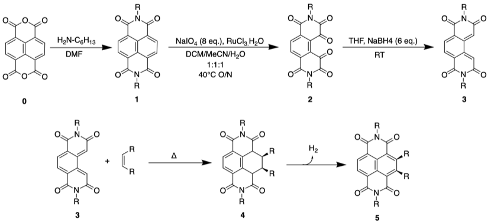

# Thursday 10/1/2018

### Morning realisation

I made an assumption about the cyclisation of **3** **4**, in that I assumed that the newly formed ring would re-aromatise, but this step should really only re-aromatise the left hand ring, so the chemistry will look more like this:

I'm pretty sure this changes the applications again, though I'll do some reading to see what I can come up with

### Post supervisor meeting

I dare say that most of what I thought about this project so far was wrong, but now I have some direction which is useful:

1.  Get the outline done for submission on Sunday evening.
2.  Do a risk assessment on all the chemistry involved, particularly **2**$\ce{->}$**3**, as I've been informed it can be quite dangerous if not performed correctly.
3.  perform synthesis **2** **3** (under strict supervisor guidance) whilst concurrently performing **0**$\ce{->}$**1**$\ce{->}$**2**, since it's well understood chemistry.
4.  Thoroughly characterise **3** to verify that we have the correct product.
5.  look into appropriate dienophiles for **3**$\ce{->}$**4**, as it needs to be an 'inverse demand' Diels Alder reaction, with substituents on the dienophile acting as electron donating groups (EDGs), since we have EWGs on the **3**
6.  In conjunction with step 5, I can explore other types of chemistry, such as nucleophilic addition top see if the nucleophile will attack the diene, the carbonyl carbon of the imide, or the aromatic rings
7.  Time permitting, look into ceric ammonium nitrate (CAN) as an oxidising agent to re-aromatise **4** back into a naphthalene core.

The applications for all of this, beyond the curious "exploring what chemistry is possible" are all the primary application of NDIs[^6], as well as to open up a new direction of chemistry for NDI research

It was also suggested that I should go all the way from synthesising the initial NDI (**1**) from naphthalene dianhydride (NDA)[^7] (**0**) as well as starting with the stock **2**, for the sake of completeness.

[^6]:Ohno, M.; Koide, N.; Sato, H.; Eguchi, S. Synthesis of Heterocycle-Linked [60] Fullerene Derivatives by Heterocyclic o-Quinodimethane Diels-Alder Reaction and Self-Sensitized Photooxygenation of the Cycloadducts. Tetrahedron 1997, 53 (27), 9075–9086. https://doi.org/10.1016/S0040-4020(97)00600-5.
[^7]:Suraru, S. L.; Würthner, F. Strategies for the Synthesis of Functional Naphthalene Diimides. Angew. Chemie - Int. Ed. 2014, 53 (29), 7428–7448. https://doi.org/10.1002/anie.201309746.

