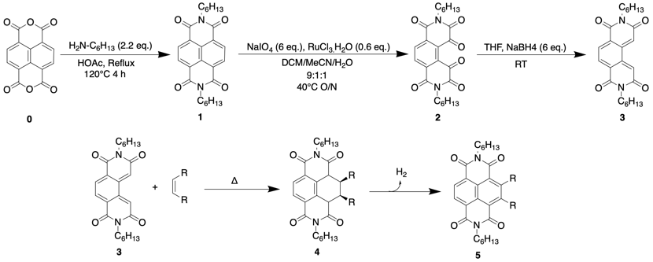
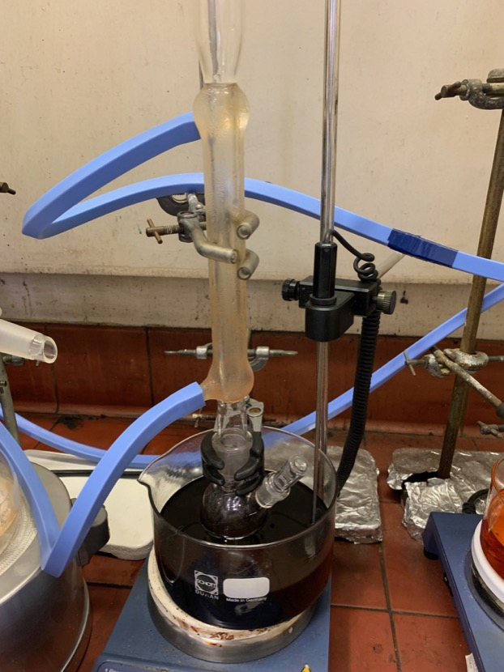

# Tuesday 15/1/2018

### Synthesis 1 (AS02) **1** from **0** (attempt 2)

To a two neck, 50 mL round bottom flask was added, 102.7 mg of **0** and 20 mL of HOAc. With constant stirring, 0.11 mL of hexylamine was syringed into the flask dropwise. The flask was capped, refluxed and heated to 120$^\circ$ C. After 4 hours The heating and stirring was switched off and TLC was run in DCM to verify that the product was produced. While the TLC was streaked and smeared, under long wavelength UV light, there was a distinct glow that matched the colour of the stock sample of **1**. The mixture was allowed to cool to room temperature overnight. The setup is shown in [fig:AS02reflux](#fig:AS02reflux){reference-type="ref" reference="fig:AS02reflux"}.

### Tomorrow's plan and preparation

Tomorrow, time is scheduled to set up a THF drying still for reaction **2**$\ce{->}$**3**, I also need to purify the products of reaction AS02, following a different methodology.In preparation, I'm reading up on THF drying[^8], so that I understand the chemistry, risks (there are many...) and apparatus setup.

Once the THF still is set up, I'll also be trying again to purify **1**.

{: style="width: 40%; "class="center" #fig:AS02reflux}

Refluxing setup

[^8]:Suraru, S. L.; Würthner, F. Strategies for the Synthesis of Functional Naphthalene Diimides. Angew. Chemie - Int. Ed. 2014, 53 (29), 7428–7448. https://doi.org/10.1002/anie.201309746.