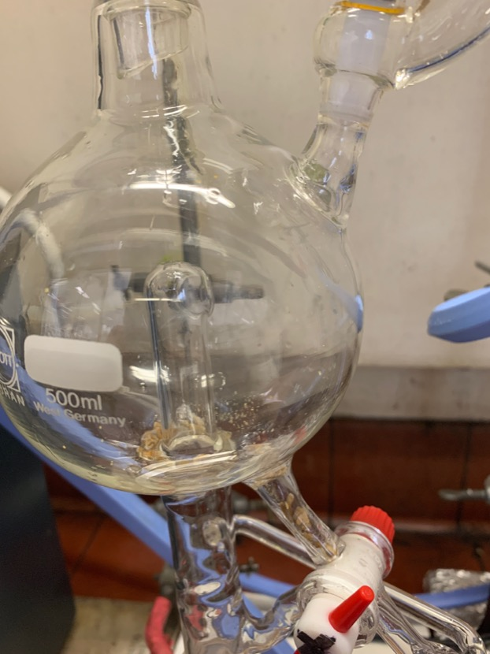
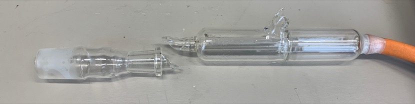
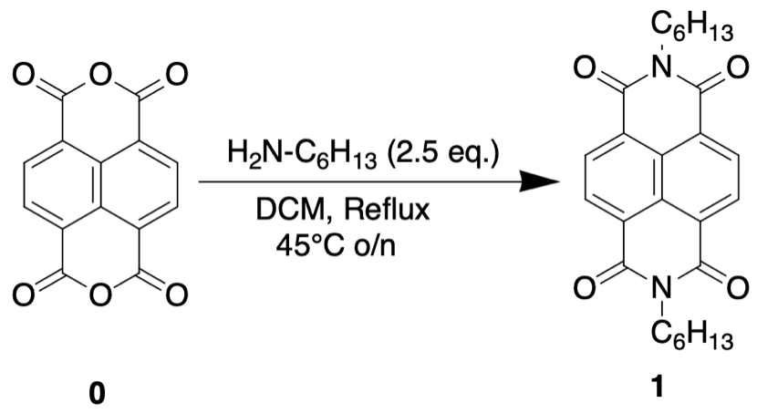

# Thursday 17/1/2018

### THF distillation

Upon coming in to the lab this morning, something had happened to the THF still. The Argon gas had stopped, the gas bubbler had popped off and snapped in half ([fig:THFbubbler](#fig:THFbubbler){reference-type="ref" reference="fig:THFbubbler"}), and somehow, pieces of sodium metal had gone from the boiling flask up into the solvent still-head ([fig:THFstillhead](#fig:THFstillhead){reference-type="ref" reference="fig:THFstillhead"}). The only way I can see this happening is if the THF solution had boiled over, up into the still-head, carrying the sodium metal with it. The gas tank has been changed over with a full tank of and the gas bubbler has been switched over, but I am waiting for my supervisor to be able to advise how to safely get the still back up and running.

| {#fig:THFstillhead} | {#fig:THFbubbler} |
| :----------------------------------------------------------: | :---------------------------------------------------------: |
|    The solvent still-head with sodium metal pieces in it     |                   The broken gas bubbler                    |

### Synthesis of **1** (AS03) (attempt 3)

While the previous synthesis of **1** had been successful, the purification by column chromatography had not been so successful, due to my lack of practice in the matter. As so, I'm reattempting synthesis and purification of the compound, but this time I'm changing the method of the synthesis as well.

{: style="width: 50%;" class="center"}

To a two neck, 50 mL round bottom flask was added, 110.8 mg of **0** and 20 mL of DCM. With constant stirring, 0.15 mL of hexylamine was syringed into the flask dropwise. The flask was capped, refluxed and heated to 45$^\circ$ C overnight.