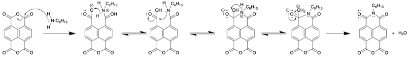

# Monday 21/1/2018

### Theory

I've finally sucked it up and started researching/drawing up some mechanisms, and I'm relatively confident with this amination[^9] ([\[fig:amination\]](#fig:amination){reference-type="ref" reference="fig:amination"}). Other mechanisms are proving more difficult to pin down though. while I can find a mechanism for the oxidation[^4] (**1**$\ce{->}$**2**) it's specific to hexenes. I can find evidence that the process works for aromatic compounds[^10], but can't find a mechanism to prove it.

The reduction (**2**$\ce{->}$**3**) is also proving difficult, and in trying to figure out the mechanism by hand, I keep getting stumped by the lack of water or acid, that would otherwise contribute protons to the solution.

{: style="width: 100%;" class="center" #fig:amination width="\textwidth"}

Proposed mechanism for the amination of **0**, converting an anhydride into an imide

### THF distillation

After the weekend, the THF that was distilled off was combined with fresh benzophenone, fresh sodium and put back on the still to be refluxed.

### Synthesis of **1** (AS03) (attempt 3)

coming back after the weekend, nothing had crystallised out of the flask and so more toluene was added and the mixture was dried with the rotary evaporator. The crude leftover solution was recombined with minimal DCM and left to slowly crystallise overnight.

[^4]:Tabatabaeian, K.; Mamaghani, M.; Mahmoodi, N. O.; Khorshidi, A. Ultrasonic-Assisted Ruthenium-Catalyzed Oxidation of Aromatic and Heteroaromatic Compounds. Catal. Commun. 2008, 9 (3), 416–420. https://doi.org/10.1016/j.catcom.2007.07.024.
[^9]:Suraru, S. L.; Würthner, F. Strategies for the Synthesis of Functional Naphthalene Diimides. Angew. Chemie - Int. Ed. 2014, 53 (29), 7428–7448. https://doi.org/10.1002/anie.201309746.
[^10]:Yao, Z. S.; Wei, X. Y.; Lv, J.; Liu, F. J.; Huang, Y. G.; Xu, J. J.; Chen, F. J.; Huang, Y.; Li, Y.; Lu, Y.; et al. Oxidation of Shenfu Coal with RuO4and NaOCl. Energy and Fuels 2010, 24 (3), 1801–1808. https://doi.org/10.1021/ef9012505.