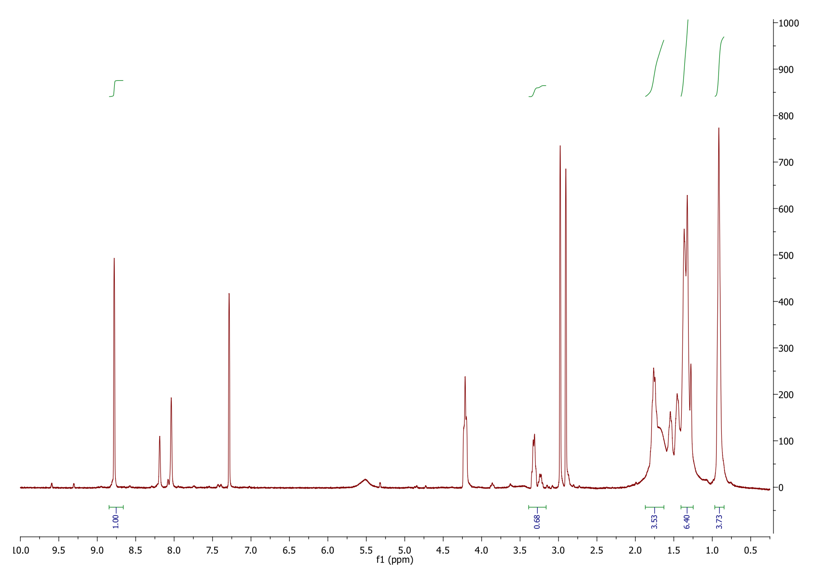
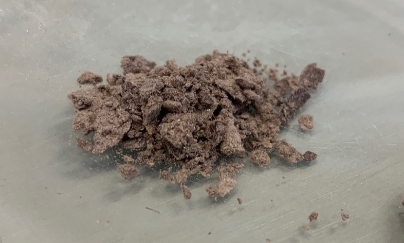
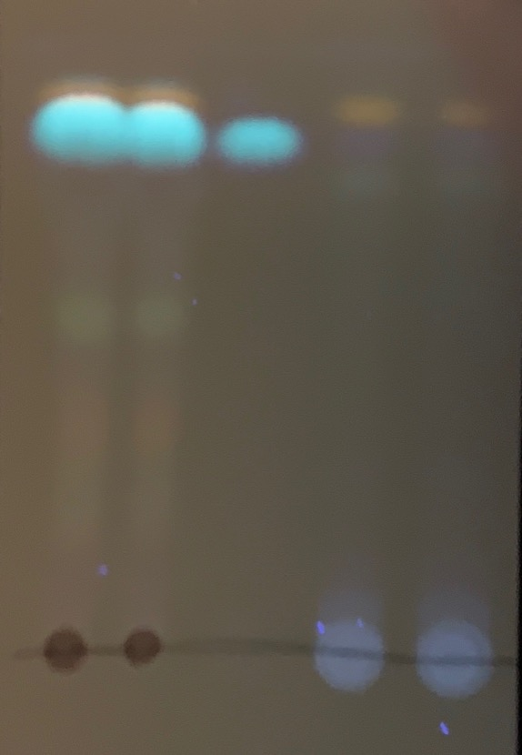
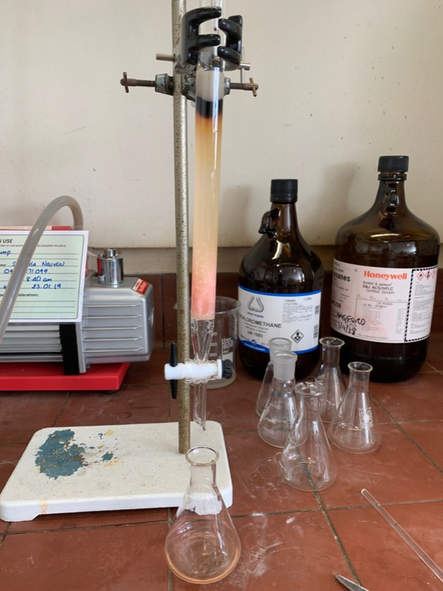
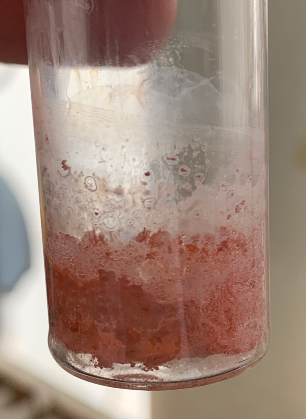

# Tuesday 22/1/2018

### THF distillation

Upon returning to the still in the morning, I was informed that the hose to the nitrogen tank had popped off in the middle of the night, causing panic, as researchers came in to the lab in the morning, reporting a gas leak. The tank is now empty, with a new one being ordered today, the THF is still not dry, and the process continues.

### Synthesis of **1** (AS03) (attempt 3)

After being allowed to evaporate and crystallise, a was taken of the crude product to confirm the presence of the target NDI ([fig:AS03crudeNMR](#fig:AS03crudeNMR){reference-type="ref" reference="fig:AS03crudeNMR"}). The majority of what is there can be identified as hexylamine, **1**, chloroform, DCM, DMF, and toluene. The NDA won't show up on it's own, as it's protons share the same environment as that of the core **1 protons, however both combined represent the peak at 8.78 ppm.

{: style="width: 100%;" class="center"  #fig:AS03crudeNMR}

NMR of the crude product of AS03, with **1** peaks being integrated

After the NMR spectra was taken, the product was re-dissolved in minimal DCM and dried, before being washed with methanol and hexane, resulting in 0.1342 g of crude crystalline product.

|         {label="fig:TLCAS03crude"}         |            {#fig:TLCAS03crude}             |
| :----------------------------------------------------------: | :----------------------------------------------------------: |
| Crude crystalline product, having been washed in methanol in hexane | TLC in DCM of (from left) $2\times$ washed crystalline product, pure C6-NDI, $2\times$ washing liquid (methanol and hexane), under long wave UV light |

Looking at [fig:TLCAS03crude](#fig:TLCAS03crude){reference-type="ref" reference="fig:TLCAS03crude"}, the product is definitely in the crystalline product, however there are lots of other products in there, some of which I cannot identify. looking at the TLC without the camera, only a few of the products are visible, however interesting, looking through the camera on my phone, significantly more is visible, possibly due to inbuilt image processing that saturates the picture.

|                                |         |
| :----------------------------------------------------------: | :-----------------------------------: |
| Column with silica 60 as the solid phase and DCM/Hexane (10:1) as the liquid phase | Dried products eluted from the column |

After doing some reading on column chromatography, it had come to my attention that the column I was using was far too big for the amount of product being purified, resulting in high volumes of solvents being required to process the column, and less separation between the fractions. I decided to run a column with a 1.5 cm diameter and about 20 cm of silica. I tried a series of different solvent systems, comprising of DCM, hexane and toluene, but settled on 10:1 DCM/hexane.

I ran the column and collected 6 different fractions, however from fraction 2-4, all contained **1**, and some quantity of a pink impurity. Under TLC the pink impurity is completely masked by **1** and as you can see in [fig:TLCAS03crude](#fig:TLCAS03crude){reference-type="ref" reference="fig:TLCAS03crude"}, only really appears as a small orange line up the top of the blue dot. I suspect that under long wave UV the pink and blue mix to give an orange, however since **1** is clear in solution, the pink colour dominates. Tomorrow I plan to run NMR to see what the pink product is.

The pink product has been seen before in a fellow group member's research:

*"A pink solid was found in the boxes. The NDI-C5 solid an impurity. The pink impurity was removed by dissolving the crude in a small volume of $\ce{CHCl3}$ (2 mL) and adding it to$\ce{MeOH}$ (8 mL) to precipitate it as a white solid."*

The precipitate and solution was centrifuged and the process was repeated in hexane.