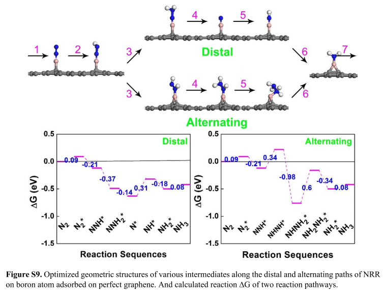
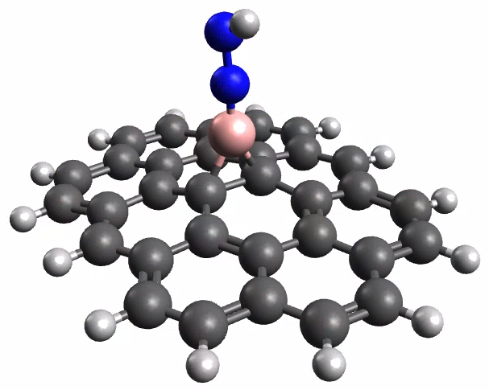
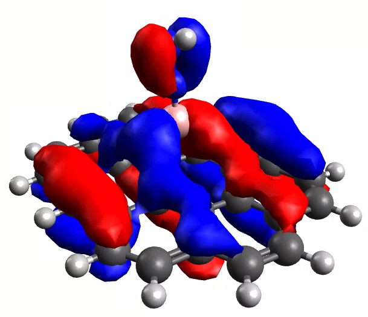
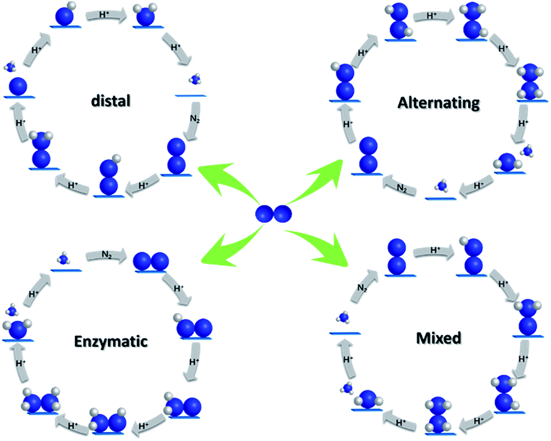

# Week 1

## Wednesday, 5. August 2020

I have chosen to work with Assoc. Prof. Chenghua Sun on nitrogen reduction ($\ce{N2 -> NH3}$) using boron catalysis.

### The Reaction

The nitrogen reduction reaction (NRR) is the process by which nitrogen is catalytically reduced to ammonia. This can happen through multiple pathways as shown below, however it can also occur through an enzymatic pathway (dissociative?) as occurs in nitrogen fixing bacteria[^3], however only the distal and alternating are likely in the *relatively* mild conditions of this reaction[^1].

{: style="width: 40%;" class="center"}

I'm not entirely sure of the source of the protons yet, however I *think* that they might be electrolytically cleaved ($\ce{2H2O -> 4e- + 4H+ +O2 }$ or $\ce{H2 -> 2e- + 2H+}$).

### The Project

This particular project follows on from the work of Liu et al.[^2] who tested a range of surfaces (Boron adsorbed graphene, boron doped graphene, boron nitride, boron sulphide, black phosphorus, two conformation of $\ce{g-C3N4}$ and two conformations of $\ce{MoS2}$ ).

{: style="width: 50%;" class="center"} 

A further point of interest in that of the use of ionic liquids (IL) to essentially act as an environmental electric field that the reaction can take place in. It has been shown that ILs can catalyse chemical reactions, however the mechanism by which this occurs differs quite significantly based on the specifics of the mechanisms involved[^4].

### The Catalytic Effect of Graphene (from play... I need papers to back this up :stuck_out_tongue: ):

In playing around with the system, it seems that the graphene works to disperse the electron density, delocalising it away from the $\ce{N#N}$ bond, making it much weaker, as can be seen below

|           The geometry            |  The third $\pi$ bonding orbital  |
| :-------------------------------: | :-------------------------------: |
|  |  |

[^1]: John, J.; Lee, D.-K.; Sim, U. Photocatalytic and Electrocatalytic Approaches towards Atmospheric Nitrogen Reduction to Ammonia under Ambient Conditions. *Nano Converg.* **2019**, *6* (1), 15. https://doi.org/10.1186/s40580-019-0182-5.
[^2]: Liu, C.; Li, Q.; Wu, C.; Zhang, J.; Jin, Y.; Macfarlane, D. R.; Sun, C. Single-Boron Catalysts for Nitrogen Reduction Reaction. *J. Am. Chem. Soc.* **2019**, *141* (7), 2884–2888. https://doi.org/10.1021/jacs.8b13165.
[^3]: Foster, S. L.; Bakovic, S. I. P.; Duda, R. D.; Maheshwari, S.; Milton, R. D.; Minteer, S. D.; Janik, M. J.; Renner, J. N.; Greenlee, L. F. Catalysts for Nitrogen Reduction to Ammonia. *Nat. Catal.* **2018**, *1* (7), 490–500. https://doi.org/10.1038/s41929-018-0092-7.
[^4]:Keaveney, S. T., Haines, R. S., & Harper, J. B. (2015). Developing principles for predicting ionic liquid effects on reaction outcome. The importance of the anion in controlling microscopic interactions. *Organic & Biomolecular Chemistry*, *13*(12), 3771–3780. https://doi.org/10.1039/C4OB02482F

## Thursday, 6. August 2020

Looking through some papers, I'm getting the impression that a decent compromise between the double hybrid functionals needed for ILs and the GGA functionals needed for graphene is the ==revPBE-D3(BJ)== which is a revised[^7] Perdew-Burke-Erzerhof[^6] functional with DFT-D by Grimme[^5] and Becke-Johnson damping[^8]. This seems to be the recommendation over PBE in general from the god of DFT, Lars Goerigk[^9] and seems to perform well for ILs as well[^10], however it also recommended ==B97-3c==[^11] for low cost DFT computation of ILs, which inherently includes D3BJ dispersion corrections, as used in [^12]

### Computation jobs

I've just started to get some jobs lined up on my home computational server (Ryzen 3700X, 32GB ram) and will keep track of them here:

These jobs are just the optimisation of the implicitly solvated pathway steps (ORCA; OPT B97-3c/Def2-TZVP CPCM(Water) ), so that there's an easy starting point to add in solvent when the time comes

| Pathway         |                      0                      |                      1                      |                    2                     |                    3                     |                    4                     |                    5                     |                    6                     |                    7                     |
| --------------- | :-----------------------------------------: | :-----------------------------------------: | :--------------------------------------: | :--------------------------------------: | :--------------------------------------: | :--------------------------------------: | :--------------------------------------: | :--------------------------------------: |
| **Distal**      | Running | Finished | Queued | Queued | Queued | Queued | Queued | Queued |
| **Alternating** | Running | Finished | Queued | Queued | Queued | Queued | Queued | Queued |

## Friday, 7. August 2020

| Pathway         |                    0                    |                      1                      |                      2                      |                      3                      |                      4                      |                    5                     |                    6                     |                    7                     |
| --------------- | :-------------------------------------: | :-----------------------------------------: | :-----------------------------------------: | :-----------------------------------------: | :-----------------------------------------: | :--------------------------------------: | :--------------------------------------: | :--------------------------------------: |
| **Distal**      | Failed | Finished | Finished |   Failed   |   Failed   | Queued | Queued | Queued |
| **Alternating** | Failed | Finished | Finished | Finished | Finished | Queued | Queued | Queued |

#### Charge/Multiplicity/N-B bonds

| Pathway         |   0   |   1   |   2   |   3    |   4   |   5   |   6   |   7   |
| --------------- | :---: | :---: | :---: | :----: | :---: | :---: | :---: | :---: |
| **Distal**      | 0 1 0 | 1 1 1 | 0 1 1 | 0 1 2  | 0 1 3 | 0 1 2 | 0 1 1 | 0 1 0 |
| **Alternating** | 0 1 0 | 1 1 1 | 0 1 1 | -1 1 2 | 0 1 1 | 1 1 1 | 0 1 1 | 0 1 0 |

## Sunday, 9. August 2020

I found a better mechanism diagram that shows all four mechanisms![^13]

{: style="width: 50%;" class="center"}

| Pathway         |                    0                    |                      1                      |                      2                      |                      3                      |                      4                      |                      5                      |                    6                     |                    7                     |
| --------------- | :-------------------------------------: | :-----------------------------------------: | :-----------------------------------------: | :-----------------------------------------: | :-----------------------------------------: | :-----------------------------------------: | :--------------------------------------: | :--------------------------------------: |
| **Distal**      | Failed | Finished | Finished | Finished | Finished |  Queued   | Queued | Queued |
| **Alternating** | Failed | Finished | Finished | Finished | Finished | Running | Queued | Queued |

#### Charge/Multiplicity/N-B bonds

| Pathway         |   1   |   2   |   3    |   4   |   5   |   6   |   7   |
| --------------- | :---: | :---: | :----: | :---: | :---: | :---: | :---: |
| **Distal**      | 1 1 1 | 0 1 1 | ==-1 1 1==  | 0 1 3 | 0 1 2 | 0 1 1 | 0 1 0 |
| **Alternating** | 1 1 1 | 0 1 1 | -1 1 2 | 0 1 1 | 1 1 1 | 0 1 1 | 0 1 0 |

[^5]:Grimme, S., Antony, J., Ehrlich, S., & Krieg, H. (2010). A consistent and accurate ab initio parametrization of density functional dispersion correction (DFT-D) for the 94 elements H-Pu. *Journal of Chemical Physics*, *132*(15). https://doi.org/10.1063/1.3382344
[^6]:Perdew, J. P., Burke, K., & Ernzerhof, M. (1996). Generalized Gradient Approximation Made Simple. *Physical Review Letters*, *77*(18), 3865–3868. https://doi.org/10.1103/PhysRevLett.77.3865
[^7]:Zhang, Y., & Yang, W. (1998). Comment on “Generalized Gradient Approximation Made Simple.” *Physical Review Letters*, *80*(4), 890–890. https://doi.org/10.1103/PhysRevLett.80.890
[^8]:Grimme, S., Ehrlich, S., & Goerigk, L. (2011). Effect of the damping function in dispersion corrected density functional theory. *Journal of Computational Chemistry*, *32*(7), 1456–1465. https://doi.org/10.1002/jcc.21759
[^9]:Goerigk, L., Hansen, A., Bauer, C., Ehrlich, S., Najibi, A., & Grimme, S. (2017). A look at the density functional theory zoo with the advanced GMTKN55 database for general main group thermochemistry, kinetics and noncovalent interactions. *Physical Chemistry Chemical Physics*, *19*(48), 32184–32215. https://doi.org/10.1039/C7CP04913G
[^10]:Perlt, E., Ray, P., Hansen, A., Malberg, F., Grimme, S., & Kirchner, B. (2018). Finding the best density functional approximation to describe interaction energies and structures of ionic liquids in molecular dynamics studies. *Journal of Chemical Physics*, *148*(19). https://doi.org/10.1063/1.5013122
[^11]:Brandenburg, J. G., Bannwarth, C., Hansen, A., & Grimme, S. (2018). B97-3c: A revised low-cost variant of the B97-D density functional method. *Journal of Chemical Physics*, *148*(6). https://doi.org/10.1063/1.5012601
[^12]:Goli, A., Alinezhad, H., & Ganji, M. D. (2020). Theoretical insights into the performance of graphene derivatives, h-BN and BNC heterostructures in the adsorption and elimination of atrazine: An all-electron DFT study. *Diamond and Related Materials*, *108*(May), 107967. https://doi.org/10.1016/j.diamond.2020.107967

[^13]:Gao, L., Wang, F., Yu, M., Wei, F., Qi, J., Lin, S., & Xie, D. (2019). A novel phosphotungstic acid-supported single metal atom catalyst with high activity and selectivity for the synthesis of NH 3 from electrochemical N 2 reduction: a DFT prediction. *Journal of Materials Chemistry A*, *7*(34), 19838–19845. https://doi.org/10.1039/C9TA06470B