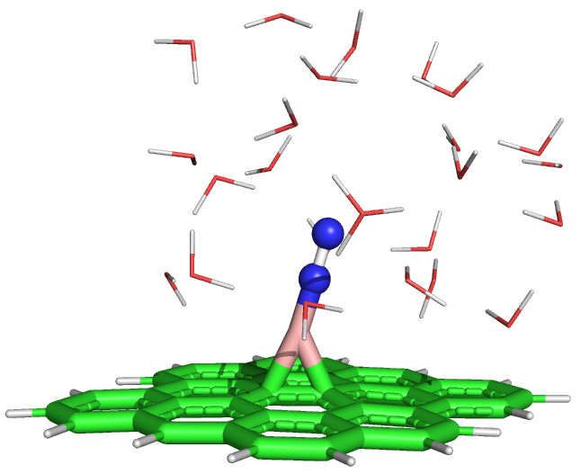
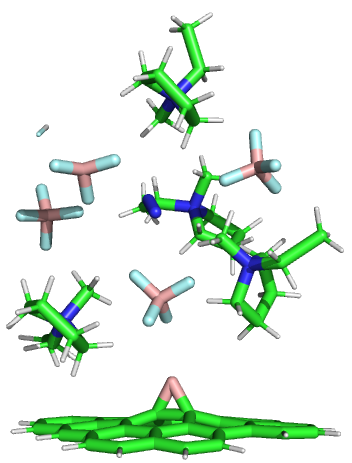
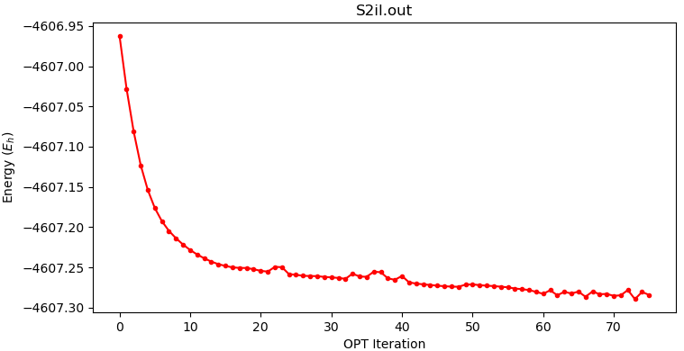

# Week 4

## Sunday, 23. August 2020

### Catching up on What I've Done in the Past Week

I've mostly been spending a lot of time writing my lit review, though it has opened up a few concerns in my computational methodology. mostly around the specifics of the geometries functionals and basis sets. I've had to do a lot of learning about auxiliary basis sets, but I think that's a positive.

The lit review has helped my understanding of some of these process though, just in connecting the dots.

I really love this quote form one of Katya's former research students:

> "So I not only have to understand the dots, but now I have to connect them!?"

I've been playing around with MOPAC to try and generate some reasonable starting geometries which seems to work for the aqueous systems, but for the IL systems, it just done's allocate the charges properly, resulting in bonded boron. I ran some quick tests with DFT and these issues don't occur there, though it really doesn't like the a lone proton (unsurprisingly), so I need to utilise the equilibrium:

$$
\ce{BF4- + H+ <=> BF3 + HF}
$$


| S2il PM7 | S3aq PM7 |
| :--------------------------------: | :----------------------: |
| {: style="max-height: 250px;" class="center"} | {: style="max-height: 250px;" class="center"} |

Though I have actually switched from \[c4mim\]\[$\ce{BF4}$\] to \[c2mim\]\[$\ce{BF4}$\], so this image is out of date.

My current charge/mutiplicity table looks like this though:

| Solvent  |  S1  |  S2  |  S3  |  S4  | $\ce{N2}$ |
| -------- | :--: | :--: | :--: | :--: | :-------: |
| Gas      | 0 2  | 0 2  | 0 1  | N/A  |    0 1    |
| Water/IL | 1 2  | 1 2  | 1 2  | 0 1  |           |

### 11:14 PM

At this point in time, I'm currently procrastinating writing notes for another subject by trying to get some decent geometries for my DFT calculations. I'm mostly doing this by using the same functional that I intend to use for the proper optimisation calcs (B97-3c), but using is single zeta basis set (ma-Def2-SVP) instead of the double of triple that I'll need to use for publishable results (ma-Def2-D/TZVP) .

I'm also using a custom solvent in the form of a dielectric that I got from the supplementary info from Rybinska-Fryca et al.[^1] and a refractive index from good ol' Sigma Aldrich[^2].

```fortran
%cpcm
   epsilon 13.9
   refrac 1.413
end
```


I'm not really bothering to put references in here at this point, as I've got all that in my lit review (48 of them :neutral_face:)

Sometimes I forget how beautiful water/h-bond networks  can be...


<iframe class="center" width="560" height="315" src="https://www.youtube.com/embed/Ymi4QJs8n04" frameborder="0" allow="accelerometer; autoplay; encrypted-media; gyroscope; picture-in-picture" allowfullscreen></iframe>

[^1]:Rybinska-Fryca, A., Sosnowska, A., & Puzyn, T. (2018). Prediction of dielectric constant of ionic liquids. *Journal of Molecular Liquids*, *260*, 57–64. https://doi.org/10.1016/j.molliq.2018.03.080
[^2]:Merck KGaA. (2020). 1-Ethyl-3-methylimidazolium tetrafluoroborate. Retrieved August 23, 2020, from https://www.sigmaaldrich.com/catalog/product/aldrich/900772?lang=en&region=AU

### 2:12 PM

The geometry above isn't actually what I'm working with ATM for S2il, and the current geom looks more like this:

{: style="width: 30%;" class="center"}

## Monday, 24. August 2020

### 3:41 PM

It looks like we're having a bit of trouble getting supercomputer access, so I just sent an email off to Katya to see if I can get access to Monash's HPC clusters.

I also have set up the gas phase jobs to be re-run in in B97-3c, though I'll use non-augmented Def2 for everything but the IL jobs

The single zeta opt job has been running overnight and is still kicking along. The energy is still decreasing, though from looking at the trajectory, it's in the final tweaking stage. hopefully shouldn't be too long now, and with any luck, I'll be able to dump a few jobs on MonArch soon :smile: 

{: style="width: 60%;" class="center"}

I've been tidying up my research diary and putting in some blank pages ready to be populated with data, and have set up a proper working directory structure for my project as well. ==Always gotta keep your data clean!==

### 4:27 PM

I have supercomputer access! :smile:

More specifically, I have access to MonARCH, as long as I acknowledge Monash eResearch Centre (more than happy to do so). My quota is typical for the Pas group and I have access to 100 cores at any time, which means I can run 6 jobs at 16 cores, which is pretty typical. I can also run these with much higher ram allocations (64GB) which I couldn't do on my home server. I *can* run jobs with higher mem/cpu requirements, but then I'd need to join other queues, and it would take longer to get my jobs picked up. As such, my jobs are getting picked up in 10 secs - 10 mins, which is VERY respectable, and 64GB seems to be plenty for ma-Def2-TZVP calculations on 16 cores (4GB/core).

### 5:51 PM

Status Table

|           |                          S1                          |                          S2                          |                          S3                          |                         S4                          |
| --------- | :--------------------------------------------------: | :--------------------------------------------------: | :--------------------------------------------------: | :-------------------------------------------------: |
| **Gas**   | Opt/Freq <span style="color: orange;">Running</span> | Opt/Freq <span style="color: orange;">Running</span> | Opt/Freq <span style="color: orange;">Running</span> |                         N/A                         |
| **Water** | Low Opt <span style="color: orange;">Running</span>  | Low Opt <span style="color: orange;">Running</span>  | Low Opt <span style="color: orange;">Running</span>  | Low Opt <span style="color: orange;">Running</span> |
| **IL**    |   Low Opt <span style="color: blue;">Ready</span>    |   Low Opt <span style="color: blue;">Ready</span>    |   Low Opt <span style="color: blue;">Ready</span>    |  <span style="color: red;">Waiting</span> on S3il   |

 

## Tuesday, 25. August 2020

Status Table

|           |                         S1                          |                         S2                          |                         S3                          |                        S4                         |
| --------- | :-------------------------------------------------: | :-------------------------------------------------: | :-------------------------------------------------: | :-----------------------------------------------: |
| **Gas**   |  Opt/Freq <span style="color: green;">Done</span>   |  Opt/Freq <span style="color: green;">Done</span>   |  Opt/Freq <span style="color: green;">Done</span>   |                        N/A                        |
| **Water** | Low Opt <span style="color: orange;">Running</span> |  High Opt <span style="color: blue;">Queued</span>  |  High Opt <span style="color: blue;">Queued</span>  | High Opt <span style="color: blue;">Queued</span> |
| **IL**    | Low Opt <span style="color: orange;">Running</span> | Low Opt <span style="color: orange;">Running</span> | Low Opt <span style="color: orange;">Running</span> | <span style="color: red;">Waiting</span> on S3il  |

 

## Wednesday, 26. August 2020

|           |                        S1                        |                        S2                         |                         S3                          |                        S4                         |
| --------- | :----------------------------------------------: | :-----------------------------------------------: | :-------------------------------------------------: | :-----------------------------------------------: |
| **Gas**   | Opt/Freq <span style="color: green;">Done</span> | Opt/Freq <span style="color: green;">Done</span>  |  Opt/Freq <span style="color: green;">Done</span>   |                        N/A                        |
| **Water** | Low Opt <span style="color: red;">FAILED</span>  | High Opt <span style="color: blue;">Queued</span> |  High Opt <span style="color: blue;">Queued</span>  | High Opt <span style="color: blue;">Queued</span> |
| **IL**    | Low Opt <span style="color: red;">FAILED</span>  |  Low Opt <span style="color: red;">FAILED</span>  | Low Opt <span style="color: orange;">Running</span> | <span style="color: red;">Waiting</span> on S3il  |

### 10:26 AM

> "When computations happen faster, so do the errors"
>
> - I quote myself sometimes

As things are continuing, I'm running in to SCF issues on a few jobs. I'm not entirely sure where they're coming from, as they seem to be almost arbitrarily scattered around my systems.

I'm going to try without RI and using a TZ basis set, to see if that helps... If that doesn't work, I might have to think about going back to revPBE-D3BJ though. Thankfully, that shouldn't be too hard, but it is a more costly functional.

|           |                        S1                        |                          S2                          |                          S3                          |                          S4                          |
| --------- | :----------------------------------------------: | :--------------------------------------------------: | :--------------------------------------------------: | :--------------------------------------------------: |
| **Gas**   | Opt/Freq <span style="color: green;">Done</span> |   Opt/Freq <span style="color: green;">Done</span>   |   Opt/Freq <span style="color: green;">Done</span>   |                         N/A                          |
| **Water** | Low Opt <span style="color: blue;">Queued</span> | High Opt <span style="color: orange;">Running</span> | High Opt <span style="color: orange;">Running</span> | High Opt <span style="color: orange;">Running</span> |
| **IL**    | Low Opt <span style="color: blue;">Queued</span> | Low Opt <span style="color: orange;">Running</span>  | Low Opt <span style="color: orange;">Running</span>  |   <span style="color: red;">Waiting</span> on S3il   |

### 12:17 PM

So removing the RI approximations on big basis sets is REALLY BAD for performance (pretty logical really)... I'm going to try optimising with revPBE-D3BJ and seeing if that works. If it does I can either re-optimise with B97-3c, or take it as a sign and do revPBE-D3BJ for everything

### 12:24 PM

I think I should use revPBE-D3BJ for everything...

### 1:04 PM

So I've resumed everything with revPBE-D3BJ and we're ticking along again

## Friday, 28. August 2020

### 10:40 PM

For the most part, the jobs have just been either failing and I've been picking them up again, or they've been ticking along steadily. I've finally got my first high level opt done!!

That said, all the IL jobs are failing at the moment, and I'm really struggling to figure out why

|           |                         S1                          |                          S2                          |                         S3                          |                          S4                          |
| --------- | :-------------------------------------------------: | :--------------------------------------------------: | :-------------------------------------------------: | :--------------------------------------------------: |
| **Gas**   |  Opt/Freq <span style="color: green;">Done</span>   |   Opt/Freq <span style="color: green;">Done</span>   |  Opt/Freq <span style="color: green;">Done</span>   |                         N/A                          |
| **Water** | Low Opt <span style="color: orange;">Running</span> | High Opt <span style="color: orange;">Running</span> |  High Opt <span style="color: green;">Done</span>   | High Opt <span style="color: orange;">Running</span> |
| **IL**    | Low Opt <span style="color: orange;">Running</span> | Low Opt <span style="color: orange;">Running</span>  | Low Opt <span style="color: orange;">Running</span> |   <span style="color: red;">Waiting</span> on S3il   |

### What are These Failures?

For the most part, the failures seem to come under a few specific categories:

* Erratic energy in the SCF calcs from the beginning that never get below 1e-2 ΔE
  * These ones have been the most frustrating and have been really stopping the IL calcs
* During SCF, the energy slowly decreases but then jumps around erratically at about 1e-5 ΔE
  * these ones were mostly resolved by switching to revPBE-D3BJ, thous some still persist 
* SCF converges but then the job crashes afterwards, due to some error from the SCF calcs
  * I've ended up just trashing the geometries that do this

### 1:08 AM

I guess it's technically Saturday, but I'm still trying to get these jobs to play nicely.

I'm doing some more tests, and I think that B97-3c is handling the SCF slightly better than revPBE-D3BJ. I'm currently running all my ILs at ma-def2-tzvp AutoAux, so fingers crossed. Same for S1aq and S4aq which have both been giving me issues. (S2aq is the only other happy job, who's just plotting away nicely.)

I've intentionally not started to get any frequencies out of the completed job, since I don't know what level of theory I'll need to go with for everything else.


## Saturday, 29. August 2020

### 10:15 AM

I've had a sleep and I'm now thinking pretty clearly (I hope). I decided to create a new IL geometry from S4IL, which means that I can use MOPAC to generate the geometry at a PM7 level, without the multiplicitly/bonding issues[ I was getting before](#catching-up-on-what-Ive-done-in-the-past-week). I've just submitted this at B97-3c/ma-Def2-TZVP AutoAux, and hopefully It will spit out a decent geometry that I can modify and re-optimise for the other IL systems.

|           |                         S1                          |                          S2                          |                        S3                        |                          S4                          |
| --------- | :-------------------------------------------------: | :--------------------------------------------------: | :----------------------------------------------: | :--------------------------------------------------: |
| **Gas**   |  Opt/Freq <span style="color: green;">Done</span>   |   Opt/Freq <span style="color: green;">Done</span>   | Opt/Freq <span style="color: green;">Done</span> |                         N/A                          |
| **Water** | Low Opt <span style="color: orange;">Running</span> | High Opt <span style="color: orange;">Running</span> | High Opt <span style="color: green;">Done</span> | High Opt <span style="color: orange;">Running</span> |
| **IL**    |   Low Opt <span style="color: red;">Stale</span>    |    Low Opt <span style="color: red;">Stale</span>    |  Low Opt <span style="color: red;">Stale</span>  | Low Opt <span style="color: orange;">Running</span>  |

