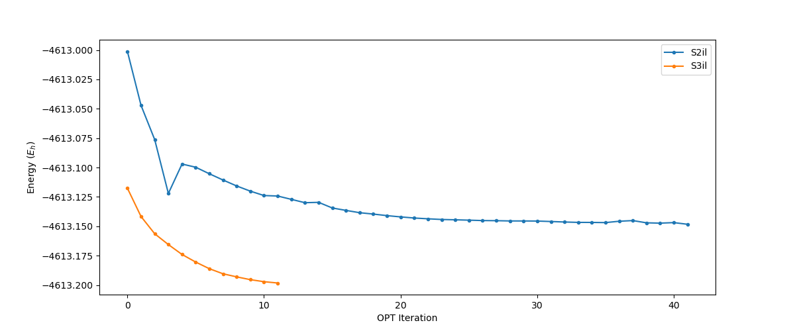
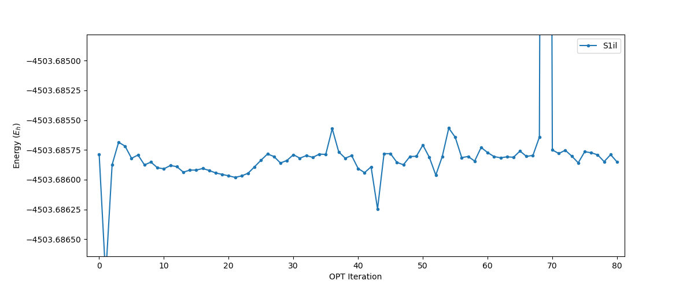
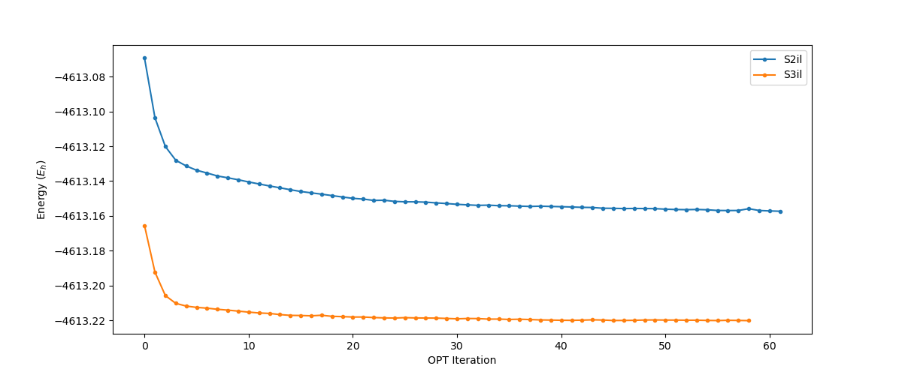

# Week 7

## Sunday, 20. September 2020

### 8:30 AM

<span style="color: grey; text-align: center; font-style: italic;" class="center">Changes marked with a ==highlight==</span>

|           |                          S1                          |                         S2                          |                         S3                          |                          S4                          |
| --------- | :--------------------------------------------------: | :-------------------------------------------------: | :-------------------------------------------------: | :--------------------------------------------------: |
| **Gas**   |   Opt/Freq <span style="color: green;">Done</span>   |  Opt/Freq <span style="color: green;">Done</span>   |  Opt/Freq <span style="color: green;">Done</span>   |                         N/A                          |
| **Water** | Opt/Freq <span style="color: orange;">Running</span> |  Opt/Freq <span style="color: green;">Done</span>   |  Opt/Freq <span style="color: green;">Done</span>   | Opt/Freq <span style="color: orange;">Running</span> |
| **IL**    | Low Opt <span style="color: orange;">Running</span>  | Low Opt <span style="color: orange;">Running</span> | Low Opt <span style="color: orange;">Running</span> | Opt/Freq <span style="color: orange;">Running</span> |

S3il has converged and is optimising! In fact, with increased levelshifting, it's completed 11 iterations (not sure how long the first one took though.)

{: style="width: 80%;" class="center"}

The specific change that I made that allowed the system to optimise was to drastically decrease the error in the gradient that levelshifting will operate until, which also seemed to restrict the size of the steps taken. Rather than optimising close to the minima then jumping back out, this caused the SCF to inch very slowly ($\sim10^{-3-4}\:Eh$ per step) towards the minima, but eventually reaching it.

Once the system had an initial density to work off, each successive optimisation step was much faster.

```
%scf
   maxiter 200
   Shift Shift 0.1 ErrOff 0.00001 end
   DIISMaxEq 30
   directresetfreq 5
end
```

### 12:15 PM

I just came back from coffee and S4il has fully optimised and is calculating frequencies!! This is amazing! Though I will re-submit it as a Freq only job, as it only has one day left on the clock.

### 9:52 PM

It keeps getting better, S4aq just finished its freq calc and S1il finished its low opt. I was in bed when I got the emails, but Ive made sure to get S1il high opt going.

<span style="color: grey; text-align: center; font-style: italic;" class="center">Changes marked with a ==highlight==</span>

|           |                          S1                          |                         S2                          |                         S3                          |                          S4                          |
| --------- | :--------------------------------------------------: | :-------------------------------------------------: | :-------------------------------------------------: | :--------------------------------------------------: |
| **Gas**   |   Opt/Freq <span style="color: green;">Done</span>   |  Opt/Freq <span style="color: green;">Done</span>   |  Opt/Freq <span style="color: green;">Done</span>   |                         N/A                          |
| **Water** | Opt/Freq <span style="color: orange;">Running</span> |  Opt/Freq <span style="color: green;">Done</span>   |  Opt/Freq <span style="color: green;">Done</span>   | ==Opt/Freq <span style="color: green;">Done</span>== |
| **IL**    | ==Opt/Freq <span style="color: red;">Queued</span>== | Low Opt <span style="color: orange;">Running</span> | Low Opt <span style="color: orange;">Running</span> | Opt/Freq <span style="color: orange;">Running</span> |

## Monday, 21. September 2020

### 11:02 PM

It's been a slow day, I've been engrossed in other work today, but there is some good news. S1aq has completed, which means we're now just waiting on the IL systems!

I've followed on by filling out the aq system sheet on here.

<span style="color: grey; text-align: center; font-style: italic;" class="center">Changes marked with a ==highlight==</span>

|           |                          S1                          |                         S2                          |                         S3                          |                          S4                          |
| --------- | :--------------------------------------------------: | :-------------------------------------------------: | :-------------------------------------------------: | :--------------------------------------------------: |
| **Gas**   |   Opt/Freq <span style="color: green;">Done</span>   |  Opt/Freq <span style="color: green;">Done</span>   |  Opt/Freq <span style="color: green;">Done</span>   |                         N/A                          |
| **Water** | ==Opt/Freq <span style="color: green;">Done</span>== |  Opt/Freq <span style="color: green;">Done</span>   |  Opt/Freq <span style="color: green;">Done</span>   |   Opt/Freq <span style="color: green;">Done</span>   |
| **IL**    | Opt/Freq <span style="color: orange;">Running</span> | Low Opt <span style="color: orange;">Running</span> | Low Opt <span style="color: orange;">Running</span> | Opt/Freq <span style="color: orange;">Running</span> |

Unfortunately, S4il had an IO error and had to be restarted.

## Tuesday, 22. September 2020

### 10:23 AM

Well S3il is now doing what it was before; converging nicely then dropping in to a MUCH lower energy ($\sim1100\:Eh$ lower) and then complaining about that's been calculated and erroring.

It looks as though S2il is doing this as well.

### 10:25 PM

I took a look at the optimised geometry for S(2/3)il and there was something strange going on in both of the systems, with the $\ce{BH3}$ and $\ce{BH4}$ bonding to form some geometer that the SCF really didn't like. I's since separated them and have got them optimising again.

## Wednesday, 23. September 2020

### 9:50 PM

Nothing of not has happened today, really. S(1-3)il are still optimising along and S4il is still (very slowly) going along with the calculations. When I re-queued S4il, I set it up to run for 6 days, so hopefully that will be enoug, since with 4 days, 21 hours, it's still forming the second bacth of  right-hand sides of the CP-SCF integrals...

{: style="width: 80%;" class="center"}

{: style="width: 80%;" class="center"}

## Thursday, 24. September 2020

### 9:36 AM

Good news and bad news overnight S3il has completed its low opt, which is good, but S4il is now constantly having IO issues. We have a huge amount of scratch on MonARCH, so I'm honestly not sure why that's happening. S2il is still doing the annoying thing of trying to optimise to a much lower energy than it should, then complaining about what it's produced.

<span style="color: grey; text-align: center; font-style: italic;" class="center">Changes marked with a ==highlight==</span>

|           |                          S1                          |                           S2                            |                            S3                            |                          S4                          |
| --------- | :--------------------------------------------------: | :-----------------------------------------------------: | :------------------------------------------------------: | :--------------------------------------------------: |
| **Gas**   |   Opt/Freq <span style="color: green;">Done</span>   |    Opt/Freq <span style="color: green;">Done</span>     |     Opt/Freq <span style="color: green;">Done</span>     |                         N/A                          |
| **Water** |   Opt/Freq <span style="color: green;">Done</span>   |    Opt/Freq <span style="color: green;">Done</span>     |     Opt/Freq <span style="color: green;">Done</span>     |   Opt/Freq <span style="color: green;">Done</span>   |
| **IL**    | Opt/Freq <span style="color: orange;">Running</span> | ==Low Opt <span style="color: orange;">Running</span>== | ==High Opt <span style="color: orange;">Running</span>== | ==Freq <span style="color: orange;">Running</span>== |

### 10:12 AM

Restarting S2il with longer running level shifting (smaller error before shutoff) seems to have sorted the issue. I did also switch to the PModel guess.

## Friday, 25. September 2020

### 1:09 PM

This is bad... this is very bad...

I wasn't convinced about my final energies form the aq calcs, so I checked them against Chenghua's JACS paper and they're quite off. I investigated a bit deeper and there are negative frequencies. 4-5 of them per job in the water network. It's really difficult because I can't identify the issue until I run the frequency calculations, each of which can take 2-6 days to run.

I'm not entirely sure what to do about though Chenghua has assured me that:

> "This project is a training - we are not looking for very valuable results, but provide a training. It includes knowledge, skills and good habits for research."

Though also:

> "I am impressed by your passion and hard working, and further it would be great if we can pay attention to the details and the formation of good habits and chemist instinct."

I'm waiting to hear back about the frequencies though.

!!! note "Personal note"
	In my defence, optimising explicit solvent is incredibly difficult and time consuming.

### 2:12 PM

After having a small panic, I'm putting S1aq and S4aq on to re-optimise with `verytightopt` and `verytightscf`, as per some researcher's advice. Since this is the biggest discrepency in enery, it should be the most obvious if things are better between them.

I've also specified for the SCF to calculate an exact hessian at the first step and then every 10 steps. Since amost of the negative frequencies are very small in magnitude, it indicates that they're very low lying on the PES and will be hard to optimise to, so an exact hessian should help with that.

<span style="color: grey; text-align: center; font-style: italic;" class="center">Changes marked with a ==highlight==</span>

|           |                              S1                              |                            S2                             |                            S3                             |                              S4                              |
| --------- | :----------------------------------------------------------: | :-------------------------------------------------------: | :-------------------------------------------------------: | :----------------------------------------------------------: |
| **Gas**   |       Opt/Freq <span style="color: green;">Done</span>       |     Opt/Freq <span style="color: green;">Done</span>      |     Opt/Freq <span style="color: green;">Done</span>      |                             N/A                              |
| **Water** | ==`verytight` Opt <span style="color: blue;">Queued</span>== | Opt/Freq <span style="color: magenta;">Done/Broken</span> | Opt/Freq <span style="color: magenta;">Done/Broken</span> | ==`verytight` Opt <span style="color: blue;">Queued</span>== |
| **IL**    |     Opt/Freq <span style="color: orange;">Running</span>     |    Low Opt <span style="color: orange;">Running</span>    |   High Opt <span style="color: orange;">Running</span>    |       Freq <span style="color: orange;">Running</span>       |

## Saturday, 26. September 2020

### 2:30 PM

Things are getting really frustrating now. S1il has formed some weird arrangements in the ILs that are drastically changing the energy, that aren't in the other IL jobs. I'm going to re-opt from the best S2il geom without $\ce{N2}$, and see how it goes, but it is taking a step backwards.

Then things just get frustrating. EVERY SINGLE Newton-Raphson based job is stalling on MonARCH. I'm trying with a different version or ORCA to see if it's any better, but unfortunately, B97-3c is ONLY available in ORCA at the moment, so I can't switch to using Gaussian (not that i'd want to), or anything that uses libxc for it's DFT (Psi4, GAMESS, etc.)

I don't have enough time in the semester to be dealing with this. It would be great if I could use a supercomputer that has a more stable ORCA implementation, but this is the only one I've been authorised to use for this project.

To make matters worse, nothing seems to be getting picked up, so my jobs are all just waiting days, then when they get picked up, they stall.

I'm trying to do as much as I can on my home computer, but it's misbehaving at the moment and I need to use it for other work.

<span style="color: grey; text-align: center; font-style: italic;" class="center">Changes marked with a ==highlight==</span>

|           |                              S1                              |                            S2                             |                            S3                             |                              S4                              |
| --------- | :----------------------------------------------------------: | :-------------------------------------------------------: | :-------------------------------------------------------: | :----------------------------------------------------------: |
| **Gas**   |       Opt/Freq <span style="color: green;">Done</span>       |     Opt/Freq <span style="color: green;">Done</span>      |     Opt/Freq <span style="color: green;">Done</span>      |                             N/A                              |
| **Water** | ==`verytight` Opt <span style="color: blue;">Queued</span>== | Opt/Freq <span style="color: magenta;">Done/Broken</span> | Opt/Freq <span style="color: magenta;">Done/Broken</span> | ==`verytight` Opt <span style="color: blue;">Queued=</span>== |
| **IL**    |     ==Low Opt <span style="color: blue;">Queued</span>==     |    Low Opt <span style="color: orange;">Running</span>    |   High Opt <span style="color: orange;">Running</span>    |      ==Freq <span style="color: blue;">Queued</span>==       |

### 8:48 PM

ORCA on MonARCH is definitely broken. the jobs run fine on my personal computer, so there must be something wrong with the ORCA module on MonARCH. I've got a couple of tests queued, checking to see if a differet openmpi version will help, but I kind of doubt it.

This has also meant that the S4il has to wait to be run as it's getting stuck like everything else.

I'm honestly not sure what's changed, since these jobs were running (crashing for other reasons) a couple of days ago...

I'm currently testing S1aq with just using the `verytight` opt and scf keywords, with `grid5` to see if that can resolve the imaginary frequencies. A HF level freq calc should be enough to show me that.