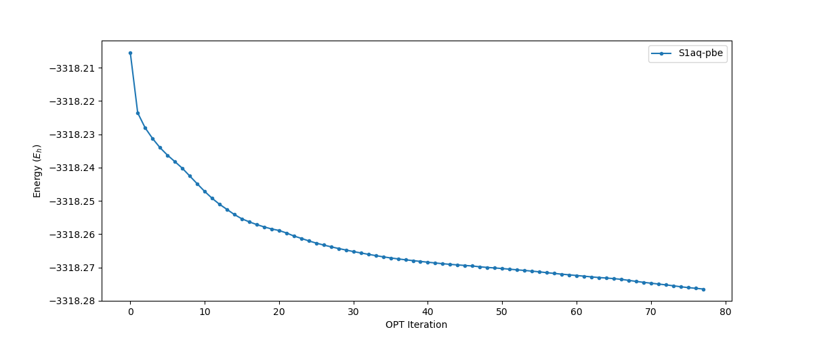
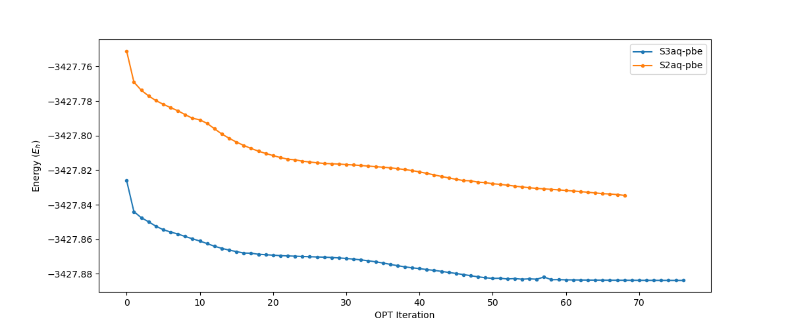

# Week 9

##  Sunday, 4. October 2020

### 3:43 PM

The revPBE jobs have been picked up and have been running smoothly (and quite fast) since they were submitted today

{: style="width: 80%;" class="center"}

{: style="width: 80%;" class="center"}

<span style="color: grey; text-align: center; font-style: italic;" class="center">Changes marked with a ==highlight==</span>

|           |                              S1                              |                              S2                              |                              S3                              |                              S4                              |
| --------- | :----------------------------------------------------------: | :----------------------------------------------------------: | :----------------------------------------------------------: | :----------------------------------------------------------: |
| **Gas**   |       Opt/Freq <span style="color: green;">Done</span>       |       Opt/Freq <span style="color: green;">Done</span>       |       Opt/Freq <span style="color: green;">Done</span>       |                             N/A                              |
| **Water** | `verytight` Freq <span style="color: orange;">Running</span><br/>==PBE Opt <span style="color: orange;">Running</span>== | `verytight` Freq <span style="color: blue;">Queued</span><br/>==PBE Opt <span style="color: orange;">Running</span>== | `verytight` Freq <span style="color: blue;">Queued</span><br/>==PBE Opt <span style="color: orange;">Running</span>== | `verytight` Freq <span style="color: orange;">Running</span><br/>PBE Opt <span style="color: blue;">Queued</span> |

### 11:26 PM

<span style="color: grey; text-align: center; font-style: italic;" class="center">Changes marked with a ==highlight==</span>

|           |                              S1                              |                              S2                              |                              S3                              |                              S4                              |
| --------- | :----------------------------------------------------------: | :----------------------------------------------------------: | :----------------------------------------------------------: | :----------------------------------------------------------: |
| **Gas**   |       Opt/Freq <span style="color: green;">Done</span>       |       Opt/Freq <span style="color: green;">Done</span>       |       Opt/Freq <span style="color: green;">Done</span>       |                             N/A                              |
| **Water** | `verytight` Freq <span style="color: orange;">Running</span><br/>PBE Opt <span style="color: orange;">Running</span> | ==`verytight` Freq <span style="color: orange;">Running</span>==<br/>PBE Opt <span style="color: orange;">Running</span> | `verytight` Freq <span style="color: blue;">Queued</span><br/>PBE Opt <span style="color: orange;">Running</span> | `verytight` Freq <span style="color: orange;">Running</span><br/>PBE Opt <span style="color: blue;">Queued</span> |

## Monday, 5. October 2020

### 10:15 AM

Some of the jobs have started to finish, namely S4aq-freq and S3aq-pbe (opt). The freq job is still showing negative frequencies though... my hope is that the revPBE jobs with optimise properly.

<span style="color: grey; text-align: center; font-style: italic;" class="center">Changes marked with a ==highlight==</span>

|           |                              S1                              |                              S2                              |                              S3                              |                              S4                              |
| --------- | :----------------------------------------------------------: | :----------------------------------------------------------: | :----------------------------------------------------------: | :----------------------------------------------------------: |
| **Gas**   |       Opt/Freq <span style="color: green;">Done</span>       |       Opt/Freq <span style="color: green;">Done</span>       |       Opt/Freq <span style="color: green;">Done</span>       |                             N/A                              |
| **Water** | `verytight` Freq <span style="color: orange;">Running</span><br/>PBE Opt <span style="color: orange;">Running</span> | `verytight` Freq <span style="color: orange;">Running</span><br/>PBE Opt <span style="color: orange;">Running</span> | ==`verytight` Freq <span style="color: orange;">Running</span>==<br/>==PBE Freq <span style="color: blue;">Queued</span>== | ==`verytight` Freq <span style="color: green;">Done</span>==<br/>==PBE Opt <span style="color: orange;">Running</span>== |

I've set up and queued S3aq-Freq in the hopes that it will give me some decent results.

!!! note "Personal Note"
	I should probably start writing up my report and implementing the suggestions of my supervisor into the intro, but my motivation is limited. I'm very much struggling to find the enthusiasm to keep going with the project.

### 10:01 PM

S2aq just finished, so I'm going to tick it off. This has freed up some processors in my allowable, so hopefully S3aq-pbe-freq will get picked up soon!

<span style="color: grey; text-align: center; font-style: italic;" class="center">Changes marked with a ==highlight==</span>

|           |                              S1                              |                              S2                              |                              S3                              |                              S4                              |
| --------- | :----------------------------------------------------------: | :----------------------------------------------------------: | :----------------------------------------------------------: | :----------------------------------------------------------: |
| **Gas**   |       Opt/Freq <span style="color: green;">Done</span>       |       Opt/Freq <span style="color: green;">Done</span>       |       Opt/Freq <span style="color: green;">Done</span>       |                             N/A                              |
| **Water** | `verytight` Freq <span style="color: orange;">Running</span><br/>PBE Opt <span style="color: orange;">Running</span> | `verytight` Freq <span style="color: orange;">Running</span><br/>==PBE Freq <span style="color: blue;">Queued</span>== | `verytight` Freq <span style="color: orange;">Running</span><br/>PBE Freq <span style="color: blue;">Queued</span> | `verytight` Freq <span style="color: green;">Done</span><br/>PBE Opt <span style="color: orange;">Running</span> |

## Tuesday, 6. October 2020

### 10:24 AM

Nothing major has happened overnight, except for S3aq-pbe-freq being picked up.

<span style="color: grey; text-align: center; font-style: italic;" class="center">Changes marked with a ==highlight==</span>

|           |                              S1                              |                              S2                              |                              S3                              |                              S4                              |
| --------- | :----------------------------------------------------------: | :----------------------------------------------------------: | :----------------------------------------------------------: | :----------------------------------------------------------: |
| **Gas**   |       Opt/Freq <span style="color: green;">Done</span>       |       Opt/Freq <span style="color: green;">Done</span>       |       Opt/Freq <span style="color: green;">Done</span>       |                             N/A                              |
| **Water** | `verytight` Freq <span style="color: orange;">Running</span><br/>PBE Opt <span style="color: orange;">Running</span> | `verytight` Freq <span style="color: orange;">Running</span><br/>PBE Freq <span style="color: blue;">Queued</span> | `verytight` Freq <span style="color: orange;">Running</span><br/>==PBE Freq <span style="color: running;">Running</span>== | `verytight` Freq <span style="color: green;">Done</span><br/>PBE Opt <span style="color: orange;">Running</span> |

I am quite hopeful that revPBE will fix the negative frequencies issue, as there seems to be a MASSIVE difference between the optimised structures of the two, as can be seen in the opts of the revPBE S1 and S4aq below, from the B97-3c optimised starting point.

<iframe class="center" width="560" height="315" src="https://www.youtube.com/embed/8eyXlmfWRBU" frameborder="0" allow="accelerometer; autoplay; encrypted-media; gyroscope; picture-in-picture" allowfullscreen></iframe>

<iframe class="center" width="560" height="315" src="https://www.youtube.com/embed/FeekX9ex4FY" frameborder="0" allow="accelerometer; autoplay; encrypted-media; gyroscope; picture-in-picture" allowfullscreen></iframe>

### 3:40 PM

I decided to get a better charge analysis of S3g, so chose to use CHELPG. orca has a convenient utility called `orca_chelpg` which allows me to pass in an existing `.gbw` file (Hessian I think?) and generate charges off that, so I ran that for S3g and got some results that have gone into my report (what little is done of it at least.)

I'm also going to do a SAPT calculation of S4aq when it's finished optimising, so that I can get a better idea of how the solvent is interacting with the SNNH* complex, though ideally, this would have been in comparison with S4il. I'm trying to write the first half of the report as though all the work was completed, then the second half as a post-mortem, to talk about what went wrong, why, and what different approaches could be used in the future.

In doing some reading, it looks like for quantitative comparison, SAPT0/jun-cc-pVDZ is a good starting point, with an MAE of $~0.014-0.055\:eV$)[^1]

S1aq has also finished... with negative frequencies of course.

<span style="color: grey; text-align: center; font-style: italic;" class="center">Changes marked with a ==highlight==</span>

|           |                              S1                              |                              S2                              |                              S3                              |                              S4                              |
| --------- | :----------------------------------------------------------: | :----------------------------------------------------------: | :----------------------------------------------------------: | :----------------------------------------------------------: |
| **Gas**   |       Opt/Freq <span style="color: green;">Done</span>       |       Opt/Freq <span style="color: green;">Done</span>       |       Opt/Freq <span style="color: green;">Done</span>       |                             N/A                              |
| **Water** | ==`verytight` Freq <span style="color: green;">Done</span>==<br/>PBE Opt <span style="color: orange;">Running</span> | `verytight` Freq <span style="color: orange;">Running</span><br/>PBE Freq <span style="color: blue;">Queued</span> | `verytight` Freq <span style="color: orange;">Running</span><br/>PBE Freq <span style="color: orange;">Running</span> | `verytight` Freq <span style="color: green;">Done</span><br/>PBE Opt <span style="color: orange;">Running</span> |

[^1]:Parker, T. M.; Burns, L. A.; Parrish, R. M.; Ryno, A. G.; Sherrill, C. D. Levels of Symmetry Adapted Perturbation Theory (SAPT). I. Efficiency and Performance for Interaction Energies. *J. Chem. Phys.* **2014**, *140* (9). https://doi.org/10.1063/1.4867135.

### 8:32 PM

S1aq-pbe just finished its opt and I've queued it for freqs

<span style="color: grey; text-align: center; font-style: italic;" class="center">Changes marked with a ==highlight==</span>

|           |                              S1                              |                              S2                              |                              S3                              |                              S4                              |
| --------- | :----------------------------------------------------------: | :----------------------------------------------------------: | :----------------------------------------------------------: | :----------------------------------------------------------: |
| **Gas**   |       Opt/Freq <span style="color: green;">Done</span>       |       Opt/Freq <span style="color: green;">Done</span>       |       Opt/Freq <span style="color: green;">Done</span>       |                             N/A                              |
| **Water** | `verytight` Freq <span style="color: green;">Done</span><br/>==PBE Opt <span style="color: blue;">Queued</span>== | `verytight` Freq <span style="color: orange;">Running</span><br/>PBE Freq <span style="color: blue;">Queued</span> | `verytight` Freq <span style="color: orange;">Running</span><br/>PBE Freq <span style="color: orange;">Running</span> | `verytight` Freq <span style="color: green;">Done</span><br/>PBE Opt <span style="color: orange;">Running</span> |

## Wednesday, 7. October 2020

### 10:46 AM

S2aq-freq (B97-3c) just finished, with negative frequencies, but more excitingly, S4aq-pbe has finished its opt, so it's queued for freqs, but also for SAPT.


As recomnmended, I've gone with the following:

```python
set_num_threads(16)
memory 128GB

molecule {
  0 1
  ...
  --
  0 1
  ...
}

set globals {
  basis          jun-cc-pVDZ
  df_basis_sapt  jun-cc-pVDZ-ri
  scf_type       df
  guess          sad
}

set sapt {
  nat_orbs_t2    true
  freeze_core    true
}

energy('sapt0-ct')
```

I'm sticking with SAPT0, since we really only need a conceptual understanding of the interactions and I'm freezing the core for speed, using MP2 natural orbital approximations as it's recommended by the Psi4 team and using the jun-cc-pvdz basis (and equivelent fitting basis) as a reccomendation from Parker et al[^1].

<span style="color: grey; text-align: center; font-style: italic;" class="center">Changes marked with a ==highlight==</span>

|           |                              S1                              |                              S2                              |                              S3                              |                              S4                              |
| --------- | :----------------------------------------------------------: | :----------------------------------------------------------: | :----------------------------------------------------------: | :----------------------------------------------------------: |
| **Gas**   |       Opt/Freq <span style="color: green;">Done</span>       |       Opt/Freq <span style="color: green;">Done</span>       |       Opt/Freq <span style="color: green;">Done</span>       |                             N/A                              |
| **Water** | `verytight` Freq <span style="color: green;">Done</span><br/>PBE Opt <span style="color: blue;">Queued</span> | ==`verytight` Freq <span style="color: green;">Done</span>==<br/>PBE Freq <span style="color: blue;">Queued</span> | `verytight` Freq <span style="color: orange;">Running</span><br/>PBE Freq <span style="color: orange;">Running</span> | `verytight` Freq <span style="color: green;">Done</span><br/>==PBE Greq <span style="color: blue;">Queued</span>==<br/>==SAPT<span style="color: blue;">Queued</span>== |

### 10:46 PM

Not a lot to report, mostly just that S1aq and S2aq have been picked up.

<span style="color: grey; text-align: center; font-style: italic;" class="center">Changes marked with a ==highlight==</span>

|           |                              S1                              |                              S2                              |                              S3                              |                              S4                              |
| --------- | :----------------------------------------------------------: | :----------------------------------------------------------: | :----------------------------------------------------------: | :----------------------------------------------------------: |
| **Gas**   |       Opt/Freq <span style="color: green;">Done</span>       |       Opt/Freq <span style="color: green;">Done</span>       |       Opt/Freq <span style="color: green;">Done</span>       |                             N/A                              |
| **Water** | `verytight` Freq <span style="color: green;">Done</span><br/>==PBE Opt <span style="color: orange;">Running</span>== | `verytight` Freq <span style="color: green;">Done</span><br/>==PBE Freq <span style="color: orange;">Running</span>== | `verytight` Freq <span style="color: orange;">Running</span><br/>PBE Freq <span style="color: orange;">Running</span> | `verytight` Freq <span style="color: green;">Done</span><br/>PBE Freq <span style="color: blue;">Queued</span><br/>SAPT<span style="color: blue;">Queued</span> |


## Thursday, 8. October 2020

### 1:56 PM

Good news and bad news:
**The good:** SAPT0-CT completed in 3 hours, which is MUCH shorter than I expected, so I've set up another SAPT2-CT for some more accurate results

**The Bad:** S3aq-pbe-freq finished and has a whole lot of negative frequencies. None of them are in the catalytic complex or nitrogen though, which makes me slightly happier, but only the full reaction pathay will show the impact.

#### SAPT0-CT Results

|       | Electrostatics | Exchange | Induction | Dispersion | Charge Transfer |
| ----- | :------------: | :------: | :-------: | :--------: | :-------------: |
| $mEh$ |   -25.92964    | 55.39211 | -23.21472 | -48.87163  |    -1.58690     |
| $eV$  |     -0.71      |   1.51   |   -0.63   |   -1.33    |      -0.04      |

S3aq-freq has also finished with negative frequencies, and S4aq-pbe-freq ha been picked up.

<span style="color: grey; text-align: center; font-style: italic;" class="center">Changes marked with a ==highlight==</span>

|           |                              S1                              |                              S2                              |                              S3                              |                              S4                              |
| --------- | :----------------------------------------------------------: | :----------------------------------------------------------: | :----------------------------------------------------------: | :----------------------------------------------------------: |
| **Gas**   |       Opt/Freq <span style="color: green;">Done</span>       |       Opt/Freq <span style="color: green;">Done</span>       |       Opt/Freq <span style="color: green;">Done</span>       |                             N/A                              |
| **Water** | `verytight` Freq <span style="color: green;">Done</span><br/>PBE Opt <span style="color: orange;">Running</span> | `verytight` Freq <span style="color: green;">Done</span><br/>PBE Freq <span style="color: orange;">Running</span> | ==`verytight` Freq <span style="color: green;">Done</span>==<br/>==PBE Freq <span style="color: green;">Done</span>== | `verytight` Freq <span style="color: green;">Done</span><br/>==PBE Freq <span style="color: orange;">Running</span>==<br/>==SAPT0-CT<span style="color: green;">Done</span>==<br/>==SAPT2-CT<span style="color: blue;">Queued</span>== |

### 9:50 PM

S4aq-sapt2 got picked up!

<span style="color: grey; text-align: center; font-style: italic;" class="center">Changes marked with a ==highlight==</span>

|           |                              S1                              |                              S2                              |                              S3                              |                              S4                              |
| --------- | :----------------------------------------------------------: | :----------------------------------------------------------: | :----------------------------------------------------------: | :----------------------------------------------------------: |
| **Gas**   |       Opt/Freq <span style="color: green;">Done</span>       |       Opt/Freq <span style="color: green;">Done</span>       |       Opt/Freq <span style="color: green;">Done</span>       |                             N/A                              |
| **Water** | `verytight` Freq <span style="color: green;">Done</span><br/>PBE Opt <span style="color: orange;">Running</span> | `verytight` Freq <span style="color: green;">Done</span><br/>PBE Freq <span style="color: orange;">Running</span> | `verytight` Freq <span style="color: green;">Done</span><br/>PBE Freq <span style="color: green;">Done</span> | `verytight` Freq <span style="color: green;">Done</span><br/>PBE Freq <span style="color: orange;">Running</span><br/>SAPT0-CT<span style="color: green;">Done</span><br/>==SAPT2-CT<span style="color: orange;">Running</span>== |

## Friday, 9. October 2020

### 8:55 AM

S4aq-sap2 ran out of memory, so I've increased it and have re-queued it.

<span style="color: grey; text-align: center; font-style: italic;" class="center">Changes marked with a ==highlight==</span>

|           |                              S1                              |                              S2                              |                              S3                              |                              S4                              |
| --------- | :----------------------------------------------------------: | :----------------------------------------------------------: | :----------------------------------------------------------: | :----------------------------------------------------------: |
| **Gas**   |       Opt/Freq <span style="color: green;">Done</span>       |       Opt/Freq <span style="color: green;">Done</span>       |       Opt/Freq <span style="color: green;">Done</span>       |                             N/A                              |
| **Water** | `verytight` Freq <span style="color: green;">Done</span><br/>PBE Opt <span style="color: orange;">Running</span> | `verytight` Freq <span style="color: green;">Done</span><br/>PBE Freq <span style="color: orange;">Running</span> | `verytight` Freq <span style="color: green;">Done</span><br/>PBE Freq <span style="color: green;">Done</span> | `verytight` Freq <span style="color: green;">Done</span><br/>PBE Freq <span style="color: orange;">Running</span><br/>SAPT0-CT<span style="color: green;">Done</span><br/>==SAPT2-CT<span style="color: blue;">Queued</span>== |

### 8:05 PM

S4aq-freq has finally finished, but the results are not great... There are quite a few negative frequencies, but more concerning is that the energy difference between S4aq and S3aq is even greater than for B97-3c, at about $5.4\:eV$. I've already accepted that my report is going to be a project post-mortem, rather than a proper publication of results, but I was hoping to at least get something useful out.

The SAPT job has failed because it ran out of memory, though this time it spat out an estimation for how much memory it require... somewhere in the order of 5298709.8 MB (5.3TB)... I think I'll just settle for SAPT0.

<span style="color: grey; text-align: center; font-style: italic;" class="center">Changes marked with a ==highlight==</span>

|           |                              S1                              |                              S2                              |                              S3                              |                              S4                              |
| --------- | :----------------------------------------------------------: | :----------------------------------------------------------: | :----------------------------------------------------------: | :----------------------------------------------------------: |
| **Gas**   |       Opt/Freq <span style="color: green;">Done</span>       |       Opt/Freq <span style="color: green;">Done</span>       |       Opt/Freq <span style="color: green;">Done</span>       |                             N/A                              |
| **Water** | `verytight` Freq <span style="color: green;">Done</span><br/>PBE Opt <span style="color: orange;">Running</span> | `verytight` Freq <span style="color: green;">Done</span><br/>PBE Freq <span style="color: orange;">Running</span> | `verytight` Freq <span style="color: green;">Done</span><br/>PBE Freq <span style="color: green;">Done</span> | `verytight` Freq <span style="color: green;">Done</span><br/>==PBE Freq <span style="color: green;">Done</span>==<br/>SAPT0-CT<span style="color: green;">Done</span><br/>==SAPT2-CT<span style="color: red;">Failed</span>== |

Possibly the most intering thing though is the charge analysis. While Loewdin calculated pretty similar charges between the aquoeus and gas phase systems, CHELPG showed in insanely diffferent:

|       |   B   | N1 (lower) | N2 (higher) | SNNH Proton |
| ----- | :---: | :--------: | :---------: | :---------: |
| Gas   | -0.08 |    0.17    |    -0.50    |    0.29     |
| Water | -0.23 |    0.59    |    -0.74    |    0.36     |

In reading to try and rationalise this though, CHELPG may not be an appropriate method of charge analysis, as it uses the external MESP to determine the charge of the atoms, so since the catalytic complex is buried, it's going to be non-representative.


### 9:59 PM

I've been taking a look at some other charge analysis methods and came across the Bader method, which since it's grid based, my be slightly more suitable to this system. The only issue is that the orca included tool `orca_plot`  to convert the ORCA hessian (.gbw) into the requisite orbital (.cube) file that the Bader[^2] tool uses, through the electron density (.scfp) file, is single threaded. For small molecules this wouldn't be too much of an issue, and if it says anything, the default grid size it calculates is 40x40x40 grid points for the cube... I'm trying to do many more points (a few hundred), but since the amount of work scales as $N^3$, the difference between $40^3$ and $500^3$ is a lot of time... about 2000x the time... It would probably be faster if I generated the .scfp file in the orca job (I believe it's calculated anyway, but discarded as a temp file)

## Saturday, 10. October 2020

### 9:59 AM

S2aq-pbe-freq has finished!, but S1aq-pbe-freq has failed with I/O errors...

<span style="color: grey; text-align: center; font-style: italic;" class="center">Changes marked with a ==highlight==</span>

|           |                              S1                              |                              S2                              |                              S3                              |                              S4                              |
| --------- | :----------------------------------------------------------: | :----------------------------------------------------------: | :----------------------------------------------------------: | :----------------------------------------------------------: |
| **Gas**   |       Opt/Freq <span style="color: green;">Done</span>       |       Opt/Freq <span style="color: green;">Done</span>       |       Opt/Freq <span style="color: green;">Done</span>       |                             N/A                              |
| **Water** | `verytight` Freq <span style="color: green;">Done</span><br/>==PBE Opt <span style="color: blue;">Queued</span>== | `verytight` Freq <span style="color: green;">Done</span><br/>==PBE Freq <span style="color: green;">Done</span>== | `verytight` Freq <span style="color: green;">Done</span><br/>PBE Freq <span style="color: green;">Done</span> | `verytight` Freq <span style="color: green;">Done</span><br/>PBE Freq <span style="color: green;">Done</span><br/>SAPT0-CT<span style="color: green;">Done</span><br/>SAPT2-CT<span style="color: red;">Failed</span> |

I also let the cube generation from `orca_plot` run overnight and I have a nice big, 1.6GB cube file. When I try and run it though, The Bader analysis tool segfaults. I might need to generate a smaller cube.

### 11:12 AM

In doing some reading, it seems like Atomic Dipole Correct Hirshfeld charges may be more reliable, which conveniently I can easily generate using Multiwfn[^3].

These charges seem MUCH more reliable:

|       |  B   | N1 (lower) | N2 (higher) | SNNH Proton |  Sum  |
| ----- | :--: | :--------: | :---------: | :---------: | :---: |
| Gas   | 0.02 |    0.07    |    -0.45    |    0.28     | -0.08 |
| Water | 0.06 |    0.10    |    -0.35    |    0.22     | 0.03  |

!!! note "Personal note"
	I swear that every time I look at programs like AIMALL and Multiwfn, I am reminded about how much there if for me to learn. The insane things that people can do with the electron density just makes me wish that there was better education around comp chem, that didn't require a physics degree to comprehend.

[^2]:Arnaldsson, A.; Tang, W.; Chill, S.; Chai, W.; Henkelman, G.; Sanville, E.; Voss, J.; McNellis, E.; Dyer, M.; Lebegue, S.; Janos, A.; Aubert, E. Bader Analysis Program v1.03. University of Texas: Austin 2017.
[^3]:Lu, T.; Chen, F. Multiwfn: A Multifunctional Wavefunction Analyzer. *J. Comput. Chem.* **2012**, *33* (5), 580–592. https://doi.org/10.1002/jcc.22885.