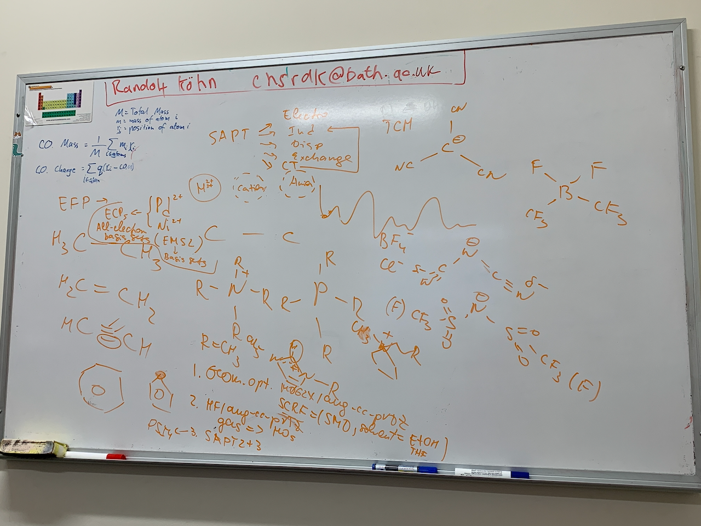

# Monday, 6. January 2020

## The basics of the project (to start)

Essentially, this project at this point is going to be investigating the nature of the ionic catalysis on certain model systems through a three stage process:

1. Optimise the geometry (gaussian)
   * M06-2x/aug-cc-pVDZ
   * SMD - Ethanol/THF
2. Obtain the MOs using HF/aug-cc-PVTZ in gas pahse
3. Run SAPT to get a decomposition of the energy between the two atoms of which we're probing the bond in question (PSI4)

This will be done by putting a single molecule to test with a single potential catalyst (cation, anion, metal catalyst) and using SAPT to determine the nature of the change

### The groups:

| Base    | Cations                      | Anions             | Metals       |
| ------- | ---------------------------- | ------------------ | ------------ |
| Ethane  | Tetramethylammonium          | $\ce{Cl-}$         | $\ce{Pd^2+}$ |
| Ethene  | Tetramethylphosphanium       | $\ce{BF4-}$        | $\ce{Ni^2+}$ |
| Ethyne  | 1,1-dimethylpyrrolidin-1-ium | $\ce{BF2(CF3)2}$   |              |
| Benzene | 1,3-dimethyl-2H-imidazole    | $\ce{C(CN)3-}$     |              |
| Furan   |                              | $\ce{N(CN)2-}$     |              |
| Pyrole  |                              | $\ce{N(SOOCF3)2-}$ |              |
|         |                              |                    |              |

## Symmetry Adapted Perturbation Theory (SAPT)

Provides a means of calculating and pulling apart the non-covalent components of a bond.

Breaks the energy down in to the components:

1. Electronic energy
2. Induction
3. Dispersion energy
4. Exchange energy
5. CT..?

Run with SAPT on Psi4

{: style="width: 100%; "class="center"}