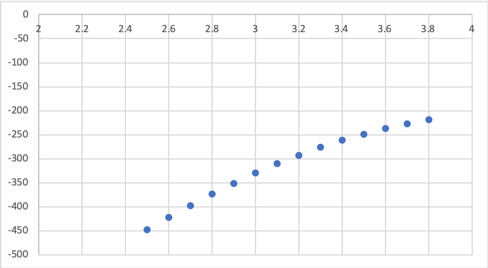
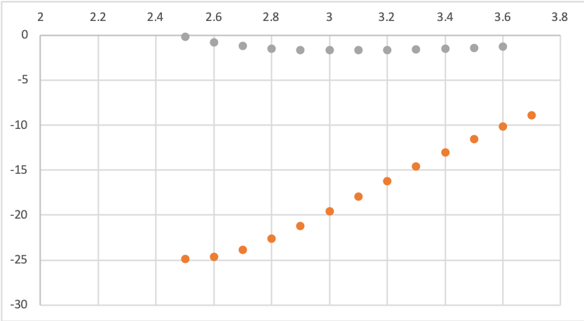

#  Friday, 31. January 2020

## To do

* [ ] Read deeper into SAPT

* [x] Check Ni opt jobs

* [x] Check LI opt jobs

* [x] Check Benzene NTF2 SAPT

* [x] Check Pd PES Jobs

  * [ ] Push on to MOs and SAPT if done

* [x] Ion pairs

  * [x] Find the appropriate ions (lowest HOMO, Highest HOMO, neutral HOMO)
  * [x] Set up opt jobs (Ions above, Ions around)

  

## What I did

I figured out and set up the ion pair optimisations and wrote some code to make that a bit easier. I also analysed the results of the Pd PES scans, we decided to use the “knee” (the largest point on the second derivative - the steepest gradient of the first derivative){: style="width: 60%; "class="center"}{: style="width: 60%; "class="center"}

<i>Blue is the data, orange is the first derivative and grey is the second derivative</i>

The opt jobs should hopefully be done by Monday, and fingers crossed the last two Pd jobs won’t have further convergence issues.
